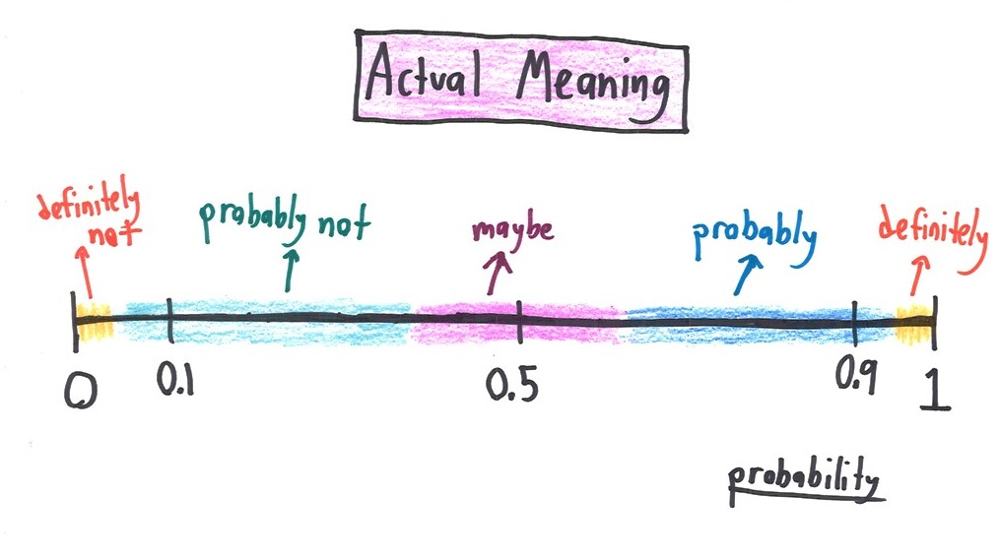

--- 
title: "Analytical Paleobiology"
author: "Peter D Smits"
date: "`r Sys.Date()`"
site: bookdown::bookdown_site
documentclass: book
bibliography: [book.bib, packages.bib]
biblio-style: apalike
header-includes:
  - \linespread{1.25}
link-citations: yes
github-repo: psmits/paleo_book
twitter-handle: PeterDSmits
description: "An informal course on analytical paleobiology"
---

# Preface {-}

This book is a series of tutorials on data analysis with examples drawn from paleobiology, macroevolution, and macroecology. Each chapter of this book can act as a 2-hour tutorial, with each lesson building on the previous ones. 

I emphasize Bayesian data analysis approaches throughout this text. Parameter inference is done using the [`brms`](https://github.com/paul-buerkner/brms) package which is a flexible tool for implementing [Stan-based](https://mc-stan.org/) models in R. 

This book uses the [`tidyverse`](https://www.tidyverse.org/) collection of R packages with a particular emphasis on `dplyr`, `ggplot2`, and `purrr`. Other `tidyverse` packages are used as necessary (e.g. `modelr`). Management and processing of posterior estimates, as well as some some aspects of visualization, is done using the [`tidybayes`](http://mjskay.github.io/tidybayes/) package. The [`pacman`](https://github.com/trinker/pacman) package is used throughout to ensure that all packages are both installed and loaded into namespace. The [`here`](https://github.com/r-lib/here) package is used to ensure safe file paths. I attempt to stick to the [`tidyverse` style guide](https://style.tidyverse.org/) as much as possible.

A lot of material in this book is derived from material and examples presented in 
[**Statistical Rethinking** by Richard McElreath](https://xcelab.net/rm/statistical-rethinking/), 
[**Bayesian Data Analysis 3** by Gelman et al.](http://www.stat.columbia.edu/~gelman/book/), and 
[**Data Analysis Using Regression and Multilevel/Hierarchical Models** by Gelman and Hill](https://www.cambridge.org/core/books/data-analysis-using-regression-and-multilevelhierarchical-models/32A29531C7FD730C3A68951A17C9D983). 

Additionally, some of the code used in this book is derived from [this rewriting](https://github.com/ASKurz/Statistical_Rethinking_with_brms_ggplot2_and_the_tidyverse) of **Statistical Rethinking**.


This textbook was made possible by my postdoctoral funding provided by [Seth Finnegan](https://finneganlab.org/) during my time at UC-Berkeley (2017-2019).
```{r include=FALSE, cache=FALSE}
rm(list = ls(all = TRUE))
```

<!--chapter:end:index.Rmd-->

# Managing and Processing Data From the Paleobiology Database

## Objectives

- Introduce the data stored in the Paleobiology Database.
- Learn how to *programatically* download PBDB data.
- Introduce tidy data and some good practices when managing data.
- Learn how to make PBDB cleaner and tidier


```{r load_packages_pbdb, results = 'hide'}

library(pacman)

p_load(tidyverse, janitor, knitr, kableExtra)

theme_set(theme_bw())

```

## Reading  {#project-reading}

The following materials are recommended pre-readings before starting this section. You do not have to read all of them, pick at least one. 

- [Verde Arregotia *et al.* 2018 "Good practices for sharing analysis-ready data in mammalogy and biodiversity research" **Hystrix, the Italian Journal of Mammalogy**](http://www.italian-journal-of-mammalogy.it/Good-practices-for-sharing-analysis-ready-data-in-mammalogy-and-biodiversity-research,101564,0,2.html).
- [Wilson *et al.* 2017 "Good enough practices in scientific computing" **PLoS Computational Biology**](https://journals.plos.org/ploscompbiol/article?id=10.1371/journal.pcbi.1005510).
- [Bryan "Project oriented workflow" tidyverse.org](https://www.tidyverse.org/articles/2017/12/workflow-vs-script/).
- [Bryan "Zen and aRt of Workflow Maintenance" talk](https://speakerdeck.com/jennybc/zen-and-the-art-of-workflow-maintenance).
- [Bryan "Code Smells and Feels" talk](https://github.com/jennybc/code-smells-and-feels#readme).
- [Bryan 2017 "Excuse me, do you have a moment to talk about version control?" **PeerJ**](https://peerj.com/preprints/3159/).
- [Wickham 2014 "Tidy Data"](https://www.jstatsoft.org/article/view/v059i10).


## Introduction

Any project you work on as a scientist has multiple parts: data, documentation, reports, code, etc. Managing and keeping track of these parts is not a simple task. Today we will discuss a small part of this process: data wrangling and sharing using the `tidyverse` set of packages and syntax. This lesson is in three parts: getting data, processing data, and sharing data.

This tutorial assumes a fair amount of familiarity with the `tidyverse`, in particular `dplyr`. For a tutorial on using `dplyr` and `purrr` I recommend 
- [R for Data Science](https://r4ds.had.co.nz/)
- [https://dplyr.tidyverse.org/articles/dplyr.html](https://dplyr.tidyverse.org/articles/dplyr.html).


## Getting data

One of the greatest resources in paleobiology is the aptly named [Paleobiology Database](https://paleobiodb.org/), or PBDB for short. The PBDB is an internet repository of fossil occurrences, collections, taxonomic opinions, and lots of other information and is freely available to everyone. The standard way to access information in the PBDB is through the classic [Download Generator](https://paleobiodb.org/classic/displayDownloadGenerator) webform. Downloading data using forms like this makes replicating previous PBDB downloads very difficult -- with so many manual options, it is hard to easily record them all or share them with someone else. 

The modern Download Generator (at time of this writing) has one major feature for increasing the reproducibility of downloads -- a URL. Every option updates a URL that calls our data from the PBDB. This URL is then a direct link to the results of that call -- giving the URL to a friend means they can download the same dataset. Play around with the download options and see how the URL changes.


That URL is a call to the [PBDB's API](https://paleobiodb.org/data1.2/), which is the data service for interfacing with the material stored in the underlying database. This means we can share the URL along with our study so that other researchers can make the same data call. The API documentation leaves something to be desired, but as you interact with the docs and start writing your own API calls, it should become clearer what some terms mean. 

A fossil occurrence is the core data type of the PBDB and probably the most important data type in paleobiology -- the unique recording of an organism at a particular location in space and time. Normally we want a list of fossil occurrences that correspond to our study system or time period. For data output from the PBDB for occurrences, each row is an observation and each column is a property of that fossil or metadata corresponding to its collection, identification, and entry into the PBDB.

We are going to focus on downloading information about fossil occurrences. Here are a few example URLs which make calls to the PBDB API. Use the API documentation to discern and describe the differences between the different calls. You can even visit these websites if you want -- it will reveal the plain-text file of the data. 

```
https://paleobiodb.org/data1.2/occs/list.json?base_name=Cetacea&interval=Miocene&show=all

https://paleobiodb.org/data1.2/occs/list.json?base_name=Cetacea&interval=Miocene&taxon_status=valid&show=all

https://paleobiodb.org/data1.2/occs/list.txt?base_name=Cetacea&interval=Miocene&idreso=genus&show=all

https://paleobiodb.org/data1.2/occs/taxa.txt?base_name=Cetacea&interval=Miocene&show=attr
```

The best part of using a URL based call is that we can embed them in our R scripts. Here is a simple example (note I'm suppressing warnings here, so don't get scared when you see a lot of them):
```{r read_carnivora, message = FALSE, results = 'hide', warning = FALSE}

url <- 'https://paleobiodb.org/data1.2/occs/list.txt?base_name=Carnivora&interval=Miocene&show=full'
carnivora <- read_csv(file = url)

```

The `carnivora` object now has the information from our PBDB call in data.frame form. By using a direct API call to the PBDB instead of relying on a previously downloaded file our analyses can instantly be updated when new data is added to the PBDB. Because the URL points directly to a CSV (or JSON) file, we don't have to save a copy of the data to our local machine, and we can instead have it live in memory during our analyses -- though you might want to download and store the data every so often (e.g. `write_csv()`) so you can work offline or share you data with a less savvy colleague. 

I find tibbles easier to process than data.frame-s, so API calls in my own code tend to look like this:
```{r read_carnivora_astibble, message = FALSE, results = 'hide', warning = FALSE}

url <- 'https://paleobiodb.org/data1.2/occs/list.txt?base_name=Carnivora&interval=Miocene&show=full'
carnivora <- read_csv(file = url) %>%
  as_tibble()

```

If you play around with the carnivora object you'll notice it has **TONS** of columns -- 118! Each of these columns records some bit of information about that fossil -- taxonomic identity, location, source, enterer, etc. You can check the [API documentation](https://paleobiodb.org/data1.2/occs/list_doc.html) for a description of each column. Frustrating many of these fields might be empty or inconsistently entered -- I'm looking at you lithology1 and environment. This inconsistency is the source of some warning messages you'll get form `readr` functions when trying to parse PBDB data because columns will be inconsistently typed. Additionally, a lot of our fossils might not be identified to the species or even genus level, or are not identified with confidence. This serves as an important point about the PBDB: the data isn't perfect. This means that the next step of any analysis of PBDB is "cleaning" or "tidying" our data until we can actually analyze it! 

**WORD OF CAUTION:** If an analysis relies entirely on the PBDB's API to filter the data, then that analysis should be considered suspect because the authors did not actually consider the quality or nature of their data in their analysis. 


## Processing data

Processing PBDB data is not a pretty task but it is extremely important and necessary before any analysis -- it builds familiarity with the data and ensures that the data you are analyzing is the data you actually want to analyze. The `dplyr` package from the `tidyverse` is a collection of tools for processing data.frame objects, making it easier to get our data into a usable form. When combined with the pipe operator (`%>%`) from [`magrittr`](https://magrittr.tidyverse.org/), we can write clear, human readable code for cleaning our data. 


Example filters we might consider
- identified precisely -- no ambiguous or imperfect "calls"
- identified to genus or better
- paleocoordinates (latitude AND longitude)
- body fossils
- collected after a certain date

We might also want to standardize the form of our column names. Capital letters, spaces, and punctuation are all really frustrating to code around. 

Lucky for us, our data is already considered "tidy" because each row is an observation and each column is a variable. This does not mean our data is ready for analysis, however. Our job as analysts is to process and filter our data till we believe every observation is ready to be analyzed. Is every observation up to snuff? Or are there errors encoded in our data?

For example, let's filter out the imprecise fossils, fossils not identified to at least the genus level, and fossils lacking paleocoordinates. Let's also make sure all the variable names have the same logic (they are all already usable, but this is a good habit to get into!)

```{r filter_carnivora}

carnivora_filter <- 
  carnivora %>%
  janitor::clean_names() %>%           # standardizes names
  filter(accepted_rank %in% c('genus', 'species'), # either is good
         !is.na(paleolng),
         !is.na(paleolat))

```

This new tibble, `carnivora_filter`, is a subset of the ordinal data that should follow the rules we've laid out in the URL-based API call and the few lines of R code. If we gave the URL and this code snippet to someone else, they could reproduce all the "rules" governing our dataset.

The accepted_* variables in PBDB data correspond to the accepted, or best, identification of a fossil. Differences between identified_* and accepted_* variables are commonly due to re-identification or changes in taxonomy. While this is really convenient on its face, sometimes the accepted species names assumes too much confidence in the identification. For example, let's take a close look at a few records.

```{r species_names_carnivora}

carnivora_table <- 
  carnivora_filter %>%
  select(identified_name, 
         identified_rank, 
         accepted_name, 
         accepted_rank) %>%
  slice(50:60)

knitr::kable(carnivora_table) %>%
  kableExtra::kable_styling()

```

In many cases there is good correspondence between the identified name and the accepted name. However, there are some inconsistencies. For example, the ninth of this table corresponds to a fossil identified as "Cormocyon cv. copei" but is given the accepted name of "Cormocyon copei" -- an identification that is arguably overconfident. But does it matter? That's up to you and your research, but let's assume it does for this tutorial. How do we resolve this and downgrade these overconfident identifications?

The simplest way might be to downgrade any identified names that include punctuation and non-character symbols to their genus. After all, "cf.", "sp." and "n. sp." all involve punctuation. 

But how do we deal with text information? Turns out there is a whole special language for dealing with text called [regular expressions](https://en.wikipedia.org/wiki/Regular_expression), or RegEx for short. RegEx are sequences of characters that help us match specific patterns in text. In this example, I'm using a specialized bit of RegEx to identify all cases where there is punctuation present in the identified name -- I don't care *where* the punctuation is, that there *is* punctuation. To do this, I'm going to be using functions from the [`stringr`](https://stringr.tidyverse.org/) package which provide for easier interaction with text and regular expressions than using the factions available base R. 

I find RegEx unintuitive before I use them as they are not intuitive, so don't worry too much if you find regular expressions bewildering when you start using them. I always spend a lot of time on Google and StackExchange figuring out the correct RegEx I need for the task at hand. 

```{r correct_names_carnivora}

carnivora_clean <- 
  carnivora_filter %>%
  mutate(improve_name = if_else(str_detect(identified_name, 
                                           pattern = '[[:punct:]]'), 
                                true = genus, 
                                false = accepted_name))

carnivora_clean %>%
  select(identified_name, accepted_name, improve_name) %>%
  slice(50:60) %>%
  knitr::kable() %>%
  kable_styling()

```

If we really wanted to be slick, we could combine all the above into a single block.

```{r full_example_carnivora, message = FALSE, results = 'hide', warning = FALSE}

url <- 'https://paleobiodb.org/data1.2/occs/list.txt?base_name=Carnivora&interval=Miocene&show=full'

carnivora <- read_csv(file = url) %>%
  as_tibble() %>%
  clean_names() %>%
  filter(accepted_rank %in% c('genus', 'species'), # either is good
         !is.na(paleolng),
         !is.na(paleolat)) %>%
  mutate(improve_name = if_else(str_detect(identified_name, 
                                           pattern = '[[:punct:]]'), 
                                true = genus, 
                                false = accepted_name))

```


## Binning observations

Fossil occurrences in the PBDB have temporal information such as geologic stage, or a rough numerical age (max_ma, min_ma). The nature of the fossil record means that we do not have exact ages for anything, instead we have ranges. The numerical age of a fossil occurrence is bounded between a max and a min. This uncertainty in age presents a lot of problems that we have to deal with in our analyses, especially if the temporal order of our fossils matters to our question! An extremely common way to overcome this uncertainty is to coarsen the resolution of our fossils by binning them -- assigning similarly aged fossils to a shared temporal unit. Each temporal bin can be said to have a "width" -- the length of time covered by that bin. 

In our example, we may want to track diversity over time. We are going to do this by counting the number of unique genera present in our time bins. To do this, we have to determine how many bins there are and to which bin each fossil belongs. The age of each fossil, however, is a range and not a single value. We could use the midpoint of this range to assign each fossil to a bin, but what if the age range of some fossils is much larger than our bin width? 
First, let's take a look at the amount of uncertainty there is in the age estimates of our fossil occurrences.
```{r range_ilo_carnivora}

carnivora_clean %>%
  mutate(age_range = abs(max_ma - min_ma)) %>%
  ggplot(aes(x = age_range)) +
  geom_histogram() +
  labs(x = 'Age range (My)', y = 'Count') +
  theme_bw()

```

We can see that a lot of our fossils have age uncertainty of 5 million years or less, and a few of them have large ranges of 10 million years or more. Fossils with age ranges greater than 10 million years are potentially suspect or at least are not high quality -- certainly trying to assign them to a single 2 million year bin isn't going to be ideal as it adds confidence where there is none. In your own analyses you might consider these situations on a case-by-case basis or try to find more information from other sources, but for purposes of this tutorial we will exclude those occurrences whose age ranges are 10 million years or greater.

We can dither over an "optimal" bin width for our data, but for the purpose of this exercise let's assign all our fossil occurrences to 2 million year bins. 

Because binning data is so common, I've written a function, `bin_ages()` to do this. I present it here and will use it to bin our data. The `bin_ages()` function follows that convention that the youngest bin is bin 1. I've written documentation for this function using `roxygen` formatting. Feel free to modify it or write your own. This function requires you to assign a single age to the fossil, after which it is binned. In the example that follows, I calculate the midpoint age of each fossil and proceed from there.

```{r bin_foo_carnivora}

#' Break time data up into bins
#' 
#' Have fun with this. Basic rules. Greater than equal to base, less than top.
#' 
#' @param x vector of ages
#' @param by bin width
#' @param age logical bin age returned, not number (default FALSE, return bin number)
#' @return vector of bin memberships
#' @author Peter D Smits <peterdavidsmits@gmail.com>
bin_ages <- function(x, by = NULL, number = NULL, age = FALSE) {

  if(is.null(by) & is.null(number)) {
    return('no scheme given. Specify either bin width or number of bins.')
  }

  if(!is.null(by) & !is.null(number)) {
    return('too much information. Specify either bin width OR number of bins, not both.')
  }

  # range to bin
  top <- ceiling(max(x))
  bot <- floor(min(x))

  # create bins
  if(!is.null(by)) {
    unt <- seq(from = bot, to = top, by = by)
  } else if(!is.null(number)) {
    unt <- seq(from = bot, to = top, length.out = number + 1)
  }

  # bin top and bottom
  unt1 <- unt[-length(unt)]
  unt2 <- unt[-1]

  # assign memberships
  uu <- map2(unt1, unt2, ~ which(between(x, left = .x, right = .y)))

  # what if we want the "age" of the bin, not number?
  if(age == TRUE) {
    unt_age <- map2_dbl(unt1, unt2, ~ median(c(.x, .y)))
  }

  # create output vector
  y <- x
  for(ii in seq(length(uu))) {
    if(age == FALSE) {
      y[uu[[ii]]] <- ii
    } else if(age == TRUE) {
      y[uu[[ii]]] <- unt_age[ii]
    }
  }
  y
}

```

Let's use this function to bin our data. Notice how I first calculate the midpoint age for each fossil and use that derived quantity to assign each occurrence to a temporal bin.

```{r bin_carnivora}

carnivora_bin <-
  carnivora_clean %>%
  filter(abs(max_ma - min_ma) < 10) %>%
  mutate(mid_ma = (max_ma + min_ma) / 2,
         bin = bin_ages(mid_ma, by = 2))

carnivora_bin %>%
  summarize(bin_number = n_distinct(bin))

```

Ok, so now we have a column `bin` that identifies the temporal bin that each occurrence belongs to. The quick summary at the bottom demonstrates that we have broken our data into 9 bins of equal length. The limit here is that our bins are identified by their number and not their "age". Luckily, the `age` parameter of the `bin_ages()` function that changes the output from bin number to bin age. Here it is in use.
```{r bin_age_carnivora}

carnivora_bin <- 
  carnivora_bin %>%
  mutate(bin_age = bin_ages(mid_ma, by = 2, age = TRUE))

# take a look
carnivora_bin %>%
  select(mid_ma, bin, bin_age) %>%
  slice(1:10) %>%
  knitr::kable(.) %>%
  kableExtra::kable_styling()

```

As before, we can combine all of these operations into a set of piped statements.
```{r bin_complete_carnivora}

url <- 'https://paleobiodb.org/data1.2/occs/list.txt?base_name=Carnivora&interval=Miocene&show=full'
carnivora <- read_csv(file = url) %>%
  as_tibble() %>%
  clean_names() %>%
  filter(accepted_rank %in% c('genus', 'species'), # either is good
         !is.na(paleolng),
         !is.na(paleolat)) %>%
  mutate(improve_name = if_else(str_detect(identified_name, 
                                           pattern = '[[:punct:]]'), 
                                true = genus, 
                                false = accepted_name)) %>%
  filter(abs(max_ma - min_ma) < 10) %>%
  mutate(mid_ma = (max_ma + min_ma) / 2,
         bin = bin_ages(mid_ma, by = 2),
         bin_age = bin_ages(mid_ma, by = 2, age = TRUE))

```


## Sharing data

So far we have generated two "kinds" of data tables: the raw data output from the PBDB that is returned from our URL-based API call, and the cleaned data we've crafted with a bit of code. Both of these datasets are extremely important and should be shared with the audience.

There are two ways to share the raw data associated with our study: the URL-based API call, and a spreadsheet of the downloaded information. Because the information on the PBDB updates over time, an API call made today might not yield an identical dataset. Earlier I hailed this as fantastic, which it is, but it is also limiting -- someone might not be able completely reproduce your analysis using this information because the data could be different. The API call is useful for improving and expanding on previous analyses, but by itself is not enough to reproduce your analysis. You also need to share the raw data download so that your complete analysis, including filtering and cleaning, is reproducible.

You probably also want to save a local copy of your filtered and cleaned dataset so you don't have to re-run your cleaning scripts all the time. It also means you can separate your cleaning from the rest of your analysis. You'll end up with multiple R scripts and multiple datasets -- that's good. 

For example, my projects tend to have multiple subdirectories: R/, data/, and results/. In the R directory, I'll have multiple scripts -- one for loading and cleaning data, one for visualizing this cleaned data, and at least one for analyzing the cleaned data. I save the raw data to the data/ directory, and the cleaned data and figured in the results/ directory.


Here is a quick example of what I mean without referencing subdirectories:
```{r save_carnivora, eval = FALSE}

url <- 'https://paleobiodb.org/data1.2/occs/list.txt?base_name=Carnivora&interval=Miocene&show=full'
carnivora <- read_csv(file = url)

carnivora_clean <- 
  carnivora %>%
  as_tibble() %>%
  clean_names() %>%
  filter(accepted_rank %in% c('genus', 'species'), # either is good
         !is.na(paleolng),
         !is.na(paleolat)) %>%
  mutate(improve_name = if_else(str_detect(identified_name, 
                                           pattern = '[[:punct:]]'), 
                                true = genus, 
                                false = accepted_name))
  filter(abs(max_ma - min_ma) < 10) %>%
  mutate(mid_ma = (max_ma + min_ma) / 2,
         bin = bin_ages(mid_ma, by = 2),
         bin_age = bin_ages(mid_ma, by = 2, age = TRUE))

write_csv(carnivora, 'carnivora_raw.csv')
write_csv(carnivora_clean, 'carnivora_clean.csv')

```

For more information and advice on how to organize your projects, check out Jenny Bryan's excellent material on project oriented workflows, linked [above](#project-reading).


## Summary

In this lesson we introduced the PBDB API and how to include URL-based API calls in our R code. We also covered multiple aspects of cleaning PBDB data including species identifications and temporal binning. Finally, we briefly covered exporting our data, both raw and cleaned, so that our analyses are more reproducible. All of these steps are fundamental in any analysis and form a great deal of the work associated with any analysis problem.
```{r include=FALSE, cache=FALSE}
rm(list = ls(all = TRUE))
```

<!--chapter:end:pbdb.Rmd-->

# Introduction to Bayesian data analysis

> Statistical inference is concerned with drawing conclusions, from numerical data, about quantities that are not observed. -- Gelman et al. **BDA3**: 4.

> Bayesian data analysis is just a logical procedure for processing information. -- McElreath **Statistical Rethinking**: 12.


## Objectives

- Learn what a (Bayesian) model actually means.
- Introduce the logic behind Bayesian updating.
- Dip our toes into numerical methods using **brms**.
- Cover the basics of summarizing a posterior distribution using **tidybayes**.


## Reading

The following materials are recommended prereadings before starting this tutorial. 

- Chapter 1 "The Golem of Prague" from [**Statistical Rethinking** by Richard McElreath](https://xcelab.net/rm/statistical-rethinking/).
- Chapter 2 "Small Worlds and Large Worlds" from [**Statistical Rethinking** by Richard McElreath](https://xcelab.net/rm/statistical-rethinking/).
- OPTIONAL Chapter 3 "Sampling the Imaginary" from [**Statistical Rethinking** by Richard McElreath](https://xcelab.net/rm/statistical-rethinking/).

Most of this section is based on material presented in **Statistical Rethinking** and code material from [Solomon Kurz's rewrite of **Statistical Rethinking**](https://bookdown.org/ajkurz/Statistical_Rethinking_recoded/).


```{r load_packages_intro, results = 'hide'}

library(pacman)

p_load(tidyverse, brms, tidybayes)

theme_set(theme_bw())

```


## Learning from data

Bayesian inference is a fancy way of counting and comparing possibilities. As we collect and analyze our data, we learn which possibilities are more plausible than others. The logical strategy is "When we don't know what caused the data, potential causes that may produce the data in more ways are more plausible."


### Counting and plausibility

We're going to use a simple example from **Statistical Rethinking** to start our thinking about Bayesian analysis.

**Setup**: We've got a bag with four marbles. Each marble can be either blue (B) or white (W). We don't know the composition of the bag. Our goal is to figure out which of possible configuration is most plausible, given whatever evidence we learn about the bag. A sequence of three marbles have pulled from the bag, one at a time, returned to the bag, and then the bag is shaken before drawing another. We draw the sequence [B W B]. 

How many ways are there to produce this draw? Try first this possible bag composition: [B W W W]. 

Here is the full table of ways to produce [B W B] given each possible bag composition.

| conjecture | ways to produce [B W B] |
|---|---|
| [W W W W] | 0 x 4 x 0 = 0 |
| [B W W W] | 1 x 3 x 1 = 3 |
| [B B W W] | 2 x 2 x 2 = 8 |
| [B B B W] | 3 x 1 x 3 = 9 |
| [B B B B] | 4 x 0 x 4 = 0 |


What happens when we draw another marble from the bag? We update the counts! How do we update the counts? We multiply the prior counts by the new count, with the old counts are acting as our prior counts. Here is an example how we would update our counts if we were to draw an additional [B].

| conjecture  | ways to produce [B]  | previous counts  | new count  |
|---|---|---|---|
| [W W W W] | 0 | 0 | 0 x 0 = 0 |
| [B W W W] | 1 | 3 | 3 x 1 = 3 |
| [B B W W] | 2 | 8 | 8 x 2 = 16 |
| [B B B W] | 3 | 9 | 9 x 3 = 27 |
| [B B B B] | 4 | 0 | 0 x 4 = 0 |


Logically, what we've done can be expressed as

<center>
  plausibility of [B W W W] after seeing [B W B] $\propto$ ways [B W W W] can produce [B W B] X prior plausibility of [B W W W].
</center>

But these are counts and plausibilities; we want probabilities! First, to make explaining ourselves simpler, let's define $p$ as the proportion of blue marbles in the bag and $D_{new}$ as our data. We can now rewrite the previous statement as: 

<center>
  plausibility of $p$ after $D_{new}$ $\propto$ ways $p$ can produce $D_{new}$ X prior plausibility of $p$.
</center>


We want to standardize the measure of plausibility so that the sum of the plausibilities for all conjectures sums to 1. To standardize, we add up all the products, one for each $p$, then divide each product by the sum of the products.

| possible combinations | $p$ | ways to produce data | plausibility |
|---|---|---|---|
| [W W W W] | 0 | 0 | 0 |
| [B W W W] | 0.25 | 3 | 0.15 |
| [B B W W] | 0.5 | 8 | 0.40 |
| [B B B W] | 0.75 | 9 | 0.45 |
| [B B B B] | 1 | 0 | 0 |

This process is equivalent to 

<center>
  plausibility of $p$ after $D_{new}$ = (ways $p$ can produce $D_{new}$ X prior plausibility $p$) / sum of products
</center>


Each part of the calculations we've done so far correspond directly to quantities in applied probability theory.

- The conjectured proportion of blue marbles, $p$, is usually called a *parameter*. 
- The relative number of ways that $p$ can produce the data is usually called the *likelihood*.
- The prior plausibility of a specific $p$ is called the *prior probability*.
- The updated plausibility of any specific $p$ is called the *posterior probability*.


## Building a model {#globe-example}

Bayesian inference is made easier by working with probabilities instead of counts, but this makes everything look a lot harder. Let's explore this with a new problem.

**Setup**: We've a globe with land and water sections. We want to know how much of the globe is water. Our strategy is to throw the globe up, catch it, and note the surface under the right index finger. Let's do this 9 times.

```{r globe_toss}
d <- tibble(toss = c("w", "l", "w", "w", "w", "l", "w", "l", "w"))

# then rephrase in terms of trials and count of water
(d <- d %>% 
 mutate(n_trials  = 1:9,
        n_success = cumsum(toss == "w")))
```

To get the logic machinery working, we need to make some assumptions. These assumptions constitute our model. An ideal design loop for developing a Bayesian model has three steps:

1. **Data story** 
    - Describe aspects of the underlying reality and the sampling process. 
    - Translate this description into a formal probability model.
    - Acts as a framework for interpretation, but still a story.
    - Helps with realizing additional questions that must be answered as hypotheses are frequently vague.
2. **Updating**
    - Bayesian models begin with a set of plausibilities assigned to each possibility (*Prior*).
    - Update those plausibilities based on the data to give *posterior* plausibility.
3. **Evaluate**
    - Certainty is no guarantee that the model is good or accurate.
    - Supervise and critique your model!
    - Check model's adequacy for some purpose, or in light of stuff we don't know.


### A data story

How did the data come to be? A data story is a description of the aspects of the reality underlying our data, including the sampling process. This story should be sufficient to specifying an algorithm to simulate new data. Write out the data story for the globe tossing activity.


### Bayesian updating {#bayes-updating-ex}

A Bayesian model begins with one set of plausibilities assigned to each possible result: the prior plausibilities. These values are updated in light of data to produce our posterior plausibilities. This process is called *Bayesian updating*.

Here is an illustration of Bayesian updating applied to our globe tossing experiment. The posterior generated at each observation becomes the prior for the subsequent observation.

```{r globe_updating}
sequence_length <- 50                  # how many points to calculate prob for

d %>% 
  expand(n_trials, # for each value of ...
         p_water = seq(from = 0, to = 1, length.out = sequence_length)) %>% 
  left_join(d, by = "n_trials") %>%
  group_by(p_water) %>% 
  # lag is the *previous* value
  mutate(lagged_n_success = lag(n_success, k = 1), 
         lagged_n_trials  = lag(n_trials,  k = 1)) %>% 
  ungroup() %>% 
  # if first time, flat prior. 
  # otherwise use previous posterior as new prior.
  mutate(prior = ifelse(n_trials == 1, 
                        .5,
                        dbinom(x = lagged_n_success, 
                               size = lagged_n_trials, 
                               prob = p_water)),
         strip = str_c("n = ", n_trials), # which draw is it?
         likelihood = dbinom(x = n_success, 
                             size = n_trials, 
                             prob = p_water)) %>% # calculate likelihood for current draw
  # normalize the prior and the likelihood, making them probabilities 
  group_by(n_trials) %>% 
  mutate(prior = prior / sum(prior),
         likelihood = likelihood / sum(likelihood)) %>%   
  ggplot(aes(x = p_water)) +
  geom_line(aes(y = prior), linetype = 2) +
  geom_line(aes(y = likelihood)) +
  scale_x_continuous("proportion water", breaks = c(0, .5, 1)) +
  scale_y_continuous("plausibility", breaks = NULL) +
  facet_wrap(~strip, scales = "free_y")
```


**Side note on sample size:** Bayesian estimates are valid and interpretable at any sample size. This fact is very much in contrast to the folk-wisdom around a minimum number of samples needed that you'll hear in non-Bayesian contexts. In non-Bayesian contests, statistical inference is by behaviour at large samples sizes, called asymptotic behaviour. The reason Bayesian estimates are always valid and interpretable comes down to the prior. If the prior is bad, the resulting posterior could be misleading. Regardless, all estimates in either context are based on assumptions -- the assumptions made during Bayesian analysis are more obvious and capable of being directly interrogated.


### Evaluate

Our model is learning from a "small world" of data. If there are important differences between the model and reality, then there is no guarantee of "large world" performance.

Certainty is no guarantee that the model is good, either. As the amount of data increases, our model will become increasingly sure of the proportion of water. This sureness happens even if the model is seriously misleading because our estimates are conditional on our model. What is happening is that, given a specific model, we can be sure that plausible values are within a narrow range.

It is important that you supervise and critique your model, and not assume it worked or is correct because your code did not return an error. Anything that is not included in our model might not affect our inference directly, but might affect it indirectly because of that unmodeled dependence. For example, we currently are assuming that the order the data was collected in doesn't matter (*exchangeable*), but what if the order of the observations actually did matter? Check the model's inferences in light of aspects of the data that you know but the model doesn't know about. This part of data analysis is an inherently creative endeavor that is up to you (the analyst) and your scientific community. Robots can't do this step for you.

The goal when evaluating your model is not to test the truth of the model's assumptions. Our model's assumptions can never be exactly right as they are not the true data generating process. Failure to prove that our model false is a failure of our imagination, not a success of our model. Additionally, a model doesn't have to be true in order to produce precise and useful inference. Models are information processing machines, and there are parts of information that cannot be easily represented by framing our problem in terms of the truth of our assumptions.

Instead, our objective should be to test the model's adequacy for some *purpose*. What are we trying to learn? This means asking and answering more questions than those originally used to construct our model. Think about what you already know as a domain expert and compare this knowledge to your model's estimates/predictions; if there is a conflict you should update your model (likelihood *and/or* prior) to better reflect your domain knowledge. It is hard to give general advice on model evaluation as there are lots of different contexts for evaluating the adequacy of a model -- prediction, comprehension, measurement, and persuasion. These are inherently *scientific questions*, not statistical questions. As I said earlier, robot's can't do this step for you.


## Terms and theory

- **Common notation**
    - $y$ observed data.
    - $\tilde{y}$ unobserved data.
    - $X$ explanatory variables, covariates, etc.
    - $\Theta$ parameters of interest.
    - $p(\cdot|\cdot)$ conditional probability distribution.
    - $p(\cdot)$ marginal probability distribution.
    - $p(\cdot,\cdot)$ joint probability distribution.
    - $Pr(\cdot)$ probability of an event.
- **Likelihood**
    - Specifies the plausibility of data mathematically. 
    - Maps each conjecture onto the relative number of ways the data could occur, given that possibility.
    - Sometimes written $p(y | \Theta)$ or $L(\Theta | y)$.
- **Parameters**
    - Adjustable inputs.
    - 1+ quantities we want to know about.
    - Represent the different conjectures for causes or explanations of the data
    - Difference between data and parameters is fuzzy and exploitable in Bayesian analysis --> advanced topic
- **Prior**
    - Every parameter you are trying to estimate must be provided a prior.
    - The "initial conditions" of the plausibility of each possibility.
        - Which parameters values do we think are more plausible than others?
        - Constrain parameters to reasonable ranges.
        - Express any knowledge we have about that parameter before any data is observed.
    - An engineering assumption; helps us learn from our data.
    - Regularizing or weakly informative priors are conservative in that they tend to guard against inferring strong associations between variables --> advanced topics.
    - Sometimes written $p(\Theta)$.
- **Posterior**
    - Logical consequence of likelihood, the set of parameters to estimate, and priors for each parameter.
    - The relative plausibility of different parameter values, conditional on the data.
    - Sometimes written $p(\Theta | y)$.


## Bayes' Theorem 

The logic defining the posterior distribution is called Bayes' Theorem. The theorem itself is an intuitive result from probability theory.

First, describe the model and data as a joint probability. 
$$
\begin{align}
p(y, \Theta) &= p(\Theta | y) p(y) \\
p(y, \Theta) &= p(y | \Theta) p(\Theta) \\
\end{align}
$$

Then set equal to each other and solve for $p(\Theta | y)$:
$$
\begin{align}
p(\Theta | y) p(y) &= p(y | \Theta) p(\Theta) \\
p(\Theta | y) &= \frac{p(y | \Theta) p(\Theta)}{p(y)} \\
\end{align}
$$

Et voilà, Bayes' Theorem. The probability of any particular value of $\Theta$, given the data, is equal to the product of the likelihood and the prior, divided by $p(y)$.

"But what's $p(y)$?" you ask. The term $p(y)$ is a confusing one -- it can be called the "average likelihood," "evidence," or "probability of the data." The average likelihood here means it is averaged over the prior and its job is to standardize the posterior so it integrates to 1. $p(y)$ is expressed mathematically as:

$$
p(y) = E(p(y | \Theta)) = \int p(y | \Theta) p(\Theta) d\Theta
$$

$E(\cdot)$ means to take the expectation, a (weighted) average. Notice also that $p(y)$ is a type of marginal probability distribution; the process of integrating out a term ($\Theta$) is called marginalization -- we are averaging $y$ over all values of $\Theta$. Remember also that an integral is like an average over a continuous distribution of values.


## But how does it *work*?

Our model has three parts: likelihood, parameters, and the prior. These values get put into a "motor" that gives us a posterior distribution. The motor goes through the process of conditioning the prior on the data.

Turns out that knowing all the rules doesn't necessarily help us with the calculations. For most interesting models we will ever consider, the necessary integrals in the Bayesian conditioning machinery have no closed form and can't be calculated no matter how talented you are. Each new parameter effectively adds a new level to the integral used to calculate $p(y)$. Instead, we need to rely on numerical techniques to approximate the mathematics defined in Bayes' theorem.

All the numerical techniques we use produce only *samples* from the posterior distribution, not the distribution itself. Luckily, samples from the distribution are easier to work with than the actual distribution -- this way we don't have to do integrals.


### Grid approximation

One of the simplest conditioning techniques is grid approximation. While most parameters are continuous, we can get a decent approximation of them by considering only a finite grid of parameter values. For any particular value $p'$, compute the posterior probability by multiplying the prior probability of $p'$ by the likelihood of $p'$.

Grid approximation is a teaching tool that forces you to really understand the nature of Bayesian updating. You will probably never use it in your actual work mostly because grid approximation scales very poorly as the number of parameters increases.

How to do grid approximation: 

1. Define a grid (range of values to look at). 
2. Calculate the value of the prior at each parameter value of the grid.
3. Compute the likelihood at each parameter value.
4. Compute the unstandardized posterior at each parameter, but multiplying the prior by the likelihood.
5. Standardize the posterior by dividing each value by the sum of all unstandardized values.

The number of points you evaluate on the grid determines the precision of your estimates. More points, finer grained posterior. 

For example, here's the posterior probability of the percent of water on the globe given our data evaluated at 5 points and 20 points.

```{r prob_water_5}
tibble(p_grid = seq(from = 0, to = 1, length.out = 5), # define grid
       prior = 1) %>%                  # define prior
  mutate(likelihood = dbinom(6, size = 9, prob = p_grid), # compute likelihood at each value in grid
         unstd_posterior = likelihood * prior, # computer product of likelihood and prior
         posterior = unstd_posterior / sum(unstd_posterior)) %>% # standardize the posterior, so it sums to 1
  # make a plot
  ggplot(aes(x = p_grid, y = posterior)) +
    geom_point() +
    geom_line() +
    labs(subtitle = "5 points",
         x = "probability of water",
         y = "posterior probability")
```

```{r prob_water_20}
tibble(p_grid = seq(from = 0, to = 1, length.out = 20), # define grid
       prior = 1) %>%                  # define prior
  mutate(likelihood = dbinom(6, size = 9, prob = p_grid), # compute likelihood at each value in grid
         unstd_posterior = likelihood * prior, # compute product of likelihood and prior
         posterior = unstd_posterior / sum(unstd_posterior)) %>% # standardize the posterior, so it sums to 1
  # make a plot
  ggplot(aes(x = p_grid, y = posterior)) +
    geom_point() +
    geom_line() +
    labs(subtitle = "20 points",
         x = "probability of water",
         y = "posterior probability")
```


### Markov chain Monte Carlo

For many models, grid approximation or quadratic approximation aren't good enough. Grid approximation takes too long as your model gets bigger. Quadratic approximation chokes on complex models. Instead, we end up having to use a technique like Markov chain Monte Carlo (MCMC).

Unlike grid approximation, where we computed the posterior distribution directly, MCMC techniques merely draw samples from the posterior. You end up with a collection of parameter values, where the frequencies of those values correspond to the posterior plausibilities.

Let's do a quick example where we fit this model using **brms**. This package acts as an interface with [Stan probabilistic programming language](http://mc-stan.org/) which implements Hamiltonian Monte Carlo sampling, a fancy type of MCMC. The function `brm()` is the workhorse of the **brms** package, and builds and compiles a Stan model as defined in R. If you've used functions like `lm()` or `glm()`, the syntax should look familiar to you. 

```{r globe_model, cache = T, message = F, results = 'hide'}
# this can take a bit as the model compiles
globe_brms <-
  brm(data = list(w = 24),             # generate data
      family = binomial(link = "identity"), # define likelihood distribution
      formula = w | trials(36) ~ 1,    # define parameter
      prior = prior(uniform(0, 1), class = Intercept), # give prior to parameter
      control = list(adapt_delta = 0.95), # control sampling behavior --> advanced topic
      refresh = 0,                     # silences a bunch of text
      iter = 2000,                     # how many draws from posterior? (default)
      warmup = 1000)                   # how many draws till we start recording (default = 1/2 iter)
```
```{r print_globe}
print(globe_brms)

# look at the posterior distribution of proportion water
globe_brms %>%
  spread_draws(b_Intercept) %>%
  ggplot(aes(x = b_Intercept)) +
  geom_line(stat = 'density') +
  scale_x_continuous('proportion water',
                     limits = c(0, 1)) +
  scale_y_continuous(NULL, breaks = NULL)
```


### Aside on Interpreting Probabilities

From [Math with Bad Drawings](mathwithbaddrawings.com/2015/09/23/what-does-probability-mean-in-your-profession/).




## Working with samples

In applied Bayesian analysis we rarely work directly with the integrals required by Bayes' theorem. Most numerical techniques we use, including MCMC methods, produce a set of samples that are individual draws from the posterior distribution. These samples transform a problem in calculus to a problem in data summary. It is easier to count the number of samples within an interval then calculate the integral for that interval.

This section also serves as a brief introduction to summarizing posterior samples using **tidybayes**, which we will continue using in our next lesson.

Once our model produces a posterior distribution, the model's work is done. It is now *our* job to summarize and interpret that posterior. Common questions we might want to ask include:

- How much posterior probability lies below some parameter value?
- How much posterior probability lies between two parameter values?
- Which parameter value marks the lower 5% of the posterior probability?
- Which range of parameter values contains 90% of the posterior probability?
- Which parameter value has the highest posterior probability?


### Intervals of defined boundaries

What is the posterior probability that the proportion of water is less than 50%? Count the number of observations that are less than 0.5, then divide by the number of samples.
```{r pp_lessthan}
globe_brms %>%
	spread_draws(b_Intercept) %>%
	dplyr::summarize(p_val = sum(b_Intercept < 0.5) / length(b_Intercept))
```

What if we want to know the posterior probability that the proportion of water is between 0.5 and 0.75?
```{r pp_between}
globe_brms %>%
	spread_draws(b_Intercept) %>%
	dplyr::summarize(p_val = sum(b_Intercept > 0.5 & b_Intercept < 0.75) / length(b_Intercept))
```


### Intervals of defined mass

An interval of defined mass report two parameter values that contain between them the specified amount of posterior probability, a probability mass. You probably have heard of confidence intervals -- an interval of posterior probability is called a *credible interval*, though the distinction between the terms isn't terribly important.

There are two kinds of intervals of defined mass: percentile (or quantile) interval, and highest posterior density interval.


#### Percentile interval (PI)

For example, you may want to know the boundaries of the lower 80% posterior interval. This interval has to start at 0, but where does it stop? How do we calculate the 80th percentile?
```{r percentile_80}
globe_brms %>%
  spread_draws(b_Intercept) %>%
  dplyr::summarize(q80 = quantile(b_Intercept, 0.8))
```

What about the middle 80% interval? There are lots of ways to get this information, so here are two examples.
```{r percentile_middle_80}
# one way
(qu <- globe_brms %>%
  spread_draws(b_Intercept) %>%
  dplyr::summarize(q10 = quantile(b_Intercept, 0.1),
                   q90 = quantile(b_Intercept, 0.9)))

# another way
globe_brms %>%
  spread_draws(b_Intercept) %>%
  select(b_Intercept) %>%
  pull() %>%
  quantile(prob = c(0.1, 0.9))         
```

We can also plot this interval on the distribution.
```{r shade_interval}
# plot the distribution
p1 <- globe_brms %>%
  spread_draws(b_Intercept) %>%
  ggplot(aes(x = b_Intercept)) +
  geom_line(stat = 'density') +
  scale_y_continuous(NULL, breaks = NULL) +
  scale_x_continuous(limits = c(0, 1))

# get back the density line calculation
p1_df <- ggplot_build(p1)$data[[1]]    # this is messy

# shade area under the distribution
p1 + geom_area(data = subset(p1_df, x > qu$q10 & x < qu$q90),
               aes(x=x,y=y),
               fill = "black", 
               color = NA) 
```


#### Highest posterior density interval 

An HPDI is defined as the narrowest interval containing the specified probability mass. There are an infinite of posterior intervals with the same mass, but what if you want that interval that best represents the parameter values most consistent with the data AND you want the densest of these intervals.

Here an example of a 50% HPDI
```{r hdp_vs_pi}
globe_brms %>%
  spread_draws(b_Intercept) %>%
  select(b_Intercept) %>%
  pull() %>%
  hdi(.width = 0.5)

# compare to 50% PI
globe_brms %>%
  spread_draws(b_Intercept) %>%
  select(b_Intercept) %>%
  pull() %>%
  qi(.width = 0.5)
```
 
Why are the PI and HPDI not equal?

If the choice of interval makes a big difference in your summary, then you probably shouldn't be using intervals to summarize the posterior! The entire distribution of samples is our actual estimate, these summaries are there to help digest this wealth of information. Do not only work with simplified versions of our posterior estimates!


### Point estimates

Sometimes we only want a single point from the distribution. Given an entire posterior distribution, what value should we report? Mechanically, this task is simple -- pick a summary (e.g. mean) and go. Conceptually, however, this task is actually quite complex. The Bayesian parameter estimate is the entire posterior distribution, and not a single number. In most cases, it is unnecessary to choose a single point estimate. It is always better to report *more* than necessary about the posterior distribution than not enough.

The three most common point estimates are the mean, median, and mode -- you're probably already familiar with all three of them. A principled way of choosing among these three estimates is considering as products of different *loss functions*. Loss functions are an advanced topic we will not cover today but I encourage you to read up on; here's a good [blog entry by John Myles White](http://www.johnmyleswhite.com/notebook/2013/03/22/modes-medians-and-means-an-unifying-perspective/) on the subject.

The mode represents the parameter value with the highest posterior probability, or the *maximum a posteriori* estimate (MAP). In frequentist contexts, the maximum likelihood estimate is the equivalent to mode of the likelihood function. Calculating the mode of a distribution is an optimization problem and isn't always easy. Luckily, **tidybayes** has a function which gets us a mode (and other information) from the posterior samples.

Here is a code snippet that gives a mode and a middle 95% percentile interval:
```{r point_mode}
globe_brms %>%
  spread_draws(b_Intercept) %>%
  select(b_Intercept) %>%
  mode_qi()
```

We could also report a mean or median. Here are some ways to do get these estimates along with some kind of interval:
```{r point_many}
# mean with 95% PI
globe_brms %>%
  spread_draws(b_Intercept) %>%
  select(b_Intercept) %>%
  mean_qi()

# mean with 95% HPDI
globe_brms %>%
  spread_draws(b_Intercept) %>%
  select(b_Intercept) %>%
  mean_hdci()

# median with 95% PI
globe_brms %>%
  spread_draws(b_Intercept) %>%
  select(b_Intercept) %>%
  median_qi()

# median with 95% HPDI
globe_brms %>%
  spread_draws(b_Intercept) %>%
  select(b_Intercept) %>%
  median_hdci()
```

Usually it is better to communicate as much about the posterior distribution as you can.


## Summary

So far we've introduced the conceptual mechanism driving Bayesian data analysis. This framework emphasizes the posterior probability distribution, which is the logical compromise between our previous information and whatever new information we've gained (given our model). Posterior probabilities state the relative plausibility of each conjectured possibility that could have produced the data, given our model. These plausibilities are updated in light of observations, a process known as Bayesian updating.

We've defined the components of a Bayesian model: a likelihood, one or more parameters, and a prior for every parameter. The likelihood defines the plausibility of the data, given a fixed value for the parameters. The prior provides the initial plausibility of each parameter value, before accounting for the data. These components, when processed through Bayes' Theorem, yield the posterior distribution.

Many of the actual calculations necessary to yield the posterior distribution have no closed-form solution and must instead be approximated using numerical methods. We covered grid approximation as a gentle introduction to sampling. We also fit our basic model using **brms**, which uses Stan's HMC engine to condition our estimates on the data.

Given the posterior samples from our model fit, we also covered basic methods for summarizing a posterior distribution such as intervals and point estimates.
```{r include=FALSE, cache=FALSE}
rm(list = ls(all = TRUE))
```

<!--chapter:end:intro_bayes.Rmd-->

# Introduction to linear regression {#reg-intro}


## Objectives

- Set up a linear regression model.
- Interpret the parameters of a regression model.
- Communicate and describe a statistical model clearly to others.
- Fit regression models in **brms**.
- Basics of summarizing and visualizing a model fit.

```{r load_packages_intro_reg, message = F, results = 'hide'}

library(pacman)

p_load(tidyverse, modelr, brms, tidybayes, here)

theme_set(theme_bw())

```

## Reading

The following materials are recommended pre-readings before starting this tutorial. 

- Chapter 4 "Linear Models" from [**Statistical Rethinking** by Richard McElreath](https://xcelab.net/rm/statistical-rethinking/).
- OPTIONAL Chapter 3 "Sampling the Imaginary" from [**Statistical Rethinking** by Richard McElreath](https://xcelab.net/rm/statistical-rethinking/).
- OPTIONAL Chapter 3 "Linear regression: the basics" from [**Data Analysis Using Regression and Multilevel/Hierarchical Models** by Gelman and Hill](https://www.cambridge.org/core/books/data-analysis-using-regression-and-multilevelhierarchical-models/32A29531C7FD730C3A68951A17C9D983). 

## Linear regression

Linear regression refers to a large family of statistical models which attempt to learn about the mean and variance of some measurement, using an additive combination of other measures. Linear regression is a descriptive model that corresponds to many processes.

Normally regression is presented as a way of representing the relationship between two or more variables. I believe this description obscures the interpretation and meaning of regression results. Instead, we're going to think of linear regression as a method that summarizes how the *average* or expected values of a numerical outcome vary as a linear function of one or more predictors. 

Regression can be used to predict an outcome given a linear function of those predictors, and regression coefficients can be thought of as comparisons across predicted values or as comparisons among averages in the data. A regression coefficient describes the expected change in the response per unit change in its predictor. Linear regression uses a Gaussian/Normal distribution to describe the distribution of our measurement of interest. Like any model, linear regression is not universally applicable. But linear regression is pretty foundational in statistics because once you can build and interpret a linear regression model, it is easy to move on to other types of regression for when things aren't Normal. 

Models of normally distributed data are very common: t-test, single regression, multiple regression, ANOVA, ANCOVA, MANOVA, MANCOVA, etc. All of these models are functionally equivalent. Learning and understanding each of these special cases is a lot of unnecessary work; instead, we're going to focus on a general modeling strategy that subsumes all of these special cases as variations on a theme. Additionally, we're going to cover a statistical notation for communicating a model that encodes all of our assumptions and presents them clearly for other readers (including yourself in the future).


### Talking about models

Here are the choices encoded in a model description:

1. Outcome variable or variables that we hope to predict or understand ($y$).
2. Likelihood distribution that defines the plausibility of the individual observations.
3. Predictors or covariates -- a set of other measurements that we will use to predict or understand the outcome ($X$).
4. Relation between the shape of the likelihood distribution (e.g. location and scale) to the predictor variables. The nature of this relation forces us to define all the parameters of the model.
5. Priors for all the parameters in the model.

Here's the globe tossing model from last week
$$
\begin{align} 
w &\sim \text{Binomial}(n, p) \\
p &\sim \text{Uniform}(0, 1). \\
\end{align}
$$
The $\sim$ symbol indicates a stochastic relationship. A stochastic relationship means that the variable or parameter is mapped onto a distribution of values. It is stochastic because no single instance of the variable on the left is known with certainty. This relationship is probabilistic as some values are more plausible than others, though there are many plausible values under any model.

Can you identify the various parts of this model description? 

This notation allows us to specify and communicate our model clearly so that other people can understand what we're doing. This language is general, and can be used to describe all model types. It is ok if you do not immediately understand this notation; that's a normal part of learning. By continuing to use this notation, we will build familiarity with this syntax. 


### Growing a regression model

We're going to use a real dataset of invertebrate valve sizes and slowly build up a regression model to describe differences between taxonomic groups. We will begin with a proto-regression model and then add predictors.

The dataset we're going to have fun with as part of today's activities is the Bivalve and Brachiopod body size data from [Payne et al. 2014 ProcB](http://rspb.royalsocietypublishing.org/content/281/1783/20133122.long). Their data includes location, age, type, and valve length. Load the "occurrence" tab-delimited file and start exploring the distribution of body sizes. 


```{r load_payne_data}
# `here` allows us to grab from subdirectory without formally specifying path 
# allows portability
r <- read_tsv(here('data', 'payne_bodysize', 'Occurrence_PaleoDB.txt')) 

# modify raw data for use
# genus can occur 1+ times
(d <- r %>%
  group_by(taxon_name, taxon) %>%
  dplyr::summarize(size = mean(size)) %>% # is this always a good idea?
  mutate(size_log = log(size)) %>%    # log transform
    ungroup())

# look at the data
d %>% 
  gather(key, value, size, size_log) %>%
  ggplot(aes(x = value)) + 
  stat_bin() +
  facet_wrap(~ key, scales = 'free_x', switch = 'x') +
  labs(x = 'valve length')
```

Linear regression uses a Gaussian distribution to describe a continuous variable of interest. The Gaussian distribution at the center of linear regression has two parameters describing the shape of the distribution -- mean $\mu$ and standard deviation $\sigma$. Here's a quick picture of a Gaussian distribution, play around with the mean and standard deviation parameters.

```{r example_distribution}
ggplot(data = tibble(x = seq(from = -25, to = 25, by = 0.1)),
       aes(x = x, y = dnorm(x, mean = 5, sd = 1000))) +
  geom_line() +
  scale_y_continuous(NULL, breaks = NULL)
```

The way Bayesian updating works means we want to consider all possible combinations of $\mu$ and $\sigma$ and rank them by posterior plausibility. The posterior is in effect a distribution of plausible Gaussian distributions.

To define the log valve length as Gaussian distributed with mean $\mu$ and standard deviation $\sigma$, we write
$$
s_{i} \sim \text{Normal}(\mu, \sigma).
$$

What do the different terms and symbols in this statement mean?

To complete this model we need to define the priors for the parameters $\mu$ and $\sigma$. We need a joint prior $Pr(\mu, \sigma)$, but most of the time we can define independent priors for each parameter -- this is equivalent to saying $Pr(\mu, \sigma) = Pr(\mu)Pr(\sigma)$. Here's a more complete look at the Gaussian model of log valve length:
$$
\begin{align}
s_{i} &\sim \text{Normal}(\mu, \sigma) \\
\mu &\sim \text{Normal}(3, 10) \\
\sigma &\sim \text{Uniform}(0, 20) \\
\end{align}
$$
What do each of these three lines mean? 

Let's discuss the choice of priors for $\mu$ and $\sigma$. It is a good idea to plot your priors so that you can better understand your assumptions. 
```{r vis_priors}
# prior for mean of log valve length
ggplot(data = tibble(x = seq(from = -50, to = 50, by = .1)),
       aes(x = x, y = dnorm(x, mean = 3, sd = 10))) +
  geom_line() + 
  scale_y_continuous(NULL, breaks = NULL) +
  labs(x = expression(mu))

# prior for standard deviation of log valve length
ggplot(data = tibble(x = seq(from = 0, to = 30, by = .1)),
       aes(x = x, y = dunif(x, min = 0, max = 20))) +
  geom_line() +
  scale_y_continuous(NULL, breaks = NULL) +
  labs(x = expression(sigma))
```

But what do these distributions *mean* for the distribution of log valve lengths? These individual priors imply the full distribution of lengths, so let's simulate them together and plot those results:
```{r prior_predictive}
n <- 1e4                               # number of samples

tibble(sample_mu = rnorm(n, mean = 5, sd = 5),
       sample_sigma = runif(n, min = 0, max = 10)) %>%
  mutate(x = rnorm(n, mean = sample_mu, sd = sample_sigma)) %>% # joint distribution
  ggplot(aes(x = x)) +
  stat_density() +
  scale_y_continuous(NULL, breaks = NULL) +
  labs(x = expression(paste("Prior predictive distribution for ", italic(s[i]))))
```

The resulting distribution describes the relative prior plausibilities we've defined for log valve lengths. Play around with the numbers in the priors and see its effect on the prior probability density of log valve lengths.


### Sampling from the model

Now that we've completely defined out model (likelihood, data to condition on, parameters, and priors for all parameters) we can estimate the posterior plausibilities of our parameter values.

We're going to use the `brms` package to fit our model. This package was briefly introduced at the end of last lesson, and we're going to get more experience with it today. After we fit the model, we'll use functions from `tidybayes` that will help us extract and visualize our posterior distribution.
```{r fit_model, cache = T, message = F, results = 'hide'}
m_1 <- brm(data = d, 
           family = gaussian(), 
           formula = bf(size_log ~ 1), 
           prior = c(prior(normal(3, 10), class = Intercept), 
                     prior(uniform(0, 20), class = sigma)),
           iter = 2000,                 # default
           warmup = 1000,               # 1/2 iter
           chains = 4,                  # each chain is a set of samples
           cores = 4,                   # parallel processing; this might not work on your computer
           refresh = 0)                 # less text output
```
```{r inspect_model_fit}
# what does the brm object look like?
print(m_1)

# what do the estimates and chains look like?
plot(m_1)

# what are the parameter named?
get_variables(m_1)

# extract the samples
m_1 %>%
  spread_draws(b_Intercept, sigma)
```

We now have 4000 samples from the joint posterior. How do we want to summarize them? Here are some examples:
```{r summary_point_pi}
# median and 95% quantile interval
m_1 %>%
  gather_draws(b_Intercept, sigma) %>%
  median_qi()                          # ?brms::point_interval for docs

# posterior predictive distribution
m_1 %>% 
  add_predicted_draws(newdata = d,     # original data gives to simulate from
                      model = .,       # the model we want the PPD from
                      n = 100) %>%     # how many draws from PPD per observation
  ggplot(aes(x = .prediction, group = .draw)) +
  geom_line(stat = 'density', 
            alpha = 0.1, 
            colour = 'blue') +
  geom_line(stat = 'density', 
            data = d,                  # compare to original data distribution
            mapping = aes(x = size_log, 
                          group = NULL), 
            colour = 'black',
            size = 1.5) +
  scale_y_continuous(NULL, breaks = NULL) +
  labs(x = 'log valve length')
```

We will be discussing the posterior predictive distribution further later in the lesson. For now, think of this as the distribution of outcomes implied by our model -- the distribution of plausible distributions.


## Adding a predictor to the mix

Currently, our model doesn't really resemble what we think of as "regression." Typically, we want to understand how the mean of our outcome variable is related to one or more predictor variables. 

Let's start with a basic analysis questions: do Bivalves and Brachiopods differ in valve length and how? Start by looking at the data.
```{r vis_comparison}
d %>%
  mutate(taxon = recode(taxon,
                        Biv = 'Bivalvia',
                        Bra = 'Brachiopoda')) %>% # make text clearer 
  ggplot(aes(x = taxon, y = size_log)) +
  geom_violin(fill = 'grey60', colour = NA) +
  geom_jitter(height = 0, alpha = 0.5) +
  labs(x = 'taxon', y = 'log valve length')
```

To build a linear model the strategy is to make the parameter for the mean of the Gaussian distribution, $\mu$, into a linear function of the predictor variable and other, new parameters we invent. A linear model means that we assume that the predictors have a perfectly constant and additive relationship to the mean of the outcome.

Currently, our model looks like this:
$$
\begin{align}
s_{i} &\sim \text{Normal}(\mu, \sigma) \\
\mu &\sim \text{Normal}(3, 10) \\
\sigma &\sim \text{Uniform}(0, 20) \\
\end{align}
$$

How do we add "Bivalve vs Brachiopod" to our model of valve size? 

First, let the mathematical name of the column "taxon" from the tibble `d` be called $x$. This variable $x$ is a predictor variable that can take one of two values: 0 for Biv(alve), and 1 for Bra(chiopod). Additionally, this vector has the same length as $s$. How do we then express how $x$ describes or predicts the values of $s$?

To get taxonomic group into the model, we need to define $\mu$ as a function of the values in $x$. Here's how we could do this:
$$
\begin{align}
s_{i} &\sim \text{Normal}(\mu_{i}, \sigma) \\
\mu_{i} &= \alpha + \beta x_{i}\\
\alpha &\sim \text{Normal}(3, 10) \\
\beta &\sim \text{Normal}(0, 10) \\
\sigma &\sim \text{Uniform}(0, 20) \\
\end{align}
$$
What do each of the lines in the model represent? What has changed and why?

But where did $\alpha$ and $\beta$ come from? We made them up! $\mu$ and $\sigma$ are necessary and sufficient for describing the Gaussian distribution. $\alpha$ and $\beta$ are devices we invent for manipulating $\mu$, allowing it to vary across cases in our data.

Making up new parameters like $\alpha$ and $\beta$ is a common strategy for expanding the amount of information in our model. These parameters are targets of our learning -- each must be described in the posterior density. When we want to learn something, we invent a parameter (or parameters) describing it.

In the case of the linear model, $\mu_{i} = \alpha + \beta x_{i}$, we are now asking two questions about the mean of $s$ instead of one.

1. What is the expected log valve length when $x_{i} = 0$ (e.g. species is a Bivalve)? The parameter $\alpha$ answers this question. For this reason, $\alpha$ is called the *intercept*.
2. What is the change in expected log valve length, when $x_{i}$ changes by 1 unit? The parameter $\beta$ answers this questions, and is often called a slope.

These two parameters along with $x$ describe a line that passes through $\alpha$ when $x_{i} = 0$ and has slope $\beta$.

Remember that $x$ is a binary vector -- it only takes on one of two values: 0 or 1. For a binary predictor, the regression coefficient is interpreted as the difference between the averages of the two groups.

Let's think more about this choice of prior. Do you think there is an equal chance that average brachiopod valves are larger or smaller than bivalves? In this context, we have so much data that this is harmless. In other contexts, our sampler might need more information to finds its target.

So let's fit the model:
```{r binary_model, cache = T, message = F, results = 'hide'}
m_2 <- brm(data = d, 
           family = gaussian(),
           formula = size_log ~ 1 + taxon,
           prior = c(prior(normal(3, 10), class = Intercept),
                     prior(normal(0, 10), class = b),
                     prior(uniform(0, 20), class = sigma)), 
           iter = 2000,                # default
           warmup = 1000,              # 1/2 iter
           chains = 4,                 # each chain is a set of samples
           cores = 4,                  # parallel processing; this might not work on your computer!
           refresh = 0)                # less text output
```
```{r inspect_binary_model}
# look at the brm summaries
print(m_2)

plot(m_2)
```


### Aside: Dummy coding

`brm`, and R in general, will automatically translate categorical predictors like our taxon variable into what's called *dummy coding*. Here's an illustration of what that means using the subtype variable "sub" from our raw data:
```{r demo_dummy_coding}
r %>%
  distinct(sub)

r %>%
  model_matrix(~ sub) %>%              # from modelr
  distinct()

  r %>%
    model_matrix(~ sub)
```


One of the values of the column is designated to be the intercept. In R, the default intercept is the first value of the vector, alphabetically. The other variables are called contrasts or dummy variables -- they describe the difference in mean value when compared to the intercept. By adding the intercept and the regression coefficient, you get the estimated mean for that group. If the categorical variable has $k$ states, then there are $k - 1$ contrasts or dummy variables.

There are [many other strategies for encoding categorical variables](https://stats.idre.ucla.edu/r/library/r-library-contrast-coding-systems-for-categorical-variables/), but dummy coding is by far the most common -- it helps that it is the R default.

Don't worry too much about understanding dummy coding yet -- understand that it exists and that we will return to it in a later lesson.


## Interpreting the model fit

There are two broad categories of how we process model fit: tables, and plotting. Tables are fine, but plotting is key. It is easy to feel like you understand a table while still getting it wrong.

Plotting the implications of your estimates will allow you to inquire about several things that are sometimes hard to read from tables:

1. If the model fitting procedure worked correctly.
2. The *absolute* magnitude, rather than merely *relative* magnitude, or a relationship between outcome and predictor.
3. The uncertainty surrounding an average relationship.
4. The uncertainty surrounding the implied predictions of the model, as these are distinct from mere parameter uncertainty.

With practice extracting estimates from your model and plotting them, you can ask any question you can think of, for any model.

Let's start by getting a basic summary of our posterior:
```{r param_median_qi}
m_2 %>%
  gather_draws(b_Intercept, b_taxonBra, sigma) %>%
  median_qi()
```

The first row corresponds to the model intercept, which we called $\alpha$. This parameter corresponds to the expected log valve length when $x = 0$. In the case of this model, this is easily interpreted as the expected log valve length of a Bivalve species. 

The second row is the slope term $\beta$. This parameter describes the expected change in log valve size associated with unit change in $x$. In this case of this model, this parameter is easier to describe: this is an estimate of the expected difference in log valve length between Bivalves ($x = 0$) and Brachiopods ($x = 1$). By adding $\beta$ and $\alpha$, we get the estimate for Brachiopod expected log valve length.

The third line is the standard deviation term $\sigma$, which describes the with of the distribution of log valve lengths. A useful trick for interpreting $\sigma$ is that about 95% of the probability of a Gaussian distribution lies between plus/minus two standard deviations from the mean. In this case, the estimate tells us that 95% of plausible log valve lengths lie within 1.68 log millimeters ($2\sigma$) of the mean log valve length.


### Linear predictor 

Our regression model describes a line with an intercept and a slope. As demonstrated above, this is true even in the case of a binary predictor -- even though our predictor can only take one of two values, the formula still describes a line.

The function `brms::add_fitted_draws()` estimates the expected log valve length from the linear model part of our model. Remember that the linear model describes only the *mean* log valve length, and not the *spread* of log valve length. This function is a convenient way to help us visualize this part of our model.

Here's an illustration of the linear relationship between taxonomic group and log valve size as described by the median estimates for each taxonomic group:
```{r vis_linear_predictor_single}
# parameters of the line
d_fitted <- d %>%
  add_fitted_draws(model = m_2,
                   n = 100) %>%        # 100 posterior estimates
  ungroup() %>%
  group_by(taxon) %>%                  # want to know taxon summary
  dplyr::summarize(value = median(.value)) %>% 
    mutate(taxon = recode(taxon,
                          Biv = 'Bivalvia',
                          Bra = 'Brachiopoda')) # make text clearer 

d %>%
  mutate(taxon = recode(taxon,
                        Biv = 'Bivalvia',
                        Bra = 'Brachiopoda')) %>% # make text clearer 
  ggplot(aes(x = taxon, y = size_log)) +
  geom_violin(fill = 'grey60', colour = NA) +
  geom_jitter(height = 0, alpha = 0.5) +
  geom_line(data = d_fitted,
            mapping = aes(x = taxon, y = value, group = 1),
            size = 1, colour = 'blue') +
  labs(x = 'taxon', y = 'log valve length')
```

The above plot uses the median point estimates and includes none of our uncertainty about the relationship between the taxonomic groups and log valve length. There are a few ways we can demonstrate our uncertainty about the linear relationship.

We can plot multiple lines at the same time:
```{r vis_linear_predictor_uncertainty}
d_fitted <- d %>%
  add_fitted_draws(model = m_2, 
                   n = 100) %>%
  ungroup() %>%
  mutate(taxon = recode(taxon,
                        Biv = 'Bivalvia',
                        Bra = 'Brachiopoda')) # make text clearer 
  
d %>%
  mutate(taxon = recode(taxon,
                        Biv = 'Bivalvia',
                        Bra = 'Brachiopoda')) %>% # make text clearer 
  ggplot(aes(x = taxon, y = size_log)) +
  geom_violin(fill = 'grey60', colour = NA) +
  geom_jitter(height = 0, alpha = 0.5) +
  geom_line(data = d_fitted,
            mapping = aes(x = taxon, y = .value, group = .draw),
            size = 1, colour = 'blue', alpha = 0.1) +
  labs(x = 'taxon', y = 'log valve length')
```


### Posterior prediction

An aspect of Bayesian models we've yet to discuss at length is the *posterior predictive distribution* $p(\tilde{y} | y)$.

Prediction is when, given our model and parameter estimates, we want to estimate the outcome for some combination of covariates. The posterior predictive distribution is the distribution of outcomes defined by the plausible parameter values and data -- instead of a single prediction, we have a distribution of predictions. For example, we might want to predict the log valve length of some species given our model and parameter estimates. For each possible value of a parameter, there is an implied distribution of outcomes. If we compute the distribution of outcomes for each value, this gives us a posterior predictive distribution.

Our full model describes log valve length as a Gaussian distribution with a mean (as a linear model) and a standard deviation. Our previous plots only considered the linear model aspect which describes the mean of the distribution, but there is still more information in our model that we've yet to consider: the estimated standard deviation $\sigma$. 

The `brms::add_predicted_draws()` function does this exactly. For each "new" observation, we obtain a series of predictions about that observations log valve length, not the *expected* value of log valve length. This function is similar to the `brms::add_fitted_draws()` function we used above, but instead of predicting from the linear model we are predicting from the entire distribution.

Let's illustrate this by comparing our log valve length data to our posterior predictive distribution for that data:
```{r vis_pp_dist}
d_predicted <- d %>%
  add_predicted_draws(model = m_2,
                      n = 100) %>%
ungroup() %>%
mutate(taxon = recode(taxon,
                      Biv = 'Bivalvia',
                      Bra = 'Brachiopoda')) 

d %>% 
  mutate(taxon = recode(taxon,
                        Biv = 'Bivalvia',
                        Bra = 'Brachiopoda')) %>% 
  ggplot(aes(x = taxon, y = size_log)) +
  geom_violin(fill = 'grey60', colour = NA) +
  geom_jitter(height = 0, alpha = 0.5) +
  stat_lineribbon(data = d_predicted,
                  mapping = aes(y = .prediction),
                  .width = c(0.9, 0.5, 0.1),
                  size = 0) +
  scale_fill_brewer()
```


### Posterior predictive tests

What if we want to test how well our model fits specific parts of our data, and not compare the similarities of their distributions? For example, how well does our model estimate the mean log valve size of each taxon? 

Here's the logic of posterior predictive tests: if data simulated from our posterior predictive distribution is able to reproduce a specific aspect of the original data, then the model *might* be doing something right. And if there are systematic failures in our model's ability to predict the data, then the model *must* be doing something wrong.

Remember the warnings from last lesson: 

> The goal when evaluating your model is not to test the truth of the model's assumptions. Our model's assumptions can never be exactly right and are not the true data generating process. Failure to prove that our model false is a failure of our imagination, not a success of our model. Additionally, a model doesn't have to be true in order to produce precise and useful inference. Models are information processing machines, and there are parts of information that cannot be easily represented by framing our problem in terms of the truth of our assumptions.
> 
> Instead, our objective should be to test the model's adequacy for some *purpose*. What are we trying to learn? This means asking and answering more questions than those originally used to construct our model. Think about what you know as a domain expert and compare it to your model; if there is a conflict you should update your model (likelihood and/or prior) to better reflect your domain knowledge. It is hard to give general advice on model evaluation as there are lots of different contexts for evaluating the adequacy of a model -- prediction, comprehension, measurement, and persuasion. These are inherently *scientific questions*, not statistical questions. As I said earlier, robot's can't do this step for you.


Here's are a few example posterior predictive tests:
```{r pp_tests_multi}
# summarize the original data
d_sum <- d %>%
  group_by(taxon) %>%
  dplyr::summarize(mean = mean(size_log),
                   sd = sd(size_log),
                   iqr = IQR(size_log)) %>% # lots of options, none is best
  gather(key, value, mean, sd, iqr) %>%
  mutate(key = recode(key,
                      mean = 'Mean',
                      sd = 'Std Dev',
                      iqr = 'Inter Quart Range'),
         taxon = recode(taxon,
                       Biv = 'Bivalvia',
                       Bra = 'Brachiopoda'))

d %>%
  add_predicted_draws(model = m_2,
                      n = 100) %>%     # calculate from n PPD draws
  group_by(taxon, .draw) %>%
  dplyr::summarize(mean = mean(.prediction),
                   sd = sd(.prediction),
                   iqr = IQR(.prediction)) %>%
  ungroup() %>%
  gather(key, value, mean, sd, iqr) %>%
  mutate(key = recode(key,
                      mean = 'Mean',
                      sd = 'Std Dev',
                      iqr = 'Inter Quart Range'),
         taxon = recode(taxon,
                        Biv = 'Bivalvia',
                        Bra = 'Brachiopoda')) %>%
  ggplot(aes(x = value)) +
  geom_density(fill = 'grey80',
               colour = NA) +
  geom_vline(data = d_sum,
             mapping = aes(xintercept = value),
             size = 1.5,
             colour = 'grey20') +
  facet_grid(taxon ~ key, scales = 'free', switch = 'y') +
  scale_y_continuous(NULL, breaks = NULL) +
  labs(x = '<stat> log valve length')
```

Where does our model do well? Where does our model do poorly? Why? How could we modify our model to overcome these failures?

Even though it should be obvious and mandatory to do go through with and report an extended posterior predictive checking process, it is relatively rare in macroevolutionary biology and paleobiology. Indeed, so rare that posterior predictive checking, if done creatively and well, can get you a paper: [Example 1](https://www.journals.uchicago.edu/doi/abs/10.1086/696265), [Example 2](https://www.journals.uchicago.edu/doi/abs/10.1086/682022), [Example 3](https://onlinelibrary.wiley.com/doi/abs/10.1111/j.1558-5646.2011.01574.x).


## Summary

To review, this lesson was an exercise in developing, communicating, and summarizing a Bayesian model -- specifically, a linear regression model. We've slowly developed a linear regression model by expanding a Gaussian distribution to include the effects of predictor information, beginning with writing out the symbolic representation of a statistical model, and ending with implementing our model using functions from **brms**. Using out fitted model, we explored multiple ways of representing and visualizing the posterior distributions of the parameters as well as the posterior preidctive distribution. We briefly covered the difference between fitted predictions and the posterior predictive distribution. Finally, we discussed the concept of posterior predictive tests.

```{r include=FALSE, cache=FALSE}
rm(list = ls(all = TRUE))
```

<!--chapter:end:intro_regression.Rmd-->

# Continuing with regression with continuous predictors {#reg-continue}

## Objectives

In the [previous lesson](#reg-intro) we introduced linear regression with a single, binary predictor. This lesson expands on that initial introduction by introducing and explaining continuous predictors. Along the way I will continue to emphasize checking the quality or adequacy of model fit as an important part of both understanding our model and improving out model.

- Including a continuous predictor in a regression model.
- Learn to interpret continuous predictors.
- Continue to focus on evaluating model fit as major step in modeling.


```{r load_packages_reg_continue, message = F, results = 'hide'}

library(pacman)

p_load(tidyverse, here, janitor, purrr, viridis, brms, tidybayes, bayesplot,
       modelr)

theme_set(theme_bw())

```

## Reading

The following materials are recommended pre-readings before starting this tutorial. 

- Chapter 4 "Linear Models" from [**Statistical Rethinking** by Richard McElreath](https://xcelab.net/rm/statistical-rethinking/).
- OPTIONAL Chapter 3 "Linear regression: the basics" from [**Data Analysis Using Regression and Multilevel/Hierarchical Models** by Gelman and Hill](https://www.cambridge.org/core/books/data-analysis-using-regression-and-multilevelhierarchical-models/32A29531C7FD730C3A68951A17C9D983). 
- OPTIONAL Chapter 4 "Linear regression: before and after fitting the model" from [**Data Analysis Using Regression and Multilevel/Hierarchical Models** by Gelman and Hill](https://www.cambridge.org/core/books/data-analysis-using-regression-and-multilevelhierarchical-models/32A29531C7FD730C3A68951A17C9D983). 


## Our first example

For this lesson we will be analyzing data from the [PanTHERIA}](http://www.esapubs.org/archive/ecol/E090/184/default.htm) database, a large collection of trait data for extant mammals. For a more detailed explanation of the dataset and each variable, you can review the [data dictionary](http://esapubs.org/archive/ecol/E090/184/metadata.htm). A key detail to PanTHERIA is that missing data is coded as -999.00 and not as NA or blank cells. This knowledge is something we can use when importing our data so that it translates easily into the R environment. Also, a lot of the variables have terrible names which are mixes of punctuation, capital letters, begin with numbers, etc. -- all are difficult to program around and need to be dealt with and standardized (using the `janitor` package).

That all being said, let's import the dataset, clean it up a bit, and then start visualizing it.
```{r pantheria_04}

pantheria <- read_tsv(here('data', 'PanTHERIA_1-0_WR05_Aug2008.txt'), 
                      na = '-999.00') %>%
clean_names() %>% 
# even after cleaning, the variables are rough so let's smooth them out
mutate(mass_log = log(x5_1_adult_body_mass_g), 
       range_group_log = log(x22_1_home_range_km2),
       range_indiv_log = log(x22_2_home_range_indiv_km2),
       density_log = log(x21_1_population_density_n_km2),
       activity_cycle = case_when(x1_1_activity_cycle == 1 ~ 'nocturnal',
                                  x1_1_activity_cycle == 2 ~ 'mixed',
                                  x1_1_activity_cycle == 3 ~ 'diurnal'),
       trophic_level = case_when(x6_2_trophic_level == 1 ~ 'herbivore',
                                 x6_2_trophic_level == 2 ~ 'omnivore',
                                 x6_2_trophic_level == 3 ~ 'carnivore'))

```

```{r pantheria_plot1}

pantheria %>%
  drop_na(activity_cycle) %>%
  ggplot(aes(x = trophic_level, 
             y = range_group_log)) +
  geom_violin(fill = 'grey80', 
              draw_quantiles = c(0.1, 0.5, 0.9)) +
  geom_jitter(height = 0,
              alpha = 0.5,
              mapping = aes(colour = msw05_order)) +
  scale_colour_viridis(discrete = TRUE, name = 'Order') +
  labs(x = 'Trophic level', 
       y = expression(paste('Group range size ', log(km^2))),
       title = 'Group range size differences between trophic levels, \norders highlighted')

```

```{r pantheria_plot2}

pantheria %>%
  ggplot(aes(x = mass_log, y = density_log, colour = msw05_order)) +
  geom_point() +
  scale_colour_viridis(discrete = TRUE, name = 'Order') +
  labs(x = expression(paste('Body mass ', log(g^2))),
       y = expression(paste('Population density ', log(n / km^2))),
       title = 'Body mass and population density, orders highlighted')

```


There are tons of ways we could deconstruct this dataset, some much more logical than others. For this tutorial, we're going to focus on trying to understand how population density varies across mammals. There are tons of factors that can influence the population density of a species, so our process will be to slowly build up a model one predictor at a time while continually checking the quality of the model's fit to the data.

Let's begin our population density model similarly our previous one: an intercept-only model. Once this simplest model is established, we can then add our first continuous predictor from there.

Our response variable `density_log` is a continuous value from $-\infty$ to $\infty$ so a good place to start is by assuming that this variable can be approximated by a Normal distribution, as is common with linear regression. The Normal distribution two parameters: mean and standard deviation. Sometimes the standard deviation term of the Normal distribution is replaced with a variance or precision parameter -- we're not going to deal with those alternative parameterizations. 

Let's write this out. Let $y$ be `density_log`, $\mu$ be the mean of `density_log`, and $\sigma$ be the standard deviation of `density_log`.

$$
y \sim \text{Normal}(\mu, \sigma)
$$
Can you recall what all the of the parts of the above statement mean? What are we missing? Priors!

We can probably stick with pretty vague priors here -- the mean is probably somewhere between -10 and 10 log(millimeters) and probably has at least that much range. Here's my starting point. Could I improve it? Do we have enough data that it probably won't matter?

$$
\begin{align}
y &\sim \text{Normal}(\mu, \sigma) \\
\mu &\sim \text{Normal}(0, 10) \\
\sigma &\sim \text{Cauchy}^{+}(0, 10) \\
\end{align}
$$

Something is new here -- what is this Cauchy$^{+}$ distribution? The Cauchy distribution is a thick-tailed probability distribution closely related to the Student's *t* distribution. The Cauchy$^{+}$ distribution is the half-Cauchy distribution -- this means it is only defined for all positive real values (including 0.) You can think of this distribution as a weakly regularizing prior for standard deviations -- most of the mass is concentrated towards low values and 0, but the heavy tail means there is non-zero probably of large values for $\sigma$. The half-Cauchy distribution has two parameters: location and scale. The location is the middle of the full distribution and the scale describes the "width" of the distribution. For the half-Cauchy distribution the location parameter is mostly a formality as it defines the "backstop" of the distribution -- that it is defined for values of 0 or greater, with a default being 0.

Here is a quick visualization of the Cauchy distribution's behavior as you vary the scale parameter. The half-Cauchy is this distribution reflected about the origin.
```{r cauchy_demo}

df <- tibble(x = seq(from = -20, to = 20, by = 0.1)) %>%
  mutate(scale_1 = dcauchy(x, location = 0, scale = 1),
         scale_5 = dcauchy(x, location = 0, scale = 5),
         scale_10 = dcauchy(x, location = 0, scale = 10),
         scale_20 = dcauchy(x, location = 0, scale = 20),
         scale_50 = dcauchy(x, location = 0, scale = 50))

df %>%
  gather(key = 'key', value = 'value', -x) %>% 
  separate(key, c('type', 'scale')) %>%
  mutate(scale = factor(scale, levels = sort(order(scale)))) %>%
  ggplot(aes(x = x, y = value, colour = scale)) +
  geom_line(size = 2) +
  scale_y_continuous(NULL, breaks = NULL) +
  scale_colour_viridis(discrete = TRUE) +
  labs(colour = 'Scale') +
  NULL

```

As you can see, at scales of 20 or greater the Cauchy really begins to resemble the uniform distribution but with a bump in density around 0.


Let's implement our intercept-only model in `brms`. To fit this model we are going to need to remove all species from the dataset that are missing values for `density_log`. Is getting rid of all this data ideal? Let's assume it has no effect on our results for now, but if you are interested in learning more about handling missing values in our models, look up **data imputation** -- an advanced topic we will not be covering introductory lessons. 

```{r fit_intercept, cache = TRUE, message = FALSE, results = 'hide'}

# remove missing values
pantheria <- 
  pantheria %>%
  drop_na(density_log)

# fit basic model
m_1 <- 
  pantheria %>%
  brm(data = .,
      family = gaussian(),
      formula = bf(density_log ~ 1),
      prior = c(prior(normal(0, 10), class = Intercept),
                prior(cauchy(0, 5), class = sigma)),
      iter = 2000,
      warmup = 1000,
      chains = 4,
      cores = 4,
      refresh = 0)

```

```{r intercept_print}

print(m_1)

```


As with any model, we should see how well it describes our data -- maybe this simple model does a good enough job?

Let's compare our observed distribution of population densities versus our posterior predictive distribution.

```{r intercept_ppc}

pantheria %>%
  add_predicted_draws(model = m_1,
                      n = 100) %>%
  ungroup() %>%
  ggplot(aes(x = .prediction, group = .draw)) +
  geom_line(stat = 'density', 
            alpha = 0.1,
            colour = 'blue') +
  geom_line(stat = 'density',
            data = pantheria,
            mapping = aes(x = density_log,
                          group = NULL),
            colour = 'black',
            size = 1.5) +
  scale_y_continuous(NULL, breaks = NULL) +
  labs(x = expression(paste('Population density  ', log(n / km^2))),
       title = 'Population density, actual versus predicted.') +
  NULL

```

While we might be describing the overall mean and standard deviation of our data, I do not think our simple model is capable of capturing a lot of the complexity in our data. Our data appears to be multimodal and has a very different spread than those datasets simulated from the posterior predictive distribution, especially on the right-hand side. We are probably going to have to include more information in order to get a better descriptive model of our data.


## A single continuous predictor

In linear regression, our predictors tend to describe change in mean $y$ has a function of an intercept, one or more regression coefficients, and one or more predictor. Just like in our previous lesson, we're going to try to improve upon on model by adding a predictor. What's new to this lesson is that that predictor is a continuous variable: average individual mass in log grams or `mass_log`. To do this, we need to define $\mu$ as a function of our predictor. Do you remember from last lesson how we did this? Try writing out a model definition by hand.

First, let's define $x$ as `mass_log`. Also, let's define two more variables: let $\alpha$ be the intercept of our regression, and let $\beta$ be the regression coefficient for $x$. Given this new information, here is how we can write out our regression model.
$$
\begin{align}
y_{i} &\sim \text{Normal}(\mu_{i}, \sigma) \\
\mu_{i} &= \alpha + \beta x_{i} \\
\alpha &\sim \text{Normal}(0, 10) \\
\beta &\sim \text{Normal}(-1, 5) \\
\sigma &\sim \text{Cauchy}^{+}(0, 5) \\
\end{align}
$$

Are the choice of priors reasonable? Take a closer look at the prior for $\beta$ -- this is a **weakly informative prior**. I'm guessing that the slope is probably negative, but allow for the possibility of a 0 or positive slope -- albeit less than that of a negative slope. Is this justified? Think of the physical definition of the variables -- what would you guess the relationship between body size and population density to be?

You might notice this model is functionally identical to the model from our previous lesson where we had only a single binary predictor. The difference is all on the data end, and not the model, as $x$ can take on any value and not 0 and 1.

How do we interpret all of these parameters? Our previous lesson gave us all the information we needed to describe each parameter, but I will reiterate them here because this is really important. If we don't know what our parameters precisely mean, we cannot interpret them.

- $\mu$ average value of $y$
- $\sigma$ standard deviation of $y$
- $\alpha$ intercept, average value of $y$ when $x$ = 0
- $\beta$ slope, expected change in $y$ per unit change in $x$

Let's implement this model in `brms`. Like before, we are going to ignore species that have missing data for either `density_log` or `mass_log` -- `brms()` can do this for us automatically, but let's do it by hand here again. So, our first set is filter down the `pantheria` tibble again and then fit our new model. We've already dropped all observations missing density values, so we need to do the same for mass values. Conveniently, there is no harm in checking for missing `density_log` values again so that everything is clear.

```{r fit_predictor, cache = TRUE, message = FALSE, results = 'hide'}
pantheria <- 
  pantheria %>%
  drop_na(density_log, mass_log)

m_2 <- 
  pantheria %>%
  brm(data = .,
      family = gaussian(),
      formula = bf(density_log ~ 1 + mass_log),
      prior = c(prior(normal(0, 10), class = Intercept),
                prior(normal(-1, 10), class = b),
                prior(cauchy(0, 5), class = sigma)),
      iter = 2000,
      warmup = 1000,
      chains = 4,
      cores = 4,
      refresh = 0)

```

```{r predictor_print}

print(m_2)

```

### Aside: Centering {#centering}

The intercept of a linear regression model is normally interpreted as the average value of $y$ when all predictors equal 0. A consequence of this definition means that the value of the intercept is frequently uninterpretable without also studying the regression coefficients. This is also the reason that we commonly need very weak priors for intercepts.

A trick for improving our interpretation of the intercept $\alpha$ is **centering** our (continuous) predictors. Centering is the procedure of subtracting the mean of a variable from each value. This procedure is very easy to code in R:
```{r center}

pantheria <- 
  pantheria %>%
  mutate(mass_log_center = mass_log - mean(mass_log))

```


$\alpha$ is still the expected value of the outcome variable when the predictor is equal to zero. But now the mean value of the predictor is also zero. So the intercept now means: the expected value of the outcome, when the predictor is at its average value. The simple transform of mean-centering our predictors makes interpreting the intercept a lot easier.

To illustrate this, let's refit the model with the newly centered data.

```{r fit_center, cache = TRUE, message = FALSE, results = 'hide'}

m_3 <- 
  pantheria %>%
  brm(data = .,
      family = gaussian(),
      formula = bf(density_log ~ 1 + mass_log_center),
      prior = c(prior(normal(0, 10), class = Intercept),
                prior(normal(1, 5), class = b),
                prior(cauchy(0, 5), class = sigma)),
      iter = 2000,
      warmup = 1000,
      chains = 4,
      cores = 4,
      refresh = 0)

```

```{r center_print}

print(m_3)

```

Can you explain why centering changes the value of $\alpha$ but not $\beta$? 

Centering will not change our models posterior predictive performance, but really improves the interpretability of our model parameters. Centering can also be beneficial for estimating parameter values by decreasing posterior correlation among the parameters.

I recommend always centering your (continuous) predictors. 


### Checking model fit {#continue-ppc}

Now let's see how much adding this predictor improves our ability to describe $y$. We can also visualize our data as a scatter plot with the linear predictor overlain to demonstrate our model estimates of *mean* population density as a function of species mass.

```{r predictor_fitted}

pantheria %>%
  add_fitted_draws(model = m_3,
                   n = 100) %>%
  ungroup() %>%
  ggplot(aes(x = mass_log_center, y = density_log)) +
  geom_line(mapping = aes(y = .value, group = .draw),
            alpha = 1 / 20,
            colour = 'blue') +
  geom_point(data = pantheria, size = 2) +
  scale_fill_brewer()

```

The previous plot only covers our model's estimates for *mean* population density but this is not all our model is telling us. As with our earlier posterior predictive comparisons from the intercept-only model, we can use the full posterior predictive distribution to compare our observed data to 100 datasets drawn from the posterior predictive distribution. Because the posterior predictive distribution also takes into account the estimated scale of our data ($\sigma$) and thus estimates individual values of $y$ and not the expected value of $y$, these types of comparisons give us a fuller appreciation of how well our model is or is not representing out data.

```{r predictor_predicted}

pantheria %>%
  data_grid(mass_log_center = seq_range(mass_log_center, n = 1000)) %>%
  add_predicted_draws(model = m_3,
                      n = 100) %>%
  ungroup() %>%
  ggplot(aes(x = mass_log_center, y = density_log)) +
  stat_lineribbon(mapping = aes(y = .prediction),
                  .width = c(0.9, 0.5, 0.1),
                  size = 0) +
  geom_point(data = pantheria, size = 2) +
  scale_fill_brewer() +
  NULL

```

We can also do explicit posterior predictive tests to see how well our model captures specific parts of our data such as the overall density, the median, or differences between unmodeled classes. For our first posterior predictive test, let's do a comparison between the density of our data, $y$, and the densities of 100 simulated datasets drawn from our posterior predictive distribution, $y^{\tilde}$.

```{r predictor_dens_ppc}

pantheria %>%
  add_predicted_draws(model = m_3,
                      n = 100) %>%
  ungroup() %>%
  ggplot(aes(x = .prediction, group = .draw)) +
  geom_line(stat = 'density', 
            alpha = 0.1,
            colour = 'blue') +
  geom_line(stat = 'density',
            data = pantheria,
            mapping = aes(x = density_log,
                          group = NULL),
            colour = 'black',
            size = 1.5) +
  scale_y_continuous(NULL, breaks = NULL) +
  labs(x = expression(paste('Population density  ', log(n / km^2))),
       title = 'Population density, actual versus predicted.') +
  NULL

```

Let's then see how well our model reproduces the median population density even though our model is defined for the mean of population density.

```{r predictor_median_ppc}

pantheria_summary <-
  pantheria %>%
  dplyr::summarize(median = median(density_log)) %>%
  pull()

pantheria_summary_ppc <- 
  pantheria %>%
  add_predicted_draws(model = m_3,
                      n = 100) %>%
  ungroup() %>%
  group_by(.draw) %>%
  dplyr::summarize(density_median_ppc = median(.prediction))

med_ppc <- 
  pantheria_summary_ppc %>%
  dplyr::summarize(per = sum(density_median_ppc > pantheria_summary) / n()) %>%
  pull()

pantheria_summary_ppc %>%
  ggplot(aes(x = density_median_ppc)) +
  geom_histogram(fill = 'blue') +
  geom_vline(xintercept = pantheria_summary, size = 2) +
  labs(subtitle = paste(med_ppc, '% of estimates greater than observed'),
       x = 'Median population density', y = '')

```

Let's see if our model can reproduce the differences in population density between trophic levels even though that information was not included in our model. This requires us dropping a bit more of our data because trophic level is not assigned for as many species as density or body mass.

```{r predictor_median_trophic_ppc}

pan_cut <- 
  pantheria %>%
  drop_na(density_log, mass_log_center, trophic_level)

pan_trophic_summary <- 
  pan_cut %>%
  group_by(trophic_level) %>%
  dplyr::summarize(median = median(density_log))

pan_trophic_summary_ppc <- 
  pan_cut %>%
  add_predicted_draws(model = m_3,
                      n = 100) %>%
  ungroup() %>%
  group_by(.draw, trophic_level) %>%
  dplyr::summarize(density_median_ppc = median(.prediction))

pan_trophic_summary_ppc %>%
  ggplot(aes(x = density_median_ppc)) +
  geom_histogram(fill = 'blue') +
  geom_vline(data = pan_trophic_summary,
             mapping = aes(xintercept = median),
             size = 2) +
  facet_wrap(~ trophic_level) +
  labs(x = 'Median population density', y = '') +
  NULL
```

Or we can even look at how well our posterior predictive distribution does across the different trophic levels, even though those are not encoded in the model.

```{r predictor_pred_trophic}

pan_cut <- 
  pantheria %>%
  drop_na(density_log, mass_log_center, trophic_level)

pan_cut %>%
  data_grid(mass_log_center = seq_range(mass_log_center, n = 1000),
            trophic_level) %>%
  add_predicted_draws(model = m_3,
                      n = 100) %>%
  ungroup() %>%
  ggplot(aes(x = mass_log_center, y = density_log)) +
  stat_lineribbon(mapping = aes(y = .prediction),
                  .width = c(0.9, 0.5, 0.1),
                  size = 0) +
  geom_point(data = pan_cut, size = 2) +
  scale_fill_brewer() +
  facet_wrap(~ trophic_level) +
  NULL

```

While our model does an okay job at predicting median population density of omnivores and herbivores, it is very bad at estimating the population density of carnivores. 


Given all the above plots, in particular the failure of our model to capture the differences between the (unmodeled) trophic levels, it appears that while this model does slightly better job at approximating our data than our earlier model it still fails are adequately representing our data. Even though we did not model the differences between the trophic groups, by seeing if our model captures these differences we get a better idea about how we might improve our model. In this case, because we know that while there are differences between trophic groups, these differences are not captured by the model. If we want to make sure we are describing the different sources of variation, we might want to include the tropic levels as additional predictors on top of body size.

But what is this about adding more predictors? What does that mean? That is the subject of our next lesson.


## Summary

In this lesson we introduced continuous predictors in linear regression. We also covered a lot of examples of how to inspect your model's adequacy at describing our data. This process involved checking our model's ability to represent unmodeled variation in the data that we know about but that our model does not. Our next step will be including these previously unmodeled factors in a new expanded model. In our next lesson we will cover multivariate models, or models with more than one predictor (e.g body mass AND trophic level).


```{r include=FALSE, cache=FALSE}
rm(list = ls(all = TRUE))
```

<!--chapter:end:regression_continue.Rmd-->

# Multiple predictors in linear regression {#reg-multi}

## Objectives

- Interpret regression models with a categorical predictor that has more than two levels.
- Learn to interpret regression models with more than one predictor.
- Cover strategies for visualizing multivariate regression models.


```{r load_packages_reg_multi, message = F, results = 'hide'}

library(pacman)

p_load(tidyverse, here, janitor, purrr, viridis, brms, tidybayes, bayesplot,
       modelr, forcats)

theme_set(theme_bw())

```

## Reading

The following materials are recommended pre-readings before starting this tutorial. 

- Chapter 5 "Multivariate Linear Models" from [**Statistical Rethinking** by Richard McElreath](https://xcelab.net/rm/statistical-rethinking/).
- OPTIONAL Chapter 3 "Linear regression: the basics" from [**Data Analysis Using Regression and Multilevel/Hierarchical Models** by Gelman and Hill](https://www.cambridge.org/core/books/data-analysis-using-regression-and-multilevelhierarchical-models/32A29531C7FD730C3A68951A17C9D983). 
- OPTIONAL Chapter 4 "Linear regression: before and after fitting the model" from [**Data Analysis Using Regression and Multilevel/Hierarchical Models** by Gelman and Hill](https://www.cambridge.org/core/books/data-analysis-using-regression-and-multilevelhierarchical-models/32A29531C7FD730C3A68951A17C9D983). 


## More than one predictor

Correlation between variables is very common in nature. In large datasets, all pairs of variables have a statistically discernible non-zero correlation. We should never be surprised to find that two variables are correlated. But simple correlation tells us nothing of mechanism -- the "biology" of the system. We need tools to distinguish between mere association from evidence of causation. This is where multivariate regression (regression with more than one predictor variable) comes into play.

The three general reasons for using a multivariate model are:

- **Confounds** or variables that may be correlated with variable of interest. Confounds can easily hide important variables or produce false signals. Check out [Simpson's Paradox](https://en.wikipedia.org/wiki/Simpson%27s_paradox) for an example of how a relationship can be reversed in the presence of a confounding variable.
  
- **Multiple causation**. Reality is rarely simple, to the point that we can safely assume complexity. By considering that complexity, we can improve our understanding. Additionally, when causation is multiple one cause can hide another unless they are considered simultaneously. 

- **Interactions**. Even in the absence of correlation, effects of two or more variables might depend on each other. An example would be plant growth as a function of light and water -- both are needed and only having one yields no benefit. In order to make effective inference about one variable, we need to consider the others as well. [We cover interactions in a later lesson](#interactions).

So far all the linear regression models we have encountered have either been intercept-only or with a single predictor. For this lesson we're going to continue our focus on three variables from the PanTHERIA dataset: population density, body size, and trophic level. Population density, measured as the number of individuals per square-kilometer, is our variable of interest -- we want to define a model which describes how population density varies between mammal species. We have previously investigated body size as a predictor of population density, but the posterior predictive analysis of our model of population density with only body mass as a predictor demonstrates that this model does not adequately describe the data. We were able to do this by asking if our model is able to describe differences in the data that we know about but that our model does not (e.g. trophic level).

This lesson uses the PanTHERIA dataset like we did in the [previous lesson](#reg-continue). Just like last time, here is a quick clean up of the dataset before we do anything "principled."

```{r pantheria_regmulti}

pantheria <- read_tsv(here('data', 'PanTHERIA_1-0_WR05_Aug2008.txt'), 
                      na = '-999.00') %>%
  clean_names() %>% 
  mutate(mass_log = log(x5_1_adult_body_mass_g),
         range_group_log = log(x22_1_home_range_km2),
         range_indiv_log = log(x22_2_home_range_indiv_km2),
         density_log = log(x21_1_population_density_n_km2),
         activity_cycle = case_when(x1_1_activity_cycle == 1 ~ 'nocturnal',
                                    x1_1_activity_cycle == 2 ~ 'mixed',
                                    x1_1_activity_cycle == 3 ~ 'diurnal'),
         trophic_level = case_when(x6_2_trophic_level == 1 ~ 'herbivore',
                                   x6_2_trophic_level == 2 ~ 'omnivore',
                                   x6_2_trophic_level == 3 ~ 'carnivore'))

```


### Categorical predictor {#dummy}

Trophic level is a categorical predictor with three levels. The previous categorical predictor we dealt with (Bivalve versus Brachiopod) was binary which made it very easy to interpret. In that lesson I briefly introduced the idea of dummy coding and demonstrated how that would work with a three level categorical variable. I'm going to reiterate and expand on that demonstration here.

`brm`, and R in general, will automatically translate categorical predictors like our `trophic_level` variable into what's called *dummy coding*. 

When we dummy code a categorical variable what we are doing is turning one variable with $k$ states into $k - 1$ binary variables. One state of the categorical variable is considered the "baseline" or the default condition for any observation. The other $k - 1$ binary variables then describe if the observation is different from the default -- these are called contrasts. The standard behavior for this in R is that the first state, alphabetically, is made the baseline.  Here is this in action:
```{r dummy_trophic}

(pantheria %>%
  drop_na(trophic_level) %>%
  model_matrix(~ trophic_level))

```

The `model_matrix()` function returns a tibble with $k$ columns. Take a closer look at the column names. First, focus on the second and third columns. Each title is the variable name (`trophic_level`) combined with one of the levels (e.g. `trophic_levelherbivore`). One of the factor's levels, carnivore, is not named as one of the columns, instead that level is subsumed in the `(Intercept)` column. 

The default state of any observation is this "carnivore." A 0 in the `trophic_levelherbivore` or `trophic_levelomnivore` columns means that the observation is not an herbivore or omnivore, respectively. If there is a 1 in the herbivore or omnivore column that means that observation is an herbivore or omnivore and not a carnivore -- hence why the $k - 1$ binary variables are called contrasts (with respect to the default condition/intercept). Importantly, an observation cannot/should not have a 1 in more than one of the $k - 1$ binary variables associated with a single categorical predictor.

Let's see what happens when we suppress the intercept using R's [formula syntax](https://stat.ethz.ch/R-manual/R-devel/library/stats/html/formula.html).

```{r dummy_nointercept}

(pantheria %>%
  drop_na(trophic_level) %>%
  model_matrix(~ -1 + trophic_level))

```

By suppressing the intercept in our model matrix, we've dramatically changed the first column of our tibble. Instead of being labeled `(Intercept)` and being a column of only 1s, we have a column named `trophic_levelcarnivora` which is a binary variable indicating if an observation is a carnivore or not. 

I do not recommend suppressing the intercept when developing a model, especially if you are generating your contrasts independent of the model formula (e.g. when using `brm()`), and extra especially if you have more predictors in your model than the categorical variable being coded out. If you are not careful, you might end up with the equivalent of two intercepts which causes a model to be completely undefined and useless.

As we've discussed before, R tacitly converts our categorical variables (e.g. variables where our observations are character data) into dummy coding. While this is convenient, it can lead to confusion if you aren't super familiar with categorical variables. For example, I once had a colleague ask, "How are there 5 parameters when we only have 1 predictor in our linear regression (they expected three)?" 

Something I like to do is make the most common or most general class be the intercept. This adds a bit of logic to the contrasts, as they are now "in contrast" to the most common state. The most common class in `trophic_level` is "herbivore". To change which class becomes the intercept, we need to manipulate the R structure of `trophic_level`. I'm choosing to do this using functions from the `forcats` package.

```{r dummy_recode}

(pantheria %>%
  drop_na(trophic_level) %>%
  mutate(trophic_level = fct_infreq(trophic_level)) %>% # reorder by frequency
  model_matrix(~ trophic_level))

```

By controlling which of the classes from our categorical variable is considered the intercept, we can make inference easier. Carnivores are relatively rare in our dataset, so having them as the "default" condition for our model is a bit confusing -- most of our observations would be "exceptions" or "in contrast to" our default. By having herbivores act as are default, we inherently are describing more parts of our data before looking at the contrasts.

There are [many other strategies for encoding categorical variables](https://stats.idre.ucla.edu/r/library/r-library-contrast-coding-systems-for-categorical-variables/), but dummy coding is by far the most common -- it helps that it is the R default. 


## Defining our model

Now that we have refreshed our understanding of how categorical covariates are handled in a regression model, let's write out a model describing how `density_log` varies as a linear function of our `trophic_level` categorical predictor and the `mass_log` continuous covariate. As always, let's write out our model in statistical notation before implementing it in `brms`. 

Multivariable regression models add more parameters and variables to the definition of the mean of the Normal distribution, $\mu_{i}$. For each predictor we will essentially do three things:

1. Nominate the predictor variable of interest.
2. Create a parameter that will measure the association between that variable and the outcome.
3. Multiply the parameter by the variable and add that term to the linear model.

To demonstrate this, I'm going to be a bit more formal in defining our statistical model than [before](#reg-continue) because it is good practice and because this model is more complicated than the ones we have seen before. 

We have $N$ total observations (species) in our dataset. We can define our response variable, `density_log`, as $y_{i}$ where $i$ index which species that measure is from and $i = 1, 2, \ldots, N$. Our two predictor variables are `mass_log` and `trophic_level`, which are continuous and categorical, respectively. Our first predictor is the continuous `mass_log` of each observation -- let's call this variable $x_{i}$  where $i = 1, 2, \ldots, N$. Our second variable is the categorical `trophic_level` which has three classes: carnivore, herbivore, omnivore. As discussed before, we are going to rewrite this variable as a set of $k - 1$ contrasts where $k$ is the number of levels in the variable (i.e. three). Let's name herbivore to be the baseline, with carnivore and omnivore being the contrasts. We can define these two binary predictors as $c_{i}$ and $o_{i}$, respectively. 

This covers all of our data. Now let's define the parameters that describe our the bits of our data are related. We need to define a regression model describing how the expected value of $y$ varies as a function of $x$, $c$, and $o$.

Let's assume a Normal distribution is a suitable descriptor of population density, the core assumption of linear regression. We can then define the mean and standard deviation of this distribution as $\mu_{i}$ and $\sigma$. $\mu$ is indexed by observation $i$ where $i = 1, 2, \ldots, N$ because we are going to define it as a linear function of our predictors which vary for each of our $N$ observations. We then can define the linear function describing $mu_{i}$ as an additive relationship of each covariate multiplied by its own regression coefficient plus an intercept. Let's identify the intercept as $\alpha$ and the three coefficients as $\beta_{m}$ (mass), $\beta_{o}$ (omnivore), and $\beta_{h}$ (herbivore).


Now that we've defined all of our data terms and parameters, we need to define the remaining priors for the regression coefficients and standard deviation parameter. I'm going to stick with what the priors we used from our [previous lesson](#reg-continue), with a slightly informative prior for the effect of body mass and general weakly informative priors for the other regression coefficients. 

$$
\begin{align}
y_{i} &\sim \text{Normal}(\mu_{i}, \sigma) \\
\mu_{i} &= \alpha + \beta_{m} m_{i} + \beta_{o} o_{i} + \beta_{h} h_{i} \\
\alpha &\sim \text{Normal}(0, 10) \\
\beta_{m} &\sim \text{Normal}(-1, 5) \\
\beta_{o} &\sim \text{Normal}(0, 5) \\
\beta_{h} &\sim \text{Normal}(0, 5) \\
\sigma &\sim \text{Cauchy}^{+}(0, 5) \\
\end{align}
$$


But how do we interpret a regression coefficient when we have more than one regression coefficient? The standard advice is to interpret an individual coefficient while assuming that all other predictors are held constant. The meaning of each regression coefficient is independent of the others because we are assuming the covariates are independent of one another -- for example, that body size has noting to do with trophic level. Is this assumption correct? Probably not. Is it defensible? Possibly.


## Fitting model in `brms`

Now that we've been able to write out our complete statistical model, we can not implement it in `brms`.

Our first task limiting our data to not include observations with missing values for our variables of interest. After that, we need to center our continuous predictor so that our intercept has a [clean interpretation](#reg-continue).

After our data is prepared for analysis, we can then write our `brm()` call.

```{r prep_multi}

pantheria_fit <- 
  pantheria %>%
  drop_na(density_log, mass_log, trophic_level) %>%
  mutate(mass_log_center = mass_log - mean(mass_log),
         trophic_level = fct_infreq(trophic_level))

```

By re-leveling the trophic level predictor, we are slightly modifying our model. Here is the "new" definition (it is functional identical).
$$
\begin{align}
y_{i} &\sim \text{Normal}(\mu_{i}, \sigma) \\
\mu_{i} &= \alpha + \beta_{m} m_{i} + \beta_{h} h_{i} + \beta_{c} c_{i} \\
\alpha &\sim \text{Normal}(0, 10) \\
\beta_{m} &\sim \text{Normal}(-1, 5) \\
\beta_{h} &\sim \text{Normal}(0, 5) \\
\beta_{c} &\sim \text{Normal}(0, 5) \\
\sigma &\sim \text{Cauchy}^{+}(0, 5) \\
\end{align}
$$

We can then fit this model using `brm()`.

```{r fit_multi, cache = TRUE, message = FALSE, results = 'hide'}

m_1 <- 
  pantheria_fit %>%
  brm(data = .,
      family = gaussian(),
      formula = bf(density_log ~ 1 + mass_log_center + trophic_level),
      prior = c(prior(normal(0, 10), class = Intercept),
                prior(normal(0, 5), class = b),
                prior(normal(-1, 5), class = b, coef = mass_log_center),
                prior(cauchy(0, 5), class = sigma)),
      iter = 2000,
      warmup = 1000,
      chains = 4,
      cores = 4,
      refresh = 0)

```

```{r multi_print}

print(m_1)

```


## Aside: Standardizing 

Remember, regression coefficients (e.g. $\beta_{1}$) are interpreted as the expected change in $y$ per unit change in the predictor (e.g. $m$). If our predictors are not on the same scale, it is "unfair" to compare them directly. For example, how can we compare the effect size of body mass versus being an herbivore on population density? While the regression coefficient for being an herbivore (instead of an omnivore) has a greater magnitude than the coefficient for mass, but this is misleading because a complete difference in category to a 1-km$^2$ change in geographic range.

A natural solution to this problem is to standardize our predictors so that they are all on the same scale (having the same standard deviation). You might have heard of this as z-scores or something else -- we will not be using this language.

To standardize our data, [Gelman and Hill](http://www.stat.columbia.edu/~gelman/arm/) recommend scaling or predictors by dividing by 2 standard deviations so that "a 1-unit change in the rescaled predictor corresponds to a change from 1 standard deviation blow the mean, to 1 standard deviation above." 

But why 2 standard deviations and not 1? By dividing by 2 standard deviations we gain comparability between our continuous covariates and the binary predictors. For example, consider a simple binary variable $x$ where 0 and 1 occur with equal probability. The standard deviation of this variable is then $\sqrt{0.5 \cdot 0.5} = 0.5$, which means the standardized variable, $(x - \mu_{x}) / (2 \sigma_{x})$, takes on the values $\pm 0.5$, and its coefficient reflects comparisons between $x = 0$ and $x = 1$. In contrast, dividing by 1 standard deviation means that the scaled variable takes on values $\pm 1$ and its coefficients correspond to half the difference between the two possible values of $x$.

[Gelman and Hill](http://www.stat.columbia.edu/~gelman/arm/) also state that in complicated regression models with lots of predictors, we can leave our binary inputs as is and transform our continuous predictors. In that case, the 2 standard deviation rule gives rough comparability in the coefficients. I generally center and rescale my continuous covariates. 


Our goal should be able to have meaningful interpretations for as many parameters as possible, especially regression coefficients. To ensure this, we should center and scale all continuous predictor variables before analysis. If these transformations aren't done, then we can have difficulty interpreting our models intercept and can incorrectly and unfairly compare the estimates of our regression coefficients.


```{r prep_multistan}

pantheria_fit2 <- 
  pantheria %>%
  drop_na(density_log, mass_log, trophic_level) %>%
  mutate(mass_log_stan = (mass_log - mean(mass_log)) / (2 * sd(mass_log)),
         trophic_level = fct_infreq(trophic_level))

```


```{r fit_multistan, cache = TRUE, message = FALSE, results = 'hide'}

m_2 <- 
  pantheria_fit2 %>%
  brm(data = .,
      family = gaussian(),
      formula = bf(density_log ~ 1 + mass_log_stan + trophic_level),
      prior = c(prior(normal(0, 10), class = Intercept),
                prior(normal(0, 5), class = b),
                prior(normal(-1, 5), class = b, coef = mass_log_stan),
                prior(cauchy(0, 5), class = sigma)),
      iter = 2000,
      warmup = 1000,
      chains = 4,
      cores = 4,
      refresh = 0)

```

```{r multistan_print}

print(m_2)

```


Now that we've fit our model with standardized data, we can directly compare the regression coefficients. With multiple predictors we might want to know which the relative importance of the predictors or which predictor has the largest effect size. In general, comparing effect sizes means calculating the probability that the absolute value of the posterior distribution of one coefficient is greater than another. Remember that in math, magnitude means absolute value. So when you compare effect sizes, you are comparing the relative magnitudes of the regression coefficients.

For categorical predictors with more than 2 states, we might also want to know which categories are expected to have a greater expected value of $y$ than the other categories. The way parameters are estimated, our regression coefficients only describe the difference in expected $y$ between that state and the intercept/default state, but it does not describe the difference in expected $y$ between that state and any other non-default state. In our example, this means that the carnivora regression coefficient only describes the difference in expected population density between omnivores and carnivores, but not carnivores and herbivore. 

Luckily, it is very easy to calculate the expected values of $y$ for each of categorical predictor's states -- then all state combinations can be compared directly. Here is a demonstration.

```{r compare_states}

m_2 %>%
  spread_draws(b_Intercept, b_trophic_levelherbivore, b_trophic_levelcarnivore) %>%
  transmute(omni = b_Intercept,
         herb = b_Intercept + b_trophic_levelherbivore,
         carn = b_Intercept + b_trophic_levelcarnivore) %>%
  gather(key = trophic_state, value = value) %>%
  ggplot() +
  geom_density(mapping = aes(x = value, 
                             group = trophic_state, 
                             fill = trophic_state)) +
  scale_fill_viridis(discrete = TRUE)

```

The differences in expected $y$ between three states are extremely obvious, but you could imagine calculating the probability that one state is greater than another. Here is the trivial example.


```{r compare_calc}

m_2 %>%
  spread_draws(b_Intercept, b_trophic_levelherbivore, b_trophic_levelcarnivore) %>%
  transmute(omni = b_Intercept,
         herb = b_Intercept + b_trophic_levelherbivore,
         carn = b_Intercept + b_trophic_levelcarnivore) %>%
  dplyr::summarize(omni_gr_herb = sum(omni > herb) / length(omni),
                   carn_gr_herb = sum(carn > herb) / length(omni),
                   carn_gr_omni = sum(carn > omni) / length(omni)) %>%
  gather(key = comparison, value = probability)

```


## Checking model fit {#multi-ppc}

So we've been able to fit our model and have (more) interpretable parameters. Our work with this model, however, is not done. As with our previous lessons, we now need to get an idea for how well our model represents our data -- can we "trust" inferences based on its parameter estimates?

As I've stated before, there is no single best way of evaluating model fit. Let's look at a lot of different aspects of model fit and make conclusions based on this host of evidence.

First, we check if the linear part of our model (i.e. the definition of $\mu_{i}$) appears the capture mean population density. This means plotting the fitted draws against our data.

```{r multi_fitted}

pantheria_fit2 %>%
  add_fitted_draws(model = m_2,
                   n = 100) %>%
  ungroup() %>%
  ggplot(aes(x = mass_log_stan, y = density_log)) +
  geom_line(mapping = aes(y = .value, group = .draw),
            alpha = 1 / 20,
            colour = 'blue') +
  geom_point(data = pantheria_fit2, size = 2) +
  scale_fill_brewer() +
  facet_wrap(~ trophic_level) +
  NULL

```

The linear predictor appears to cut through the "meat" of our data, though with so few carnivore observations it is hard to tell the quality of fit to those observations from this plot.


But the fitted draws are only the linear part of our model, and not our full posterior predictive distribution which includes our estimate of the scale of our data (i.e. $\sigma$). Like before, we can generate the posterior predictive distribution of population density for the whole range of mass values and trophic levels. This is technically a type *counterfactual* plot because we are estimating values for unobserved values of body mass. However, we will overlay our data points over the posterior predictive distribution to visually compare how closely our estimates resemble the observed distribution of values.


```{r multi_predicted}

pantheria_fit2 %>%
  data_grid(mass_log_stan = seq_range(mass_log_stan, n = 1000),
            trophic_level) %>%
  add_predicted_draws(model = m_2,
                      n = 100) %>%
  ungroup() %>%
  ggplot(aes(x = mass_log_stan, y = density_log)) +
  stat_lineribbon(mapping = aes(y = .prediction),
                  .width = c(0.9, 0.5, 0.1),
                  size = 0) +
  geom_point(data = pantheria_fit2, size = 2) +
  scale_fill_brewer() +
  facet_wrap(~ trophic_level) +
  NULL

```

Our data appears to sit over our posterior predictive distribution, with the concentration of points corresponding to the tighter credible intervals. However, this plot does not resolve our difficulty with evaluating our models fit to the carnivore observations.

We can also compare the density of our observations to those of draws from our posterior predictive distribution, something [we have done before](#reg-continue). This involves simulating multiple (e.g. 100) datasets from the posterior predictive distribution and visually comparing these distributions to our observed. Because our previous plots weren't able to help us resolve the quality of our model's fit to our carnivore observations, let's also break down our data by trophic level.


```{r multi_dens_troph_ppc}

pantheria_fit2 %>%
  add_predicted_draws(model = m_2,
                      n = 100) %>%
  ungroup() %>%
  ggplot(aes(x = .prediction, group = .draw)) +
  geom_line(stat = 'density',
            alpha = 0.1,
            colour = 'blue') +
  geom_line(stat = 'density',
            data = pantheria_fit2,
            mapping = aes(x = density_log,
                          group = NULL),
            colour = 'black',
            size = 1.5) +
  scale_y_continuous(NULL, breaks = NULL) +
  labs(x = expression(paste('Population density ', log(n / km^2))),
       title = 'Population density, actual versus predicted') +
  facet_wrap(~ trophic_level) +
  NULL

```


Let's also look our model's ability to reconstruct specific point estimates. This means comparing point estimates from multiple (e.g. 100) posterior predictive datasets to those estimates from observed data. We've previously focused on the median population density for the trophic groups, but let's also take a look at the standard deviation of population density for those groups -- perhaps there is heterogeneity in the spread of population density between the groups that we've yet to consider.


```{r median_ppc}

pan_trophic_summary <-
  pantheria_fit2 %>%
  group_by(trophic_level) %>%
  dplyr::summarize(median = median(density_log),
                   sd = sd(density_log)) %>%
  gather(key, value, median, sd)

pantheria_summary_ppc <- 
  pantheria_fit2 %>%
  add_predicted_draws(model = m_2,
                      n = 100) %>%
  ungroup() %>%
  group_by(.draw, trophic_level) %>%
  dplyr::summarize(median = median(.prediction),
                   sd = sd(.prediction)) %>%
  ungroup() %>%
  gather(key, value, median, sd)

pantheria_summary_ppc %>%
  ggplot(aes(x = value)) +
  geom_histogram(fill = 'blue') +
  geom_vline(data = pan_trophic_summary,
             mapping = aes(xintercept = value),
             size = 2) +
  facet_grid(key ~ trophic_level, scales = 'free', switch = 'y') +
  labs(x = 'Median population density', y = '') +
  NULL

```

The current model is doing a much better job at capturing the median population densities compared to our [previous model](#reg-continue). We also notice some evidence of heterogeneity in standard deviation between our groups -- while our model does a good job at approximating the variation in population density of herbivores and omnivores, it fails to approximate that of carnivores. How do we resolve this situation? Do we need to deal with this in order to answer our scientific questions? Are we concerned with the spread of our data as much as its central tendency?


## Aside: Matrix Notation {#matrix-notation}

Regression models are frequently written in a compact form like
$$
\mu_{i} = \alpha + \sum^{n}_{j = 1} \beta_{j} x_{ji}
$$
where $j$ indexes each of the $n$ predictor variables. This statement can be unpacked as
$$
\mu_{i} = \alpha + \beta_{1} x_{1i} + \beta_{2} x_{2i} + \ldots + \beta_{n} x_{ni}.
$$

Both of these forms can be read as $\mu$ is modeled as the sum of an intercept and an additive combination of the products of parameters and predictors. This statement can be expressed more succinctly using matrix notation as
$$
\mu_{i} = X_{i} \beta,
$$
or even more succinctly as
$$
\mu = X \beta
$$
where $\mu$ is a vector of means, \beta is a vector of regression coefficients, and X is a *design matrix*.

A design matrix has as many rows as the data, and as many columns as there are predictors plot one. This additional column is filled with 1s. These 1s are multiplied by the intercept and so return the unmodified intercept. Here is a quick visual on vector-matrix multiplication to help refresh your memory on how this all works to fit the vector $\mu$:


You might have realized that we've actually interacted with design matrices before when we were exploring how [dummy coding is handled](#dummy) -- the column of all 1s called `Intercept` is exactly what I've described here. For example, we can peak at the design matrix from the regression model we developed in this lesson.

```{r design_matrix}

(pantheria_fit2 %>%
  model_matrix(density_log ~ 1 + mass_log_stan + trophic_level))

```

Each row of the design matrix is multiplied by a vector of regression coefficients (which includes the intercept term), which are summed to give the estimate of $\mu$.


## Summary

This lesson covered linear models with more than one predictor variable. We continued our development of a regression model to explain variation in population density in mammals, using data from the PanTHERIA database. We returned to categorical variables and how they can be translated for use in regression models. Our newest model included body mass and trophic level as predictors of population density. We found that this model is an obvious improvement over the single predictor model from the previous less as more adequately describes the differences in population density associated with differences in body mass and trophic level. While our model is not a prefect descriptor of the data, it appears adequate for addressing questions relating to differences expected population density but not necessarily adequate for predicting the range of plausible population densities for carnivorous mammals.


```{r include=FALSE, cache=FALSE}
rm(list = ls(all = TRUE))
```

<!--chapter:end:regression_multi.Rmd-->

# Interactions {#interactions}


## Objectives

- Introduce interaction terms for regression models
- Demonstrate different "types" of interactions
- Cover strategies for interpreting statistical interactions
- Demonstrate ways of visualizing the effects of interaction terms

```{r load_packages_interact, message = F, results = 'hide'}

library(pacman)

p_load(tidyverse, here, janitor, purrr, viridis, brms, tidybayes, bayesplot,
       modelr, forcats)

theme_set(theme_bw())

```

## Reading

- Chapter 7 "Interactions" from [**Statistical Rethinking** by Richard McElreath](https://xcelab.net/rm/statistical-rethinking/).
- OPTIONAL Chapter 3 "Linear regression: the basics" from [**Data Analysis Using Regression and Multilevel/Hierarchical Models** by Gelman and Hill](https://www.cambridge.org/core/books/data-analysis-using-regression-and-multilevelhierarchical-models/32A29531C7FD730C3A68951A17C9D983). 


## Introduction

This lesson's theme is "interaction effects -- easy to compute, hard to explain."

**Conditioning** is an extremely important principle in statistics. Our data are conditional on how they get into our sample. Posterior distributions are conditional on the data. All model-based inference is conditional on the model. Every inference in conditional on something, whether we notice it or not.

The power of statistical modeling comes from the conditioning machines we construct that allow probability to be conditional of aspects of each case. Our linear regression models are crude robots that allow each outcome $y_{i}$ to be conditional on a set of predictors for each $i$.

However, these linear models can fail to provide enough conditioning. Our previous models have assumed that each predictor has an independent association with the mean of the outcome. What if we want to allow the association to be conditional -- that the association of one predictor with the mean of the outcome also depends on another predictor?

To model more complex conditionality, like the effect of one predictor which depends upon another predictor, we need what's called an **interaction**. An interaction is a way to allow the posterior distributions of our parameters to be conditional on further aspects of the data. In practice, it is common for predictors with large effects also tend to have large interactions with other predictors (however, small effects do not preclude the possibility of large interactions). Including interactions is a way to allow a model to be fit differently to different subsets of the data. 

Models with complex interactions are easy to fit to data, but they are considerably harder to understand. A linear interaction is the simplest kind of interaction and is built by extending the linear modeling strategy we've been following so far to parameters within the linear model itself. We're going to be discussing these simple linear interactions in three contexts: specifying our model, interpreting our parameters, and visualizing them.  


## Data and inital model {#inter-initial}

This lesson continues are use of the PanTHERIA dataset. We've already built a multiple/multivariable regression model of population density as predicted by average species body mass and trophic level. While the [model from our previous lesson was an improvement](#multi-ppc) over [simpler models using only body mass](#continue-ppc) as an individual predictor of population density, there was still room for improvement -- especially when describing variation among omnivorous species. In this exercise we're going to cover specify how a linear interaction between body size and trophic level affects (mean) population density.

First, though, we need to import and clean up our data. We can also prepare our predictors by rescaling our continuous predictor body size and re-level trophic level at the same time. 

```{r pantheria_interact}

pantheria <- read_tsv(here('data', 'PanTHERIA_1-0_WR05_Aug2008.txt'), 
                      na = '-999.00') %>%
  clean_names() %>% 
  mutate(mass_log = log(x5_1_adult_body_mass_g),
         range_group_log = log(x22_1_home_range_km2),
         range_indiv_log = log(x22_2_home_range_indiv_km2),
         density_log = log(x21_1_population_density_n_km2),
         activity_cycle = case_when(x1_1_activity_cycle == 1 ~ 'nocturnal',
                                    x1_1_activity_cycle == 2 ~ 'mixed',
                                    x1_1_activity_cycle == 3 ~ 'diurnal'),
         trophic_level = case_when(x6_2_trophic_level == 1 ~ 'herbivore',
                                   x6_2_trophic_level == 2 ~ 'omnivore',
                                   x6_2_trophic_level == 3 ~ 'carnivore')) %>%
  drop_na(mass_log, density_log, trophic_level) %>%
  mutate(mass_stan = arm::rescale(mass_log), # center and scale
         trophic_level = fct_infreq(trophic_level)) # reorder by frequency

```


Let's also write out the model we developed in the last lesson so that we have a place to start. 
$$
\begin{align}
y_{i} &\sim \text{Normal}(\mu_{i}, \sigma) \\
\mu_{i} &= \alpha + \beta_{m} m_{i} + \beta_{h} h_{i} + \beta_{c} c_{i} \\
\alpha &\sim \text{Normal}(0, 10) \\
\beta_{m} &\sim \text{Normal}(-1, 5) \\
\beta_{h} &\sim \text{Normal}(0, 5) \\
\beta_{c} &\sim \text{Normal}(0, 5) \\
\sigma &\sim \text{Cauchy}^{+}(0, 5) \\
\end{align}
$$

And, of course, we can fit this model using `brm()` like we did in the last lesson. This initial model will provide a useful comparison with the new model we will develop in this lesson.
```{r initial_model, cache = TRUE, message = FALSE, results = 'hide'}

m_1 <- 
  pantheria %>%
  brm(data = .,
      family = gaussian(),
      formula = bf(density_log ~ 1 + mass_stan + trophic_level),
      prior = c(prior(normal(0, 10), class = Intercept),
                prior(normal(0, 5), class = b),
                prior(normal(-1, 5), class = b, coef = mass_stan),
                prior(cauchy(0, 5), class = sigma)),
      iter = 2000,
      warmup = 1000,
      chains = 4,
      cores = 4,
      refresh = 0)

```


## How to specify an interaction


Specifying an interaction term is extremely easy. Let's explore this using a very basic model where the mean of $y$ is predicted by two variables, one continuous $c$ and one binary $b$. We can focus on the likelhood part of the model.

$$
\begin{align}
y &\sim \text{Normal}(\mu_{i}, \sigma) \\
\mu_{i} &= \alpha + \beta_{c} c_{i} + \beta_{b} b_{i} 
\end{align}
$$

In this case, we want to specify that the relationship between $y$ and $c$ also depends on $b$. The relationship between $y$ and $c$ is measured by the coefficient $\beta_{c}$. Following the same strategy by which we replace parameters like $\mu$ with linear models, the most straightforward way to make $\beta_{c}$ depend on $b$ is to define the coefficient $\beta_{c}$ as a linear model itself with $b$ as a predictor!

$$
\begin{align}
y_{i} &\sim \text{Normal}(\mu_{i}, \sigma) \\
\mu_{i} &= \alpha + \gamma_{c} c_{i} + \beta_{b} b_{i} \\
\gamma_{i} &= \beta_{c} + \beta_{cb} b_{i} \\
\end{align}
$$

While this is the first time we've written out a model with two linear models, its structure is still the same as all other linear regression models we've written. The issue is in how we interpret this model.

The first line of this model defines our Gaussian likelihood as normal. The second line defines the linear model of $\mu$ -- again, something we've seen before. The linear function for $\gamma$ defines the interaction between $y$ and $c$. This is a linear interaction effect because the equation $\gamma$ is a linear model.

By defining the relationship between $y$ and $c$ this way, we are explicitly modeling the hypothesis that the slope between $y$ and $c$ is **conditional** on if $b$ is 1 or 0. The parameter $\beta_{cb}$ defines the strength of this dependency. If $\beta_{cb}$ is 0, then this model reduces to the non-interaction model. If $\beta_{cb} > 0$ then observations with $b = 1$ have a greater slope between $y$ and $c$ than observations where $b = 0$. Alternatively, if $\beta_{cb} < 0$ then observations with $b = 1$ have a lower slope between $y$ and $c$ than observations where $b = 0$. When $b = 0$, this model again reduces to the interaction no longer affects $\gamma$.


### Symmetry of interactions

The way we've specified our linear interaction effect actually obscures something very important about how interactions work: they are symmetrical! By defining that the relationship between $y$ and $c$ depends on $b$ also means that the relationship between $y$ and $b$ also depends on $c$. This fact becomes obvious with a little algebra.
$$
\begin{align}
\mu_{i} &= \alpha + \gamma_{c} c_{i} + \beta_{b} b_{i} \\
\gamma_{i} &= \beta_{c} + \beta_{cb} b_{i} \\
\mu_{i} &= \alpha + (\beta_{c} + \beta_{cb} b_{i}) c_{i} + \beta_{b} b_{i} \\
&= \alpha + \beta_{c} c_{i} + \beta_{cb} b_{i} c_{i} + \beta_{b} b_{i} \\
&= \alpha + \beta_{c} c_{i} + (\beta_{b} + \beta_{cb} c_{i}) b_{i} \\
\end{align}
$$

Not only are interactions symmetrical, we could have defined $\gamma$ to be the slope of $b$ and a linear function of $c$.

One of the intermediate steps of this little algebra exercise is actually the standard way of expressing an interaction between predictors: 
$$
\begin{align}
y_{i} &\sim \text{Normal}(\mu_{i}, \sigma) \\
\mu_{i} &= \alpha + \beta_{c} c_{i} + \beta_{b} b_{i} + \beta_{cb} c_{i} b_{i}. \\
\end{align}
$$

This standard form is useful for two reasons:

1. it highlights the symmetry of the interaction,
2. this is how interactions are expressed in R.

This symmetry is important because if either $c$ or $b$ change, this will affect of the other on mean $y$ also changes. In contrast to our previous linear models, we no longer can manipulate our predictors independently. This symmetry is the reason interaction effects can be difficult to interpret, especially from tables of parameter estimates. As we are going to do shortly, interpreting interactions almost always requires plotting out results.


## Fitting a model with an interaction

We've spent a lot of time describing an interaction effect and how we can increase the conditionality of our parameters, but we've yet to actually look at parameter estimates or discuss how to actually interpret interaction effects.


Armed with what we've covered, we can quickly update our [initial model](#inter_initial) by adding in the linear interaction between body mass and trophic level. Remember, while trophic level begins as a multi-state factor, it is translated via dummy coding into multiple binary predictors with one of the states acting as the model's intercept and the regression coefficients describing the difference in mean $y$ between the default state and that predictors state. We've releveled trophic level so that the default state is omnivory and there are two binary predictors: herbivory and carnivory.


$$
\begin{align}
y_{i} &\sim \text{Normal}(\mu_{i}, \sigma) \\
\mu_{i} &= \beta_{0} + \beta_{m} m_{i} + \beta_{h} h_{i} + \beta_{c} c_{i} + \beta_{mh} m_{i} h_{i} + \beta_{mc} m_{i} c_{i} \\ 
&= X_{i} \beta \\
\beta_{0} &\sim \text{Normal}(0, 10) \\
\beta_{m} &\sim \text{Normal}(-1, 5) \\
\beta_{h} &\sim \text{Normal}(0, 5) \\
\beta_{c} &\sim \text{Normal}(0, 5) \\
\beta_{mh} &\sim \text{Normal}(0, 5) \\
\beta_{mc} &\sim \text{Normal}(0, 5) \\
\sigma &\sim \text{Cauchy}^{+}(0, 5) \\
\end{align}
$$

Luckily, there are some helpful R operators for specifying formulas. Interaction terms can be cleanly expressed in a few ways.

```{r formula_ex, eval = FALSE}

density_log ~ 1 + mass_stan + trophic_level + mass_stan:trophic_level

density_log ~ 1 + mass_stan * trophic_level

```

In R formula syntax `:` represents the interaction between the relevant terms. While `*` also indicates an interaction, it also indicates the individual effects of the relevant forms because mass\_stan * trophic\_level expands to mass\_stan + trophic\_level + mass\_stan:trophic\_level. `*` is the compact way of indicating an interaction term.

Of course, you can also calculate the interaction between `mass_stan` and `trophic_level` by hand -- it is multiplication after all. The hurdle here is that you'll have to first do the dummy coding for `trophic_level` and then calculate the interaction for `mass_stan` and `trophic_levelheribivore` and the interaction with `trophic_levelcanivore`. I'll leave this activity for interested parties who want to explore than on their own.

Now that we know how to specify an interaction using R formula syntax, we can implement and fit our model to the PanTHERIA dataset using `brm()`.

```{r inter_disc_cont}

m_2 <- 
  pantheria %>%
  brm(data = .,
      family = gaussian(),
      formula = bf(density_log ~ 1 + mass_stan * trophic_level),
      prior = c(prior(normal(0, 10), class = Intercept),
                prior(normal(0, 5), class = b),
                prior(normal(-1, 5), class = b, coef = mass_stan),
                prior(cauchy(0, 5), class = sigma)),
      iter = 2000,
      warmup = 1000,
      chains = 4,
      cores = 4,
      refresh = 0)

```

```{r inter_summary}

print(m_2)

```

## Interpreting our model

But how do we interpret these parameters? 

**Statistical Rethinking** outlines two reasons why looking at a table of posterior estimates is a bad idea.

1. Adding an interaction to a model changes the meaning of the parameters. The "main effect" coefficient of the predictor in an interaction model no longer means the same thing as the variable with the same name in a model without an interaction. Their posterior distributions are not directly comparable.

Interactions are tricky because this extra conditioning means that our normal interpretation of regression coefficients (expected change in $y$ per unit change in that predictor, holding all others constant) is no longer valid. If we manipulate the value of one predictor in an interaction, multiple parameters are involved and not that single coefficient. 


2. Tables make it difficult to incorporate uncertainty into our thinking -- we see a series individual numbers instead of the entire spread of numbers. This difficulty is exacerbated by the covariance between parameters being absent from our summary table, and when the effect of one predictor depends on multiple (2+) other predictors.

Interpreting model with an interaction requires that we add/multiple multiple parameters together. Each of those parameters have posterior distributions. We aren't adding mean estimates together, we're combining multiple posterior distributions to yield our final posterior distribution of effects.

Recall our demo model:
$$
\begin{align}
y_{i} &\sim \text{Normal}(\mu_{i}, \sigma) \\
\mu_{i} &= \alpha + \gamma_{c} c_{i} + \beta_{b} b_{i} \\
\gamma_{i} &= \beta_{c} + \beta_{cb} b_{i}. \\
\end{align}
$$
$\gamma$ depends on $\beta_{c}$ and $\beta_{cb}$. Each of those parameters would have a posterior distribution. This means that $\gamma$ has a posterior distribution. When we look at a table of parameter estimates, it is hard to readily incorporate all of our uncertainty into our interpretations.

The easiest way around these difficulties is to plot our results and spend time visualizing the effect of the interaction on our estimates of $y$. We can visualize change across multiple parameters while also including all of our uncertainty around those estimates.


So let's do that. Let's visualize how the effect of `mass_stan` varies by `trophic_level` (and vice-versa).

```{r inter_vis}

pantheria %>%
  data_grid(mass_stan = seq_range(mass_stan, n = 1000),
            trophic_level) %>%
  add_predicted_draws(model = m_2,
                      n = 100) %>%
  ungroup() %>%
  ggplot(aes(x = mass_stan, y = .prediction, fill = trophic_level, colour = trophic_level)) +
  stat_lineribbon(aes(group = trophic_level), .width = c(.5, .9), alpha = 1/3) +
  geom_point(data = pantheria,
             mapping = aes(y = density_log), size = 2) +
  labs(x = 'Body mass (sd units)', y = 'Population density') +
  NULL

```

The slope of `mass_stan` on `density_log` for omnivores is different from the slopes for the other trophic levels! The interaction between `mass_stan` and `trophic_levelomnivore` on `density_log` manifests as a more negative slope when compared to the other `trophic_level` states. This can also be phrased as that relationship has a greater slope magnitude (higher absolute value).


Also, the slopes for herbivores and carnivores are almost identical. If we look at the table of parameter estimates from our model we'll notice that the posterior for `mass_stan:tophic_levelherbivore` is centered near 0. As we noted earlier, when an interaction effect is close to 0, the model simplifies to the non-interactive case. There is however, a non-zero interaction between `mass_stan` and `trophic_levelomnivore`. The extent of this interaction is obvious from the plot we made. Without making a plot visualizing our model's results, we are able to go back and actually understand what the table of parameter estimates actually means.


## Have we improved on our previous model?

Now that we've fit our model and taken a quick look, we really should evaluate how well our model represents our data. Additionally, we might be curious if our interaction model is a better model of our data than the model without an interaction effect, and if so by how much.

We've already visualized our models predictions across the range of body sizes and trophic levels, so there is no need to plot that again. Let's instead use the posterior predictive checks we've [before](#multi-ppc).

```{r inter_dens_ppc}

pantheria %>%
  add_predicted_draws(model = m_2,
                      n = 100) %>%
  ungroup() %>%
  ggplot(aes(x = .prediction, group = .draw)) +
  geom_line(stat = 'density',
            alpha = 0.1,
            colour = 'blue') +
  geom_line(stat = 'density',
            data = pantheria,
            mapping = aes(x = density_log,
                          group = NULL),
            colour = 'black',
            size = 1.5) +
  scale_y_continuous(NULL, breaks = NULL) +
  labs(x = expression(paste('Population density ', log(n / km^2))),
       title = 'Population density, actual versus predicted') +
  facet_wrap(~ trophic_level) +
  NULL

```

```{r inter_median_ppc}

pan_trophic_summary <-
  pantheria %>%
  group_by(trophic_level) %>%
  dplyr::summarize(median = median(density_log),
                   sd = sd(density_log)) %>%
  gather(key, value, median, sd)

pantheria_summary_ppc <- 
  pantheria %>%
  add_predicted_draws(model = m_2,
                      n = 100) %>%
  ungroup() %>%
  group_by(.draw, trophic_level) %>%
  dplyr::summarize(median = median(.prediction),
                   sd = sd(.prediction)) %>%
  ungroup() %>%
  gather(key, value, median, sd)

pantheria_summary_ppc %>%
  ggplot(aes(x = value)) +
  geom_histogram(fill = 'blue') +
  geom_vline(data = pan_trophic_summary,
             mapping = aes(xintercept = value),
             size = 2) +
  facet_grid(key ~ trophic_level, scales = 'free', switch = 'y') +
  labs(x = 'Median population density', y = '') +
  NULL

```

Visual comparison of these posterior predictive check results to those from our earlier, non-interaction model indicates the possibility that our model is doing a better job at predicting population density values for omnivorous taxa than our previous model while maintaining the high quality of fit to the population densities of the herbivorous and carnivorous observations.

Visual comparisons can be sometimes unsatisfying when we're trying to understand how much of an improvement this model is over the previous one. In another lessons we will cover ways compare the relative quality of fit of different models. For now, we are covering the "how-to" of developing, fitting, and understanding interaction models.


## Continuous--Continuous interactions

TODO


## Summary

In this lesson we covered "how-to" develop, fit, and interpret regression models with a linear interaction. The refrain from this lesson is that "interactions are easy to fit, but hard to interpret." The concept and notation of interactions was first introduced in order to explain what exactly we're talking about when we talk bout "interaction terms." Next, following **Statistical Rethinking**, we emphasized understanding interactions through graphs and visualization instead of tables of parameter estimates. This involved developing and fitting a regression model of mammal population density that included an interaction between a continuous predictor and a multistate categorical predictor. This new model demonstrated a notable interaction between body size and omnivore that improved our models ability to represent our data when compared to a similar model without an interaction term.
```{r include=FALSE, cache=FALSE}
rm(list = ls(all = TRUE))
```

<!--chapter:end:interactions.Rmd-->

# Logistic regression

## Objectives

- Introduce logistic regression
- Interpret regression coefficients from logistic regression
- Assess model adequacy


```{r load_packages_logistic, message = F, results = 'hide'}

library(pacman)

p_load(tidyverse, here, janitor, purrr, viridis, brms, tidybayes, bayesplot,
       readxl, arm, modelr)

theme_set(theme_bw())

```

## Reading

The following materials are recommended pre-readings before starting this tutorial. 

- Chapter 5 "Logistic regression" from [**Data Analysis Using Regression and Multilevel/Hierarchical Models** by Gelman and Hill](https://www.cambridge.org/core/books/data-analysis-using-regression-and-multilevelhierarchical-models/32A29531C7FD730C3A68951A17C9D983). 
- Chapter 10 "Counting and Classification" from [**Statistical Rethinking** by Richard McElreath](https://xcelab.net/rm/statistical-rethinking/).
- OPTIONAL Chapter 9 "Big Entropy and the Generalized Linear Model" from [**Statistical Rethinking** by Richard McElreath](https://xcelab.net/rm/statistical-rethinking/).


A lot of the material and advice for interpreting logistic regression coefficients, both as probabilities and odds, is based on Chapter 5 of [Gelman and Hill](https://www.cambridge.org/core/books/data-analysis-using-regression-and-multilevelhierarchical-models/32A29531C7FD730C3A68951A17C9D983). 


## Introduction

Not all response variables we might be interested in are continuous variables between $-\infty$ and $\infty$. In some cases our variable of interest might be binary (0/1). For example, we might be interested in if a snail shell coils to the left or right, or if a species survives from one time to the next. The [globe tossing exercise from an earlier lesson](#globe-example) is an example of this type of data. But instead of asking for the probability of an outcome, we'll now lean how to incorporate predictor variables into that type of model.

Logistic regression is the standard way to model a binary response variable. We will be modeling the response variable, $y$, as following a Bernoulli distribution. The Bernoulli distribution has a single parameter, $\theta$, which is the probability of a "positive" outcome i.e. a 1 and not a 0. The Bernoulli distribution is related to the Binomial distribution introduced with the [globe tossing exercise](#globe-example), but describes the probability of individual events as opposed to the probability of those "positive" events in aggregate. 


Just because the type of the response variable has changed doesn't mean we have to completely reinvent the wheel. While we aren't going to use the Gaussian distribution to model our outcome like in linear regression, we're still going to use an additive series of covariates multiplied by regression coefficients. But we have one huge complication: the Bernoulli distribution's only parameter $\theta$ is defined from 0 to 1 while a linear model $X \beta$ is defined from $-\infty$ to $\infty$. We need a tool (i.e. mathematical function) to make these definitions talk to each other. 

The logit, or log-odds, function does this exactly.

The logit function is defined as the logarithm of the odds of some probability $p$:
$$
\text{logit}(p) = \text{log} \frac{p}{1 - p}. 
$$
In the case of logistic regression, we would substitute the $\theta$ parameter from the Binomial which gives us an expression to map out linear model to:
$$
\text{logit}(\theta) = \text{log} \frac{\theta}{1 - \theta} = X \beta.
$$
Sometimes you will see the previous statement written using the inverse logit function, which is actually called the logistic function, which is defined
$$
\theta = \text{logit}^{-1} (X \beta) = \frac{e^{X \beta}}{1 + e^{X \beta}}.
$$
The logistic function is where logistic regression gets its name.


Let's take a look at how the logistic transformation maps values from $-\infty$ to $\infty$ onto the (0, 1) space.  Some people find it easier to work with the inverse logit (logit$^{-1}$) formulation because it can be easier to focus on the mapping of the linear predictor on to the probabilities, as opposed to the reverse. However, both of these formulations are equally valid so understanding both is important when reading the literature.
```{r logisitic-demo}

df <- tibble(x = seq(from = -10, to = 10, by = .1)) %>%
  mutate(y = arm::invlogit(x))         # inverse logit

df %>%
  ggplot() +
  geom_line(aes(x = x, y = y)) +
  labs(x = 'logit scale', y = 'probability scale')

```

This plot of the logistic function is very revealing. When `x` has a magnitude of 3 , `y` is either close to its maxima or minima. This behavior means that the approximate slope of the logistic function for values of `x` between -3 and 3 is much larger than the approximate slope of the logistic function for values of `x` with a magnitude of 3+. We will explore the importance of this behavior in a latter part of this lesson. In general, any change on the logit scale is compressed at the ends of the probability scale -- a natural part of keeping probability bounded between 0 and 1.


Mapping functions, like the logit and logistic functions, let lot us model a parameter by a linear model, is frequently referred to as a **link function**.

Now that we've defined a way to model the $\theta$ parameter of the Bernoulli distribution as a linear function, we can start building a logistic regression and explore how to interpret our model's regression coefficients.


## Foram coiling 

For this scion, we will develop a logistic regression model to describe the probability of a foram being dextrally coiling as a function of multiple measures of that foram's size and shape.

To get to that point, we will first explore the foram measurement data. Once we have a handle on the data, we'll develop and write out a Bayesian logistic regression model and then fit that model using `brms`. Finally, as always, we'll then explore the adequacy of our model at describing out data.


The data we will be focusing on is from a paper by [Pearson and Ezard](https://bioone.org/journals/paleobiology/volume-40/issue-1/13004/Evolution-and-speciation-in-the-Eocene-planktonic-foraminifer-Turborotalia/10.1666/13004.full) that explored changes to morphology associated with speciation. In the original study, the morphological measures were analyzed as time series in an effort to characterize their evolution. For this lesson, we are instead tackling a much simpler question: do measures of foram size and shape predict if an individual is dextrally coiled or not? Are differently coiled forams simple mirror images or is there something more going on? 

We're going to be ignoring the time structure of the data for now. We'll cover time series models in a later lesson. For now, we are interested how size and shape measures predict coiling with the assumption that this relationship is constant over time. 

Let's bring the data into the memory and start playing around with it. The Peason and Ezard paper describes a few derived measures, like compression ratio, that we can quickly recalculate.

```{r read_foram}

# read in excel data directly with function from readxl
(foram <- read_xlsx(path = here::here('data', 'pearson_ezard', 
                                     'turborotalia_data.xlsx')) %>%
  janitor::clean_names() %>%
  # useful derived measures
  mutate(compression = diameter / axis,
         chamber_aspect = chamber_height / chamber_width,
         aperture_aspect = aperture_height / aperture_width,
         dextral = as.factor(dextral)))

```


A common occurrence with measurement data is that many of the measures are derived from each other. The obvious examples here are the aspect ratios -- these are directly calculated from 2 other measures. So which measures do we include in our analyses? I'm going to use the original paper as a guide and stick with compression, area, umbilical angle, aperture aspect ratio, chamber aspect ratio, and the number of chambers in the final whorl. 

```{r explore_foram}

foram %>%
  dplyr::select(dextral, compression, area, umbilical_angle, aperture_aspect, 
                chamber_aspect, chamber_number) %>%
  gather(key = key, value = value, -dextral) %>%
  ggplot(aes(x = value, fill = dextral)) +
  geom_histogram() +
  facet_wrap(~ key, scales = 'free') +
  scale_fill_viridis(discrete = TRUE)

```

## Writing out a model

Now that we've defined our response variable (`dextral`) and isolated our predictors of interest, we can now start describing out model to predict if a specimen will be dextrally or sinistrally coiled.

Let's define the coiling of each observation as $y_{i}$ where $i$, where $i = 1, 2, ..., N$ and $N$ is the total number of observations. We can then define $X$ as our [design matrix](#matrix-notation) which is an $N$ by $D + 1$ matrix, where $D$ is the number of covariates. The additional column in $X$ is entirely 1s, so that it corresponds to the intercept term of the regression. Let's define the first column of our design matrix as the one with all 1s. Lastly for now, let's define a vector of regression coefficients $\beta$ which has length $D + 1$ and the first element corresponds to the intercept.

Given these definitions, we can write out most of our logistic regression model.
$$
\begin{align}
y_{i} &\sim \text{Bernoulli}(\theta) \\
\text{logit}(\theta) &= X_{i} \beta \\
\end{align}
$$
What key component(s) of this model are missing? The priors! In order to assign priors for our regression coefficients, we first need to understand what those coefficients *mean*. 

### Interpreting logistic regression coefficients


The definition of a regression coefficient is that it describes the expected change in the response per unit change in its predictor. However, the logit (or inverse logit) function introduced into our model creates a nonlinearity which complicates the simplicity of this interpretation. 

There are two genres of effects that a regression coefficient in logistic regression can describe. The regression coefficient by itself describes the **relative effect** on the outcome expected from a change in the predictor. In contrast, the **absolute effect** of a regression coefficient is measured by the change in the probability of the outcome. This measure depends on the other parameters and describes the practical impact of a change in a predictor.


Let's explore what this means with two examples. Suppose we have a logistic model defined
$$
\begin{align}
y &\sim \text{Bernoulli}(\theta) \\
\text{logit}(\theta) &= -1 + -0.5 x \\
\end{align}
$$

The curvature of the logistic function requires us to choose where to evaluate changes, if we want to interpret on the probability scale. 

But how do we interpret regression coefficients with values like -0.5? The mean of the input variables is a good starting point. As with linear regression, the intercept of a logistic can only be interpreted assuming zero values for all the other predictors. This point is the central point of the estimated logistic function (where on the probability axis the logistic function crosses $x = 0$). For this example, $Pr(y = 1) = \text{logit}^{-1}(-1) \approx 0.27$. With mean-centered data, the central point describes the baseline probability of the result being a 1. For this example, at mean value of x (i.e. 0) there is an approximately 27% chance of $y = 1$.

A positive increase in $x$ corresponds to a negative difference of approximately -0.5 in the logit probability of $y$. This is the relative effect of the predictor in $y$.

We can calculate this difference in probability when x = 0 and when x = 1. So an increase of $x$ by 1 would decrease the probability of $y = 1$ by $\text{logit}^{-1}(-1 + -0.5 * 1) - \text{logit}^{-1}{-1 + -0.5 * 0} \approx -0.09$. This is the absolute effect of the predictor on $y$.


#### Odds ratios

Another common way to interpret logistic regression coefficients is in terms of **odds ratios**. 

If two outcomes have the probabilities $(p, 1 - p)$, then $p / (1 - p)$ is the odds. An odds of 1 means the outcomes are equally likely because odds of 1 is equivalent to a probability of 0.5 ($1 = 0.5 / (1 - 0.5)$). Similarly, odds of 0.5 or 2 represent probabilities of 1/3 and 2/3, respectively.

The ratio of two odds (e.g. $(p_{1} / (1 - p_{1})) / (p_{2} / (1 - p_{2}))$) is called an odds ratio. An odds ratio of 2 corresponds to a change from $p = 0.33$ to $p = 0.5$, or a change from $p = 0.5$ to $p = 0.67$.

An advantage of working with odds ratios instead of probabilities is that it is possible to keep scaling up odds ratios indefinitely without running into the boundary points of 0 and 1.

Exponentiated logistic regression coefficients can be interpreted as odds ratios. Let's illustrate this with an example model with only one predictor:
$$
\log \left( \frac{\text{Pr}(y = 1 | x)}{\text{Pr}(y = 0 | x)} \right) = \alpha + \beta x
$$
Adding 1 to $x$ in this equation as the effect of adding \beta to both sides of the equation. Exponentiating both sides means that the odds are then multiplied by $e^{\beta}$. So if $\beta = 0.3$, then a unit change in $x$ corresponds to multiplicative change of $e^{0.3} \approx 1.35$ in the odds.


I prefer to interpret coefficients on the probability scale and tend to recommend it. Most researchers don't understand odds in the first place, so the more obscure odds ratio only increases confusion.[Most researchers don't know the difference between an odds and a relative risk](https://www.theanalysisfactor.com/the-difference-between-relative-risk-and-odds-ratios/). People tend to understand the probability scale. By working with probabilities your interpretations are on the same scale as the data, not a transform of the data. It is important to understand the odds ratio interpretation, however, because it shows up often enough in the literature.


## Priors for our model

When thinking about how to define the priors for our logistic regression model, let's return to our graph of the logistic function. Most of the action in this graph takes place between -3 and 3, and input values with magnitude greater than 5 barely move the value of the logistic function. When we think of this in terms possible regression coefficient values, we probably wouldn't expect an intercept term with magnitude much greater than 5 or a regression coefficient with magnitude much greater than 2. 


Given our explorations, we can provide some weakly informative priors for reasonable regression coefficient values which reflect our understanding of the logistic function. Here is the full definition of our model including priors.
$$
\begin{align}
y_{i} &\sim \text{Bernoulli}(\theta) \\
\text{logit}(\theta) &= X_{i} \beta \\
\beta_{d} &\sim
  \begin{cases}
  \text{Normal}(0, 5) $ \text{if } d = 1 \\ % for intercept
  \text{Normal}(0, 1) $ \text{if } d \neq 1 \\
  \end{cases}
\end{align}
$$
Because the Bernoulli distribution only has a single parameter, we do not need to define a parameter for a scale term (e.g. standard deviation) like in a linear regression model.


This is our first time exploring and writing out a logistic regression, so we should be careful to fully understand the implications of our priors. As discussed previously, the **prior predictive distribution** is this -- the distribution of expected outcomes given our prior information. 

There are many ways we can go about simulating responses from the prior predictive distribution of our model. Two common ways are writing out an R function to simulate response data, and using the `brm()` function with the `sample_prior` argument given "only".

Let's demonstrate both these options. First, though, we're going to need to prepare our data. While our model hasn't seen our data, we can still see what it'll guess for their coiling states.

Before we analyze our data, we should mean-center and rescale our predictors by two times their standard deviations so that all regression coefficients are more interpretable and comparable.

```{r foram_prepare}

foram_ready <- 
  foram %>%
  dplyr::select(dextral,
                compression, 
                area, 
                umbilical_angle,
                aperture_aspect, 
                chamber_aspect, 
                chamber_number) %>%
  mutate_at(.vars = vars(-dextral),
            # mean center, 2*sd standardize
            .funs = list(rescale = ~ arm::rescale(.))) %>%
  dplyr::select(dextral, ends_with('rescale'))

```

Writing an R function to simulate from the prior preductive distribution is probably the simplest but most time consuming approach.

```{r logistic_prior_pred}

#' Prior predictive distribution
#'
#' What it says on the tin. Simulate prior predictive draws from our coiling model. This function gives the probability of dextral coiling.
#'
#' @param x design matrix incl. intercept (default is 1x1 identity matrix)
#' @param transform 
coil_prior_prob <- function(x) {

  # simulate values for each parameter
  # how many predictors -> ncol(x)
  b <- double(length = ncol(x))

  if(length(b) == 1) {
    b <- rnorm(1, 0, 5) 
  } else if(length(b) > 1) {
    b[1] <- rnorm(1, 0, 5)
    b[-1] <- rnorm(length(b) - 1, 0, 1)
  }
    
  # make linear function
  lin <- x %*% b
  out <- invlogit(lin)
  out
}

```

Now that we have a function to simulate prior predictive draws from data, let's apply it to our foram data. This means yielding a prior design matrix from `foram_ready` with an intercept column and all. We can stick that matrix right into our function and get a single simulate dataset from the prior predictive distribution. Let's look at the distribution of 0s and 1s from the empirical data and compare it to the distribution from four simulated data sets 

```{r hand_sim}

foram_design <- foram_ready %>%
  model_matrix(dextral ~ .) %>%
  as.matrix()

# rerun for different simulations
draw <- rerun(4, coil_prior_prob(foram_design))

sim_results <- 
  tibble(sim = 1:4,
         prob = draw,
         dextral_predict = map(draw, ~ ifelse(.x > 0.5, 1, 0)),
         dextral = map(1:4, ~ foram_ready$dextral)) %>% 
  unnest() %>%
  mutate(dextral_predict = case_when(dextral_predict == 1 ~ 'dextral',
                                     dextral_predict == 0 ~ 'sinistral'),
         dextral = case_when(dextral == 1 ~ 'dextral',
                             dextral == 0 ~ 'sinistral'))

sim_results %>%
  ggplot() +
  geom_jitter(aes(x = dextral_predict, y = dextral), alpha = 0.1) +
  facet_wrap(~ sim) +
  labs(x = 'Predicted coiling state',
       y = 'Actual coiling state') +
  NULL

```

The above plot resembles a [confusion matrix](https://en.wikipedia.org/wiki/Confusion_matrix) except we present a cloud of points in each of the quadrants as opposed to a count. However, the principle is the same -- we want to compare actual versus predicted.

The big take away from this plot is that our priors imply equally random change of that observation being dextrally or sinestrally coiled.


Another way to simulate from the prior predictive distribution is by using the `brm()` function that we usually use to fit our models. This approach doesn't involve writing our own function so it is more fool-proof. We still need to do an awkward amount by hand, though. This approach does require our model to be compiled and uses the HMC sampler to get our prior predictive draws, which means this process can take a lot longer. 

```{r brm_sim, cache = TRUE, message = FALSE, results = 'hide'}

foram_prior <- 
  foram_ready %>%
  brm(data = .,
      family = bernoulli(),
      formula = bf(dextral ~ .),
      prior = c(prior(normal(0, 5), class = Intercept),
                prior(normal(0, 1), class = b)),
      sample_prior = 'only',
      iter = 1004,                     # only need 4 after warmup
      warmup = 1000,
      chains = 4,                      
      cores = 4,
      refresh = 0)

```
```{r brm_sim_plot}

foram_ready %>%
  add_fitted_draws(model = foram_prior,
                   n = 4) %>%
  ungroup() %>%
  mutate(dextral_predict = ifelse(.value > 0.5, 1, 0)) %>%
  ggplot() +
  geom_jitter(aes(x = dextral_predict, y = dextral), alpha = 0.1) +
  facet_wrap(~ .draw)

```

With complex models it is easier to use `brm()` to simulate from the prior predictive distribution.


## Fitting our model

We've explored our variables. We've written out a model. We've explored the implications of our priors. Now let's fit our model to our data! We've already coded up our model using `brm()` earlier when looking at the prior preditive distribution. Let's do that again but this time increase the number of samples and leave off the `sample_prior` argument.

```{r side_model, cache = TRUE, message = FALSE, results = 'hide'}

m_1 <- 
  foram_ready %>%
  brm(data = .,
      family = bernoulli(),
      formula = bf(dextral ~ .),
      prior = c(prior(normal(0, 5), class = Intercept),
                prior(normal(0, 1), class = b)),
      iter = 2000,
      warmup = 1000,
      chains = 4,
      cores = 4,
      refresh = 0)

```
```{r side_model_summary}

print(m_1)

```

Looking directly at the parameter estimates let's us compare the relative effects of the predictors on the expected outcome. Let's plot the posterior estimates for the regression coefficients.

```{r side_model_coef_relative}

m_1 %>%
 tidy_draws() %>%
 dplyr::select(-(.chain:.draw), -(lp__:energy__)) %>%
 gather(key = key, value = value) %>%
 mutate(key = fct_inorder(key),
        key = fct_rev(key)) %>%
 ggplot(aes(x = value, y = key)) +
 geom_halfeyeh(.width = c(0.9, 0.5)) + # alternative to ggridges
 labs(x = 'Posterior estimate', y = 'Regression coefficient')

```
Remember, these parameters as written describe the expected change in logit $y$ per unit change in their respective variable -- this is the relative effect. To look at the absolute effect of these covariates we need to explore their effects on the probability scale.


```{r side_model_coef_probability}

m_1 %>%
 tidy_draws() %>%
 dplyr::select(-(.chain:.draw), -(lp__:energy__)) %>%
 transmute(midpoint = invlogit(b_Intercept),
           compression = invlogit(b_Intercept + b_compression_rescale * 1),
           area = invlogit(b_Intercept + b_area_rescale * 1),
           umbilical_angle = invlogit(b_Intercept + b_umbilical_angle_rescale * 1),
           aperture_aspect = invlogit(b_Intercept + b_aperture_aspect_rescale * 1),
           chamber_aspect = invlogit(b_Intercept + b_chamber_aspect_rescale * 1),
           chamber_number = invlogit(b_Intercept + b_chamber_number_rescale * 1)) %>%
 transmute_at(.vars = vars(-midpoint),
              .funs = list(change = ~ . - midpoint)) %>%
 gather(key = key, value = value) %>%
 ggplot(aes(x = value, y = key)) +
 geom_halfeyeh(.width = c(0.9, 0.5)) + # alternative to ggridges
 labs(x = 'Change in probability at midpoint for 1 unit increase in predictor', 
      y = 'Predictor')

```


We can also visualize the relationship between the individual covariates and coiling state. This involves holding all predictors constant except for one of them, and calculating the logistic function for the whole range of values.

Let's look at the effects of three of the six covariates on expected coiling direction. Remember, when we want to interpret the effects of one of these regression coefficients, we vary the one predictor of interest and hold all the others constant. With mean-centered data and holding all other predictors at 0, we can visuallize the effect of that one predictor on observations that are average for all other predictors. 

```{r side_model_compression}

line_data <- foram_ready %>%
  data_grid(compression_rescale = seq_range(compression_rescale, n = 100),
            area_rescale = 0,
            umbilical_angle_rescale = 0,
            aperture_aspect_rescale = 0,
            chamber_aspect_rescale = 0,
            chamber_number_rescale = 0) %>%
  add_fitted_draws(model = m_1,
                   n = 100) %>%
  ungroup()

ggplot(line_data) +
  geom_jitter(data = foram_ready,
              mapping = aes(x = compression_rescale,
                            y = as.numeric(dextral) - 1),
              alpha = 0.1,
              width = 0,
              height = 0.05) +
  geom_line(mapping = aes(x = compression_rescale,
                          y = .value,
                          group = .draw), 
            alpha = 0.1,
            colour = 'skyblue') +
  labs(x = 'Compression ratio (sd units)', 
       y = 'Coiling state (1 = dextral)') +
  NULL

```

```{r side_model_chamber_aspect}

line_data <- foram_ready %>%
  data_grid(compression_rescale = 0,
            area_rescale = 0,
            umbilical_angle_rescale = 0,
            aperture_aspect_rescale = 0,
            chamber_aspect_rescale = seq_range(chamber_aspect_rescale, n = 100),
            chamber_number_rescale = 0) %>%
  add_fitted_draws(model = m_1,
                   n = 100) %>%
  ungroup()

ggplot(line_data) +
  geom_jitter(data = foram_ready,
              mapping = aes(x = chamber_aspect_rescale,
                            y = as.numeric(dextral) - 1),
              alpha = 0.1,
              width = 0,
              height = 0.05) +
  geom_line(mapping = aes(x = chamber_aspect_rescale,
                          y = .value,
                          group = .draw), 
            alpha = 0.1,
            colour = 'skyblue') +
  labs(x = 'Chamber aspect ratio (sd units)', 
       y = 'Coiling state (1 = dextral)') +
  NULL

```

```{r side_model_umbilical_angle}

line_data <- foram_ready %>%
  data_grid(compression_rescale = 0,
            area_rescale = 0,
            umbilical_angle_rescale = seq_range(umbilical_angle_rescale, n = 100),
            aperture_aspect_rescale = 0,
            chamber_aspect_rescale = 0,
            chamber_number_rescale = 0) %>%
  add_fitted_draws(model = m_1,
                   n = 100) %>%
  ungroup()

ggplot(line_data) +
  geom_jitter(data = foram_ready,
              mapping = aes(x = umbilical_angle_rescale,
                            y = as.numeric(dextral) - 1),
              alpha = 0.1,
              width = 0,
              height = 0.05) +
  geom_line(mapping = aes(x = umbilical_angle_rescale,
                          y = .value,
                          group = .draw), 
            alpha = 0.1,
            colour = 'skyblue') +
  labs(x = 'Umbilical angle (sd units)', 
       y = 'Coiling state (1 = dextral)') +
  NULL

```


## Checking model adequacy

Now that we've fit out model and taken a look at our parameter estimates, we should really investigate if our model is an adequate description of our data. How confident can we be in interpreting the results of our analysis?

For our linear regression models, we could compare properties like the density or median of the response to a distribution of those measures from our poseterior predictive distribution. With binary data it isn't that easy. Instead, we have to explore other ways of summarizing our model's adequacy.

A very simple measure of performance with binary data is to measure our model's **accuracy** -- does our model predict a 1 when our data is a 1? A 0 when the data is a 0? While other metrics exist (like [ROC/AUC](https://en.wikipedia.org/wiki/Receiver_operating_characteristic), we're going to cover accuracy in this lesson.

We can plot the (mis)matches like we did when we explored our prior predictive distribution and create a visual confusion matrix.

```{r side_model_confusion}

# plot predicted versus observed for 4 posterior predictive draws
foram_ready %>%
  add_predicted_draws(model = m_1, n = 4) %>%
  ungroup() %>%
  ggplot() +
  geom_jitter(aes(x = .prediction, y = dextral),
              alpha = 0.1) +
  labs(x = 'Predicted coiling state', y = 'Observed coiling state') +
  facet_wrap(~ .draw) +
  NULL

```

We can also calculate accuracy as the percent of predictions that are correct for a single posterior predictive draw, repeat this 100s of times, and present a posterior distribution of accuracies.

```{r side_model_accuracy}

# calculate accuracy, look at distribution from 100 posterior preditive draws
foram_ready %>%
  add_predicted_draws(model = m_1, n = 100) %>%
  ungroup() %>%
  mutate(accurate = if_else(dextral == .prediction, 1, 0)) %>%
  group_by(.draw) %>%
  dplyr::summarize(accuracy = sum(accurate) / n()) %>%
  ggplot() +
  stat_density(aes(x = accuracy)) +
  labs(x = 'Posterior Predictive Accuracy', y = '') +
  NULL

```

Our model appears to correctly guess the coiling state of any observation about 62-63% of the time. Would you be confident in a model that is only this accurate? How might we improve upon this model? Is this even a valid scientific question worth continuing with? 


## Summary

This lesson introduced logistic regression and many of its gory details. We introduced the concept of a mapping or link function to connect our linear predictor to a parameter defined over a different range of values (e.g. $\text{logit}(p) = X\beta$). We spent a lot of time discussing how to interpret the regression coefficients of a logistic regression, introducing the difference between relative and absolute effects and emphasizing interpreting coefficients on the probability scale. We explored the prior predictive distribution of our logistic regression model in order to get a handle on the implications of our priors. We also covered visualizing our regression coefficients and the effects of our predictors on the probability of our outcome (shell coiling direction). Finally, after fitting out logistic regression model, we measured our models adequacy using accuracy as a measure of performance.


```{r include=FALSE, cache=FALSE}
rm(list = ls(all = TRUE))
```

<!--chapter:end:logistic.Rmd-->

# Poisson regression and others GLMs

## Outline


```{r load_packages_poisson, message = F, results = 'hide'}

library(pacman)

p_load(tidyverse, here, janitor, purrr, viridis, brms, tidybayes, bayesplot)

theme_set(theme_bw())

```


## Poisson distribution

```{r poisson_demo}

#df <- tibble(x = seq(from = 0, to = 20, by = 1)) %>%
#  mutate(lambda_01 = dpois(x, lambda = 0.1))
#
#df %>%
#  gather(key = 'key', value = 'value', -x) %>% 
#  separate(key, c('type', 'scale')) %>%
#  mutate(scale = factor(scale, levels = sort(order(scale)))) %>%
#  ggplot(aes(x = x, y = value, colour = scale)) +
#  geom_line(size = 2) +
#  scale_y_continuous(NULL, breaks = NULL) +
#  scale_colour_viridis(discrete = TRUE) +
#  labs(colour = 'Scale') +
#  NULL


```


```{r include=FALSE, cache=FALSE}
rm(list = ls(all = TRUE))
```

<!--chapter:end:poisson.Rmd-->

# Varying-intercept models


## Objectives

- Introduce multilevel structures
- Introduce varying intercept models


```{r load_packages_vary_intercept, message = F, results = 'hide'}

library(pacman)

p_load(tidyverse, here, janitor, purrr, viridis, brms, tidybayes, bayesplot,
       modelr, forcats)

theme_set(theme_bw())

```

## Reading

The following materials are recommended pre-readings before starting this tutorial. 

- Chapter 12 "Multilevel Models" from [**Statistical Rethinking** by Richard McElreath](https://xcelab.net/rm/statistical-rethinking/).
- Chapter 12 "Multilevel linear models: the basics" from [**Data Analysis Using Regression and Multilevel/Hierarchical Models** by Gelman and Hill](https://www.cambridge.org/core/books/data-analysis-using-regression-and-multilevelhierarchical-models/32A29531C7FD730C3A68951A17C9D983).  
- OPTIONAL Chapter 11 "Multilevel structures" from [**Data Analysis Using Regression and Multilevel/Hierarchical Models** by Gelman and Hill](https://www.cambridge.org/core/books/data-analysis-using-regression-and-multilevelhierarchical-models/32A29531C7FD730C3A68951A17C9D983).  

This lesson is a major conceptual leap forward in our studies. I highly recommend you check out [this interactive visualization](http://mfviz.com/hierarchical-models/) to get a handle on what we're going to be covering in this lesson. Also, if you have not already read the [lesson on multiple predictors](#reg-multi) or the [lesson on interactions](#interactions), please do as there are strong conceptual similarities between those lessons and multilevel models.


## Introduction 


When collecting or analyzing data, it is not uncommon to identify groupings or nested structures underpinning our data. For example, we might have multiple measurements from the same individual or species, species co-occurrences across multiple temporal windows or localities, species from different ecological guilds, etc. Structured data is very common but the knowledge of how to model it properly is rare.

In our previous lessons we've covered how to include [categorical predictors](#dummy) in our regression models as a way to encode some of this known structure in our data. By relying on dummy variables, however, we are forcing our model to consider the different states independently because their parameters are statistically independent even though we know of the logical relationship between them. The reality of this is that we are ignoring information that could be relevant to our understanding. But we want models that use all of this information, like that omnivory and herbivory are types of trophic levels and not completely independent. 

We want inferences about one state to possibly inform inferences about another. Importantly, this does not mean treating all states as identical. Instead we want to understand the distribution of states within a group as well as the individual states themselves. For example, this would mean the estimating the average and spread among the trophic levels as well as the individual values for each trophic level. Simultaneously inference means we can transfer information between states and improve our inferences.

Multilevel models are models that remember features of each (identified) group in the data as they learn about all of the states. The amount of variation among the clusters determines how much the model pools information across clusters and improving our overall estimates. 

Pragmatic benefits of multilevel modeling

- **Improved estimates for repeat sampling.** When more than one observation arises from the same individual, location, or time, then traditional single-level models either maximally underfit or overfit the data.  By identifying and modeling that repeated sampling, we can improve our estimates of the variable being measured and propagate our uncertainty about that parameter. 
- **Improved estimates for imbalance in sampling.** When some individuals, locations, or times are sampled more than others, multilevel models automatically cope with differeing uncertainty across these clusters. This prevents over-sampled clusters from unfairly dominating inference.
- **Estimates of variation.** If our research questions include variation among individuals or other groups within the data, then multilevel models are a big help because they model variation explicits. Dummy coding does not include the variation between the states, which is potentially very useful information. 
- **Avoid averaging, retaining variation.** Too often people summarize repeated sampling by pre-averaging some data to construct their variables. This can be dangerous because averaging removes variation. Also, there are lots of ways to average data. Averaging manufactures false confidence and introduces an arbitrary data transform. Multilevel models allow us to preserve our uncertainty and avoid unnecessary and unprincipled data transforms.

Each of the states are considered realizations from the same population. The probability distribution for the population acts as the prior for each of the states. Except this prior isn't exactly the same as we're used to. Instead, this prior is actually learned from the data.

Multilevel regression should be the default approach to regression. In the vast majority of cases, multilevel models are superior single-level models. Once you grasp the basics of the multilevel modeling strategy it becomes much easier to incorporate related tricks such as allowing for measurement error in the data and even modeling missing data! Defining, implementing, and understanding a multilevel model is in general more complicated than a single-level model. We have to define the distribution of our states -- something that sounds a lot harder than it is. Also, multilevel models are a lot harder to fit than most single-level models. This means more time tuning our MCMC algorithm, something we've so far been ableo to avoid. Finally, because multilevel models by their nature make statements at different "levels" of the data, they can be difficult for people to understanding. People rarely think about a population and the individual values within that population simultaneously.


Also, to make sure we're all on the same page because the literature is full of alternative and conflicting language: multilevel = hierachical = mixed effects. Depending on the authors background or the structure of the data, there is a change they'll favor different language. Multilevel is probably the most generic term, and labeling your model as varying-intercepts and/or varying-slopes is certaintly clearer than mixed effects model. Check out [Gelman and Hill](https://www.cambridge.org/core/books/data-analysis-using-regression-and-multilevelhierarchical-models/32A29531C7FD730C3A68951A17C9D983) Chapter 11 for a longer discussion of the complications surrounding mixed effects model as a term.


## A basic model with categorical predictor {#dummy-example}

The basic form of a multilevel model is termed a "varying-intercept" model. This type of model is conceptually very similar to a model with a [multistate categorical predictor](#dummy), but instead of including $k - 1$ binary predcitors in our model, we are defining a model where each state has its own intercept, and those intercepts share a common prior distribution.

For this example we're going to explore how mammal species population denisty varies as a function of species trophic level. All this data is from the [PanTHERIA dataset](http://www.esapubs.org/archive/ecol/E090/184/default.htm) database, a large collection of trait data for extant mammals. If you need a refresher on the definitions of the variables within this dataset, you can review the [data dictionary](http://esapubs.org/archive/ecol/E090/184/metadata.htm). 

As per usual, let's import the PanTHERIA dataset, clean it up a bit, and prepare it for further exploration and analysis. Importantly, I'm recoding `trophic_level` so that "omnivore" is the default state.

```{r pantheria_multilevel}

pantheria <- read_tsv(here('data', 'PanTHERIA_1-0_WR05_Aug2008.txt'), 
                      na = '-999.00') %>%
  clean_names() %>% 
  mutate(mass_log = log(x5_1_adult_body_mass_g),
         range_group_log = log(x22_1_home_range_km2),
         range_indiv_log = log(x22_2_home_range_indiv_km2),
         density_log = log(x21_1_population_density_n_km2),
         activity_cycle = case_when(x1_1_activity_cycle == 1 ~ 'nocturnal',
                                    x1_1_activity_cycle == 2 ~ 'mixed',
                                    x1_1_activity_cycle == 3 ~ 'diurnal'),
         trophic_level = case_when(x6_2_trophic_level == 1 ~ 'herbivore',
                                   x6_2_trophic_level == 2 ~ 'omnivore',
                                   x6_2_trophic_level == 3 ~ 'carnivore')) %>%
  drop_na(mass_log, density_log, trophic_level) %>%
  mutate(mass_stan = arm::rescale(mass_log), # center and scale
         trophic_level = fct_infreq(trophic_level)) # reorder by frequency

```

To start, let's write out a linear regression model where population density $y$ is predicted by trophic level dummy coded to two binary predictors: herbivory $h$ and carnivory $c$.

$$
\begin{align}
y_{i} &= \text{Normal}(\alpha + \beta_{h} h_{i} + \beta_{c} c_{i}, \sigma) \\
\alpha &\sim \text{Normal}(0, 10) \\
\beta_{h} &\sim \text{Normal}(0, 5) \\
\beta_{c} &\sim \text{Normal}(0, 5) \\
\sigma &\sim \text{Cauchy}^{+}(5) \\
\end{align}
$$

My guess is that this should look familiar. This is the way we've been writing out regression models with a multistate categorical predictor so far. 

$\beta_{h}$ and $\beta_{c}$ are modeled independently, which means that any information we learn about one will have no effect on our learning for the other. We know that the different trophic levels are part of the same category and are certaintly not logically independent. Additionally, because of dummy coding, $\beta_{h}$ and $\beta_{c}$ are defined by their difference from $\alpha$ (the population density of omnivores). 


## Notation for multilevel models

To allow information about one trophic level to be shared with the other trophic levels, let's reframe this model into a varying-intercept. Because this is our first time writing out a multilevel model, let's first define some terms and notation. The style of notation presented here is based on [Gelman and Hill](https://www.cambridge.org/core/books/data-analysis-using-regression-and-multilevelhierarchical-models/32A29531C7FD730C3A68951A17C9D983) and [BDA3](http://www.stat.columbia.edu/~gelman/book/), which is used widely and is used in the `brms` documentation.

Here's a summary the notation we've been using so far for our regression models.

- Observations $i = 1, \ldots, n$ where an observation is the smallest unit of measurement (e.g. species in the PanTHERIA dataset).
- Outcome measurement $y = (y_{1}, \ldots, y_{n})$. These are the values being modeled (e.g. species population density).
- Regression predictors are either vectors $x$ or $n \times k$ matrix $X$. Unless the intercept is written out explicitly, the [first column of $X$ is all 1's]($matrix-notation).
- For each obsevation $i$, its row-vector of predictors is $X_{i}$.
- For each predictor $k$, the $(k + 1)^{st}$ column of $X$ as $X_{(k)}$ (assuming that the first column of $X$ is a columns of 1's). 
- Coefficients are sometimes written as a vector $\beta$ and sometimes individually as $\alpha$ and one or more $\beta$-s. 
- Any information about the unit labels $i$ should be coded in the regression inputs. For example, if $i = 1, \ldots, n$ are in temporal order, we should create a time variable $t_{i}$ and possibly include it in $X$.

As we introduce multilevel models, we also need to introduce some new notational conventions.

- Observations belong to a group $j = 1, \ldots, J$. This is for single level groupings (e.g. specimens of a speices).
- For a second grouping you can use $g = 1, \ldots, G$ to indicate those memberships. You can substitute other letters if you prefer, but try to avoid overloading you letters (e.g. if $k$ is the number of predictors, don't use $k$ as a grouping). 
- Indices $j[i]$ represent group membership ("$i$ belongs to group $j$").
- Group-level predictors are represented by $u$ if there is only one and by a matrix $U$ with $J$ rows if there are multiple. 
- Group-level regression coeffcients are typically labeled $\gamma$.
- $\sigma_{y}$ is the data-level standard devaition and $\sigma_{\alpha}$, $\sigma_{\beta}$, and so on, are for group-level standard deviations.

These conventions will get us through this lesson. As more complicated situations arise, we'll introduce additional notational conventions.


## From categorical predictors to varying-intercept

Now that we've established some ground rules, we can update our [previous model](#dummy-example) with a multistate categorical predictor dummy coded to a varying-intercept model with that categorical predictor as the grouping factor. 

$$
\begin{align}
y_{i} &= \text{Normal}(\alpha_{j[i]}, \sigma) \\
\alpha_{j} &\sim \text{Normal}(\mu_{\alpha}, \sigma_{\alpha}) \\
\mu_{\alpha} &\sim \text{Normal}(0, 10) \\
\sigma &\sim \text{Cauchy}^{+}(5) \\
\sigma_{\alpha} &\sim \text{Normal}^{+}(1) \\
\end{align}
$$

Let's parse out this model. 

$\alpha_{j[i]}$ is the intercept the trophic level $j$ that species $i$ belongs to. The prior for $\alpha_{j}$ is a function of two parameters, $\mu_{\alpha}$ and $\sigma_{\alpha}$. 

Instead of a single prior distribution for each $j$ of $\alpha_{j}$, we're using a distribution of distributions as a prior for all values of $j$. The parameters of the prior then have their own priors, defined as usual. 

This is the "multi" part of multilevel modeling -- we've defined two levels of parameters, each of which is a simple model. We have the observation level (species), where species population densities are modeled as functions of their trophic levels. We also have a group level (trophic level) model, which describes the average population densities of the different trophic as a function of a mean of population density and its spread between the trophic levels. 

When we fit this model to our data, we will simultaneously estimate both levels -- this means that we will learn about the individual trophic levels while we also learn about the population of trophic levels.


Multilevel models breakdown the traditional differences between likelihood and prior. In this varying-intercepts model, can you isolate the likelihood? The prior? This flexibility and mutability in meaning and utility can be intimidating, especially if you're coming from a fairly traditional background where parts of your model live in distinct boxes. 

Oh, and so you know, the parameters of the prior can be referred to as *hyperparameters*, so their priors can also be referred to as hyperpriors.


## Fitting a multilevel model

So let's fit two models -- the model with trophic level dummy coded, and the model with trophic level as a varying-intercept. We can then compare posterior parameter estimates to see if anything has changed. 

```{r dummy_example, cache = TRUE, message = FALSE, results = 'hide'}

dummy_fit <- 
  pantheria %>%
  brm(data = .,
      family = gaussian(),
      formula = bf(density_log ~ 1 + trophic_level),
      prior = c(prior(normal(0, 10), class = Intercept),
                prior(normal(0, 5), class = b),
                prior(cauchy(0, 5), class = sigma)),
      iter = 2000,
      warmup = 1000,
      chains = 4,
      cores = 4,
      refresh = 0)

```
```{r dummy_print}
print(dummy_fit)
```


```{r multilevel_example, cache = TRUE, message = FALSE, results = 'hide'}

multilevel_fit <- 
  pantheria %>%
  brm(data = .,
      family = gaussian(),
      formula = bf(density_log ~ 1 + (1 | trophic_level)),
      prior = c(prior(normal(0, 10), class = Intercept),
                prior(cauchy(0, 5), class = sigma),
                prior(normal(0, 1), class = sd, group = trophic_level)),
      iter = 2000,
      warmup = 1000,
      chains = 4,
      cores = 4,
      refresh = 0,
      control = list(adapt_delta = 0.9))

```
```{r multilevel_print}
print(multilevel_fit)
```

With so few trophic levels, we have to use a more informative prior than previously. 

A lot of ink has been spilled about how many categories are necessary for multilevel modeling to be effective, and a lot of people caution against using groupings with few categories. For example, our trophic level variable only has 3 groupings and it is probably overkill to use a multilevel model instead of dummy coding the variable. With only 3 categories, it is extremely hard to get a high precision estimate of the variance between the groups, so why even estimate it?

When you have very few categories in your grouping factor, your results will be very sensitive to your choice of prior. Again, if you have 3 data points, it is going to be very hard to get precise estimates -- you're mostly going to get a result very similar to your prior. We can see this in one of [our first examples of Bayesian updating -- as more data is added, our estimates become more precise](#bayes-updating-ex).


## Understanding our multilevel model

In our dummy model our intercept term is the average population density of omnivorous mammals, while the herbivore and carnivore terms describe the *difference* between the omnivore mean and the herbivore (or carnivore) mean. This parameteriation also does not explicitly define the difference between herbivore and carnivore average population density -- that has to be calculated by hand. Make sure you can identify how all the parameters in this summary map back to our written model.

In contrast, for our multilevel model we have a single intercept term under "population-level effects" -- this is $\mu_{\alpha}$. There is also a new subsection titled "group-level effects" which has a single parameter `sd(Intercept)`. This standard deviation parameter is $\sigma_{alpha}$ from our model definition. What's missing from this summary are the estimates for the different trophic levels. In our model definition these are the individual values of $\alpha_{j}$, which describe that trophic level's difference from the grand mean $\mu_{\alpha}$. 

Let's get the posterior distributions for those differences and then calculate the estimated average population density for each trophic level.

```{r multi_variables}

multilevel_fit %>%
  get_variables()

```

Here `b_Intercept` is the global mean while `r_trophic_level[]` variables are the offsets from that mean for each of the trophic level states. 

`tidybayes` has convenience features to simultaneously extract all of the different forms `r_trophic_level[]` appears as. Instead of writing out 

`r_trophic_level[herbivore,Intercept]`

for each of the specific columns, we can more succinctly write out

`r_trophic_level[state,term]`.

This syntax will return our posterior draws with `state` and `term` as columns of the relevant information (trophic level and Intercept, respectively).

```{r mult_spread_1}

multilevel_fit %>%
  spread_draws(r_trophic_level[state, term])

```

You can even ommit the second term.

```{r mult_spread_2}

multilevel_fit %>%
  spread_draws(r_trophic_level[state,])

```

We can plot the distribution of posterior estimates for each trophic level's difference from the grand mean. Remember, the estimated average population density for each trophic level are these values *plus* the esimtates for the intercept term. 

```{r multi_est}

multilevel_fit %>%
  spread_draws(r_trophic_level[state, ]) %>%
  ggplot(aes(x = r_trophic_level,
             y = state)) +
  geom_halfeyeh(.width = c(0.5, 0.8))

```

We can also make a similar plot, but this time compare the posterior estimates of average population density by trophic group. This will be essentially the previous plot but with the intercept added to the trophic level differences.

```{r multi_w_intercept}

multilevel_fit %>%
  spread_draws(b_Intercept, r_trophic_level[state, ]) %>%
  mutate(mean_dens = b_Intercept + r_trophic_level) %>%
  ggplot(aes(x = mean_dens,
             y = state)) +
  geom_halfeyeh(.width = c(0.5, 0.8))

```

You'll notice the last two plots are almost identical except the first was centered about 0 and the second is (approximately) centered around 3.15.


## Shrinkage

But how different are our estimates for mean population density by trophic level when estimated using a single-level regression versus a multilevel regression?

```{r compare_ests}

single_level <- 
  dummy_fit %>%
  spread_draws(b_Intercept, 
               b_trophic_levelherbivore,
               b_trophic_levelcarnivore) %>%
  transmute(omnivore = b_Intercept,
            herbivore = b_Intercept + b_trophic_levelherbivore,
            carnivore = b_Intercept + b_trophic_levelcarnivore) %>%
  gather(key = key, value = value) 

multi_level <- 
  multilevel_fit %>%
  spread_draws(b_Intercept, r_trophic_level[state, ]) %>%
  ungroup() %>%
  mutate(key = state,
         value = b_Intercept + r_trophic_level) %>%
  select(key, value)

bind_rows(single_level, multi_level, .id = 'model') %>%
  mutate(model = case_when(model == 1 ~ 'single',
                           model == 2 ~ 'multi')) %>%
  ggplot(aes(x = value, colour = model, fill = model)) +
  geom_density(alpha = 0.5) +
  facet_wrap(~ key)

```

The estimates from both models are almost identical. The only visible difference is that the estimates for mean omnivore population density, which has *shrunk* slightly towards mean. Interestingly, our estimate of mean omnivore population density is our least precise (highest variance).


```{r include=FALSE, cache=FALSE}
rm(list = ls(all = TRUE))
```

<!--chapter:end:vary_intercept.Rmd-->

# Varying slopes and intercepts
```{r include=FALSE, cache=FALSE}
rm(list = ls(all = TRUE))
```

<!--chapter:end:vary_all.Rmd-->

# Model Comparison 


## Bias-Variance Trade-off

### RMSE


## Regularization


## Information Criteria and WAIC


## LOO(IC)


```{r include=FALSE, cache=FALSE}
rm(list = ls(all = TRUE))
```

<!--chapter:end:model_comparison.Rmd-->

# Time Series


## Objectives


```{r include=FALSE, cache=FALSE}
rm(list = ls(all = TRUE))
```

<!--chapter:end:time_series.Rmd-->

