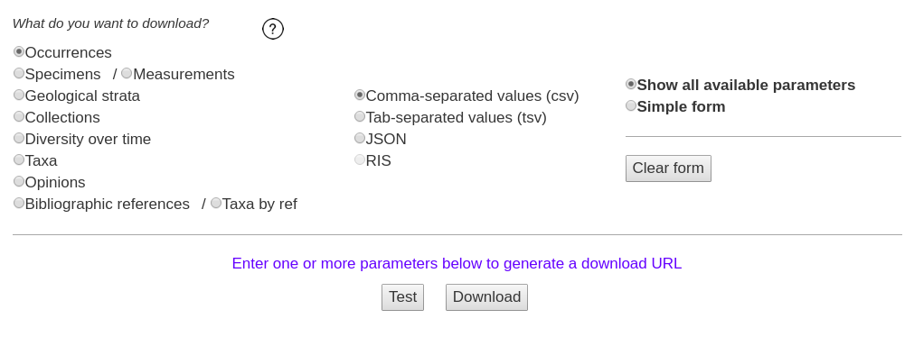

# Managing and Processing Data From the Paleobiology Database

## Objectives

- Introduce the data stored in the Paleobiology Database.
- Learn how to *programatically* download PBDB data.
- Introduce tidy data and some good practices when managing data.
- Learn how to make PBDB cleaner and tidier


```{r load_packages_pbdb, results = 'hide'}

library(pacman)

p_load(tidyverse, janitor, knitr, kableExtra)

theme_set(theme_bw())

```

## Reading  {#project-reading}

The following materials are recommended pre-readings before starting this section. You do not have to read all of them, just pick at least one. 

- [Verde Arregotia *et al.* 2018 "Good practices for sharing analysis-ready data in mammalogy and biodiversity research" **Hystrix, the Italian Journal of Mammalogy**](http://www.italian-journal-of-mammalogy.it/Good-practices-for-sharing-analysis-ready-data-in-mammalogy-and-biodiversity-research,101564,0,2.html).
- [Wilson *et al.* 2017 "Good enough practices in scientific computing" **PLoS Computational Biology**](https://journals.plos.org/ploscompbiol/article?id=10.1371/journal.pcbi.1005510).
- [Bryan "Project oriented workflow" tidyverse.org](https://www.tidyverse.org/articles/2017/12/workflow-vs-script/).
- [Bryan "Zen and aRt of Workflow Maintenance" talk](https://speakerdeck.com/jennybc/zen-and-the-art-of-workflow-maintenance).
- [Bryan "Code Smells and Feels" talk](https://github.com/jennybc/code-smells-and-feels#readme).
- [Bryan 2017 "Excuse me, do you have a moment to talk about version control?" **PeerJ**](https://peerj.com/preprints/3159/).
- [Wickham 2014 "Tidy Data"](https://www.jstatsoft.org/article/view/v059i10).


## Introduction

Any project you work on as a scientist has multiple parts: data, documentation, reports, code, etc. Managing and keeping track of these parts is not a simple task. Today we will discuss a small part of this process: data wrangling and sharing using the `tidyverse` set of packages and syntax. This lesson is in three parts: getting data, processing data, and sharing data.

This tutorial assumes a fair amount of familiarity with the `tidyverse`, in particular `dplyr`. For a tutorial on using `dplyr` and `purrr` I recommend 
- [R for Data Science](https://r4ds.had.co.nz/)
- [https://dplyr.tidyverse.org/articles/dplyr.html](https://dplyr.tidyverse.org/articles/dplyr.html).


## Getting data

One of the greatest resources in paleobiology is the aptly named [Paleobiology Database](https://paleobiodb.org/), or PBDB for short. The PBDB is an internet repository of fossil occurrences, collections, taxonomic opinions, and lots of other information and is freely available to everyone. The standard way to access information in the PBDB is through the classic [Download Generator](https://paleobiodb.org/classic/displayDownloadGenerator) webform. Downloading data using forms like this makes replicating previous PBDB downloads very difficult -- with so many manual options, it is hard to easily record them all or share them with someone else. 

The modern Download Generator (at time of this writing) has one major feature for increasing the reproducibility of downloads -- a URL. Every option updates a URL that calls our data from the PBDB. This URL is then a direct link to the results of that call -- giving the URL to a friend means they can download the same dataset. Play around with the download options and see how the URL changes.



That URL is a call to the [PBDB's API](https://paleobiodb.org/data1.2/), which is the data service for interfacing with the material stored in the underlying database. This means we can share the URL along with our study so that other researchers can make the same data call. The API documentation leaves something to be desired, but as you interact with the docs and start writing your own API calls, it should become clearer what some terms mean. 

A fossil occurrence is the core data type of the PBDB and probably the most important data type in paleobiology -- the unique recording of an organism at a particular location in space and time. Normally we want a list of fossil occurrences that correspond to our study system or time period. For data output from the PBDB for occurrences, each row is an observation and each column is a property of that fossil or metadata corresponding to its collection, identification, and entry into the PBDB.

We are going to focus on downloading information about fossil occurrences. Here are a few example URLs which make calls to the PBDB API. Use the API documentation to discern and describe the differences between the different calls. You can even visit these websites if you want -- it will reveal the plain-text file of the data. 

```
https://paleobiodb.org/data1.2/occs/list.json?base_name=Cetacea&interval=Miocene&show=all

https://paleobiodb.org/data1.2/occs/list.json?base_name=Cetacea&interval=Miocene&taxon_status=valid&show=all

https://paleobiodb.org/data1.2/occs/list.txt?base_name=Cetacea&interval=Miocene&idreso=genus&show=all

https://paleobiodb.org/data1.2/occs/taxa.txt?base_name=Cetacea&interval=Miocene&show=attr
```

The best part of using a URL based call is that we can embed them in our R scripts. Here is a simple example (note I'm suppressing warnings here, so don't get scared when you see a lot of them):
```{r read_carnivora, message = FALSE, results = 'hide', warning = FALSE}

url <- 'https://paleobiodb.org/data1.2/occs/list.txt?base_name=Carnivora&interval=Miocene&show=full'
carnivora <- read_csv(file = url)

```

The `carnivora` object now has the information from our PBDB call in data.frame form. By using a direct API call to the PBDB instead of relying on a previously downloaded file our analyses can instantly be updated when new data is added to the PBDB. Because the URL points directly to a CSV (or JSON) file, we don't have to save a copy of the data to our local machine, and we can instead just have it live in memory during our analyses -- though you might want to download and store the data every so often (e.g. `write_csv()`) so you can work offline or share you data with a less savvy colleague. 

I find tibbles easier to process than data.frame-s, so API calls in my own code tend to look like this:
```{r read_carnivora_astibble, message = FALSE, results = 'hide', warning = FALSE}

url <- 'https://paleobiodb.org/data1.2/occs/list.txt?base_name=Carnivora&interval=Miocene&show=full'
carnivora <- read_csv(file = url) %>%
  as_tibble()

```

If you play around with the carnivora object you'll notice it has **TONS** of columns -- 118! Each of these columns records some bit of information about that fossil -- taxonomic identity, location, source, enterer, etc. You can check the [API documentation](https://paleobiodb.org/data1.2/occs/list_doc.html) for a description of each column. Frustrating many of these fields might be empty or inconsistently entered -- I'm looking at you lithology1 and environment. This inconsistency is the source of some warning messages you'll get form `readr` functions when trying to parse PBDB data because columns will be inconsistently typed. Additionally, a lot of our fossils might not be identified to the species or even genus level, or are not identified with confidence. This serves as an important point about the PBDB: the data isn't perfect. This means that the next step of any analysis of PBDB is "cleaning" or "tidying" our data until we can actually analyze it! 

**WORD OF CAUTION:** If an analysis relies entirely on the PBDB's API to filter the data, then that analysis should be considered suspect because the authors did not actually consider the quality or nature of their data in their analysis. 


## Processing data

Processing PBDB data is not a pretty task but it is extremely important and necessary before any analysis -- it builds familiarity with the data and ensures that the data you are analyzing is the data you actually want to analyze. The `dplyr` package from the `tidyverse` is a collection of tools for processing data.frame objects, making it easier to get our data into a usable form. When combined with the pipe operator (`%>%`) from [`magrittr`](https://magrittr.tidyverse.org/), we can write clear, human readable code for cleaning our data. 


Example filters we might consider
- identified precisely -- no ambiguous or imperfect "calls"
- identified to genus or better
- paleocoordinates (latitude AND longitude)
- body fossils
- collected after a certain date

We might also want to standardize the form of our column names. Capital letters, spaces, and punctuation are all really frustrating to code around. 

Lucky for us, our data is already considered "tidy" because each row is an observation and each column is a variable. This does not mean our data is ready for analysis, however. Our job as analysts is to process and filter our data till we believe every observation is ready to be analyzed. Is every observation up to snuff? Or are there errors encoded in our data?

For example, let's filter out the imprecise fossils, fossils not identified to at least the genus level, and fossils lacking paleocoordinates. Let's also make sure all the variable names have the same logic (they are all already usable, but this is a good habit to get into!)

```{r filter_carnivora}

carnivora_filter <- 
  carnivora %>%
  janitor::clean_names() %>%           # standardizes names
  filter(accepted_rank %in% c('genus', 'species'), # either is good
         !is.na(paleolng),
         !is.na(paleolat))

```

This new tibble, `carnivora_filter`, is a subset of the ordinal data that should follow the rules we've laid out in the URL-based API call and the few lines of R code. If we gave the URL and this code snippet to someone else, they could reproduce all the "rules" governing our dataset.

The accepted_* variables in PBDB data correspond to the accepted, or best, identification of a fossil. Differences between identified_* and accepted_* variables are commonly due to re-identification or changes in taxonomy. While this is really convenient on its face, sometimes the accepted species names assumes too much confidence in the identification. For example, let's take a close look at a few records.

```{r species_names_carnivora}

carnivora_table <- 
  carnivora_filter %>%
  select(identified_name, 
         identified_rank, 
         accepted_name, 
         accepted_rank) %>%
  slice(50:60)

knitr::kable(carnivora_table) %>%
  kableExtra::kable_styling()

```

In many cases there is good correspondence between the identified name and the accepted name. However, there are some inconsistencies. For example, the ninth of this table corresponds to a fossil identified as "Cormocyon cv. copei" but is given the accepted name of "Cormocyon copei" -- an identification that is arguably overconfident. But does it matter? That's up to you and your research, but let's assume it does for this tutorial. How do we resolve this and downgrade these overconfident identifications?

The simplest way might be to downgrade any identified names that include punctuation and non-character symbols to just their genus. After all, "cf.", "sp." and "n. sp." all involve punctuation. 

But how do we deal with text information? Turns out there is a whole special language for dealing with text called [regular expressions](https://en.wikipedia.org/wiki/Regular_expression), or RegEx for short. RegEx are sequences of characters that help us match specific patterns in text. In this example, I'm using a specialized bit of RegEx to identify all cases where there is punctuation present in the identified name -- I don't care *where* the punctuation is, just that there *is* punctuation. To do this, I'm going to be using functions from the [`stringr`](https://stringr.tidyverse.org/) package which provide for easier interaction with text and regular expressions than using the factions available base R. 

I find RegEx unintuitive before I use them as they are not intuitive, so don't worry too much if you find regular expressions bewildering when you start using them. I always spend a lot of time on Google and StackExchange figuring out the correct RegEx I need for the task at hand. 

```{r correct_names_carnivora}

carnivora_clean <- 
  carnivora_filter %>%
  mutate(improve_name = if_else(str_detect(identified_name, 
                                           pattern = '[[:punct:]]'), 
                                true = genus, 
                                false = accepted_name))

carnivora_clean %>%
  select(identified_name, accepted_name, improve_name) %>%
  slice(50:60) %>%
  knitr::kable() %>%
  kable_styling()

```

If we really wanted to be slick, we could combine all the above into a single block.

```{r full_example_carnivora, message = FALSE, results = 'hide', warning = FALSE}

url <- 'https://paleobiodb.org/data1.2/occs/list.txt?base_name=Carnivora&interval=Miocene&show=full'

carnivora <- read_csv(file = url) %>%
  as_tibble() %>%
  clean_names() %>%
  filter(accepted_rank %in% c('genus', 'species'), # either is good
         !is.na(paleolng),
         !is.na(paleolat)) %>%
  mutate(improve_name = if_else(str_detect(identified_name, 
                                           pattern = '[[:punct:]]'), 
                                true = genus, 
                                false = accepted_name))

```


## Binning observations

Fossil occurrences in the PBDB have temporal information such as geologic stage, or a rough numerical age (max_ma, min_ma). The nature of the fossil record means that we do not have exact ages for anything, instead we have ranges. The numerical age of a fossil occurrence is bounded between a max and a min. This uncertainty in age presents a lot of problems that we have to deal with in our analyses, especially if the temporal order of our fossils matters to our question! An extremely common way to overcome this uncertainty is to coarsen the resolution of our fossils by binning them -- assigning similarly aged fossils to a shared temporal unit. Each temporal bin can be said to have a "width" -- the length of time covered by that bin. 

In our example, we may want to track diversity over time. We are going to do this by counting the number of unique genera present in our time bins. To do this, we have to determine how many bins there are and to which bin each fossil belongs. The age of each fossil, however, is a range and not a single value. We could use the midpoint of this range to assign each fossil to a bin, but what if the age range of some fossils is much larger than our bin width? 
First, let's take a look at the amount of uncertainty there is in the age estimates of our fossil occurrences.
```{r range_ilo_carnivora}

carnivora_clean %>%
  mutate(age_range = abs(max_ma - min_ma)) %>%
  ggplot(aes(x = age_range)) +
  geom_histogram() +
  labs(x = 'Age range (My)', y = 'Count') +
  theme_bw()

```

We can see that a lot of our fossils have age uncertainty of 5 million years or less, and a few of them have large ranges of 10 million years or more. Fossils with age ranges greater than 10 million years are potentially suspect or at least are not high quality -- certainly trying to assign them to a single 2 million year bin isn't going to be ideal as it adds confidence where there is none. In your own analyses you might consider these situations on a case-by-case basis or try to find more information from other sources, but for purposes of this tutorial we will exclude those occurrences whose age ranges are 10 million years or greater.

We can dither over an "optimal" bin width for our data, but for the purpose of this exercise let's just assign all our fossil occurrences to 2 million year bins. 

Because binning data is so common, I've written a function, `bin_ages()` to do this. I present it here and will use it to bin our data. The `bin_ages()` function follows that convention that the youngest bin is bin 1. I've written documentation for this function using `roxygen` formatting. Feel free to modify it or write your own. This function requires you to assign a single age to the fossil, after which it is binned. In the example that follows, I calculate the midpoint age of each fossil and proceed from there.

```{r bin_foo_carnivora}

#' Break time data up into bins
#' 
#' Have fun with this. Basic rules. Greater than equal to base, less than top.
#' 
#' @param x vector of ages
#' @param by bin width
#' @param age logical bin age returned, not number (default FALSE, return bin number)
#' @return vector of bin memberships
#' @author Peter D Smits <peterdavidsmits@gmail.com>
bin_ages <- function(x, by = NULL, number = NULL, age = FALSE) {

  if(is.null(by) & is.null(number)) {
    return('no scheme given. Specify either bin width or number of bins.')
  }

  if(!is.null(by) & !is.null(number)) {
    return('too much information. Specify either bin width OR number of bins, not both.')
  }

  # range to bin
  top <- ceiling(max(x))
  bot <- floor(min(x))

  # create bins
  if(!is.null(by)) {
    unt <- seq(from = bot, to = top, by = by)
  } else if(!is.null(number)) {
    unt <- seq(from = bot, to = top, length.out = number + 1)
  }

  # bin top and bottom
  unt1 <- unt[-length(unt)]
  unt2 <- unt[-1]

  # assign memberships
  uu <- map2(unt1, unt2, ~ which(between(x, left = .x, right = .y)))

  # what if we want the "age" of the bin, not just number?
  if(age == TRUE) {
    unt_age <- map2_dbl(unt1, unt2, ~ median(c(.x, .y)))
  }

  # create output vector
  y <- x
  for(ii in seq(length(uu))) {
    if(age == FALSE) {
      y[uu[[ii]]] <- ii
    } else if(age == TRUE) {
      y[uu[[ii]]] <- unt_age[ii]
    }
  }
  y
}

```

Let's use this function to bin our data. Notice how I first calculate the midpoint age for each fossil and use that derived quantity to assign each occurrence to a temporal bin.

```{r bin_carnivora}

carnivora_bin <-
  carnivora_clean %>%
  filter(abs(max_ma - min_ma) < 10) %>%
  mutate(mid_ma = (max_ma + min_ma) / 2,
         bin = bin_ages(mid_ma, by = 2))

carnivora_bin %>%
  summarize(bin_number = n_distinct(bin))

```

Ok, so now we have a column `bin` that identifies the temporal bin that each occurrence belongs to. The quick summary at the bottom demonstrates that we have broken our data into 9 bins of equal length. The limit here is that our bins are identified by their number and not their "age". Luckily, the `age` parameter of the `bin_ages()` function that changes the output from bin number to bin age. Here it is in use.
```{r bin_age_carnivora}

carnivora_bin <- 
  carnivora_bin %>%
  mutate(bin_age = bin_ages(mid_ma, by = 2, age = TRUE))

# take a look
carnivora_bin %>%
  select(mid_ma, bin, bin_age) %>%
  slice(1:10) %>%
  knitr::kable(.) %>%
  kableExtra::kable_styling()

```

As before, we can combine all of these operations into a set of piped statements.
```{r bin_complete_carnivora}

url <- 'https://paleobiodb.org/data1.2/occs/list.txt?base_name=Carnivora&interval=Miocene&show=full'
carnivora <- read_csv(file = url) %>%
  as_tibble() %>%
  clean_names() %>%
  filter(accepted_rank %in% c('genus', 'species'), # either is good
         !is.na(paleolng),
         !is.na(paleolat)) %>%
  mutate(improve_name = if_else(str_detect(identified_name, 
                                           pattern = '[[:punct:]]'), 
                                true = genus, 
                                false = accepted_name)) %>%
  filter(abs(max_ma - min_ma) < 10) %>%
  mutate(mid_ma = (max_ma + min_ma) / 2,
         bin = bin_ages(mid_ma, by = 2),
         bin_age = bin_ages(mid_ma, by = 2, age = TRUE))

```


## Sharing data

So far we have generated two "kinds" of data tables: the raw data output from the PBDB that is returned from our URL-based API call, and the cleaned data we've crafted with a bit of code. Both of these datasets are extremely important and should be shared with the audience.

There are two ways to share the raw data associated with our study: the URL-based API call, and a spreadsheet of the downloaded information. Because the information on the PBDB updates over time, an API call made today might not yield an identical dataset. Earlier I hailed this as fantastic, which it is, but it is also limiting -- someone might not be able completely reproduce your analysis using just this information because the data could be different. The API call is useful for improving and expanding on previous analyses, but by itself is not enough to reproduce your analysis. You also need to share the raw data download so that your complete analysis, including filtering and cleaning, is reproducible.

You probably also want to save a local copy of your filtered and cleaned dataset so you don't have to re-run your cleaning scripts all the time. It also means you can separate your cleaning from the rest of your analysis. You'll end up with multiple R scripts and multiple datasets -- that's good. 

For example, my projects tend to have multiple subdirectories: R/, data/, and results/. In the R directory, I'll have multiple scripts -- one for loading and cleaning data, one for visualizing this cleaned data, and at least one for analyzing the cleaned data. I save the raw data to the data/ directory, and the cleaned data and figured in the results/ directory.


Here is a quick example of what I mean without referencing subdirectories:
```{r save_carnivora, eval = FALSE}

url <- 'https://paleobiodb.org/data1.2/occs/list.txt?base_name=Carnivora&interval=Miocene&show=full'
carnivora <- read_csv(file = url)

carnivora_clean <- 
  carnivora %>%
  as_tibble() %>%
  clean_names() %>%
  filter(accepted_rank %in% c('genus', 'species'), # either is good
         !is.na(paleolng),
         !is.na(paleolat)) %>%
  mutate(improve_name = if_else(str_detect(identified_name, 
                                           pattern = '[[:punct:]]'), 
                                true = genus, 
                                false = accepted_name))
  filter(abs(max_ma - min_ma) < 10) %>%
  mutate(mid_ma = (max_ma + min_ma) / 2,
         bin = bin_ages(mid_ma, by = 2),
         bin_age = bin_ages(mid_ma, by = 2, age = TRUE))

write_csv(carnivora, 'carnivora_raw.csv')
write_csv(carnivora_clean, 'carnivora_clean.csv')

```

For more information and advice on how to organize your projects, check out Jenny Bryan's excellent material on project oriented workflows, linked [above](#project-reading).


## Summary

In this lesson we introduced the PBDB API and how to include URL-based API calls in our R code. We also covered multiple aspects of cleaning PBDB data including species identifications and temporal binning. Finally, we briefly covered exporting our data, both raw and cleaned, so that our analyses are more reproducible. All of these steps are fundamental in any analysis and form a great deal of the work associated with any analysis problem.
