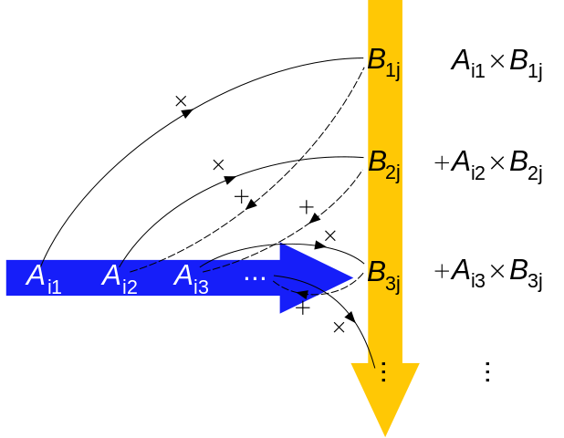

# Multiple predictors and interactions in linear regression

## Objectives

- Interpret regression models with a categorical predictor that has more than two levels.
- Learn to interpret regression models with more than one predictor.
- Introduce statistical interactions in regression models.
- Cover strategies for visualizing multivariate regression models.


```{r load_packages_reg_multi, message = F, results = 'hide'}

library(pacman)

p_load(tidyverse, here, janitor, purrr, viridis, brms, tidybayes, bayesplot,
       modelr, forcats)

theme_set(theme_bw())

```

## Reading

The following materials are recommended pre-readings before starting this tutorial. 

- Chapter 5 "Multivariate Linear Models" from [**Statistical Rethinking** by Richard McElreath](https://xcelab.net/rm/statistical-rethinking/).
- OPTIONAL Chapter 3 "Linear regression: the basics" from [**Data Analysis Using Regression and Multilevel/Hierarchical Models** by Gelman and Hill](https://www.cambridge.org/core/books/data-analysis-using-regression-and-multilevelhierarchical-models/32A29531C7FD730C3A68951A17C9D983). 
- OPTIONAL Chapter 4 "Linear regression: before and after fitting the model" from [**Data Analysis Using Regression and Multilevel/Hierarchical Models** by Gelman and Hill](https://www.cambridge.org/core/books/data-analysis-using-regression-and-multilevelhierarchical-models/32A29531C7FD730C3A68951A17C9D983). 


## More than one predictor

Correlation between variables is very common in nature. In large datasets, all pairs of variables have a statistically discernible non-zero correlation. We should never be surprised to find that two variables are correlated. But simple correlation tells us nothing of mechanism -- the "biology" of the system. We need tools to distinguish between mere association from evidence of causation. This is where multivariate regression (regression with more than one predictor variable) comes into play.

The three general reasons for using a multivariate model are:

- **Confounds** or variables that may be correlated with variable of interest. Confounds can easily hide important variables or produce false signals. Check out [Simpson's Paradox](https://en.wikipedia.org/wiki/Simpson%27s_paradox) for an example of how a relationship can be reversed in the presence of a confounding variable.
  
- **Multiple causation**. Reality is rarely simple, to the point that we can safely assume complexity. By considering that complexity, we can improve our understanding. Additionally, when causation is multiple one cause can hide another unless they are considered simultaneously. 

- **Interactions**. Even in the absence of correlation, effects of two or more variables might depend on each other. An example would be plant growth as a function of light and water -- both are needed and only having one yields no benefit. In order to make effective inference about one variable, we need to consider the others as well.

So far all the linear regression models we have encountered have either been intercept-only or with a single predictor. For this lesson we're going to continue our focus on three variables from the PanTHERIA dataset: population density, body size, and trophic level. Population density, measured as the number of individuals per square-kilometer, is our variable of interest -- we want to define a model which describes how population density varies between mammal species. We have previously investigated body size as a predictor of population density, but the posterior predictive analysis of our model of population density with only body mass as a predictor demonstrates that this model does not adequately describe the data. We were able to do this by asking if our model is able to describe differences in the data that we know about but that our model does not (e.g. trophic level).

This lesson uses the PanTHERIA dataset like we did in the [previous lesson](#reg-continue). Just like last time, here is a quick clean up of the dataset before we do anything "principled."

```{r pantheria_regmulti}

pantheria <- read_tsv(here('data', 'PanTHERIA_1-0_WR05_Aug2008.txt'), 
                      na = '-999.00') %>%
  clean_names() %>% 
  mutate(mass_log = log(x5_1_adult_body_mass_g),
         range_group_log = log(x22_1_home_range_km2),
         range_indiv_log = log(x22_2_home_range_indiv_km2),
         density_log = log(x21_1_population_density_n_km2),
         activity_cycle = case_when(x1_1_activity_cycle == 1 ~ 'nocturnal',
                                    x1_1_activity_cycle == 2 ~ 'mixed',
                                    x1_1_activity_cycle == 3 ~ 'diurnal'),
         trophic_level = case_when(x6_2_trophic_level == 1 ~ 'herbivore',
                                   x6_2_trophic_level == 2 ~ 'omnivore',
                                   x6_2_trophic_level == 3 ~ 'carnivore'))

```


### Categorical predictor {#dummy}

Trophic level is a categorical predictor with three levels. The previous categorical predictor we dealt with (Bivalve versus Brachiopod) was binary which made it very easy to interpret. In that lesson I briefly introduced the idea of dummy coding and demonstrated how that would work with a three level categorical variable. I'm going to reiterate and expand on that demonstration here.

`brm`, and R in general, will automatically translate categorical predictors like our `trophic_level` variable into what's called *dummy coding*. 

When we dummy code a categorical variable what we are doing is turning one variable with $k$ states into $k - 1$ binary variables. One state of the categorical variable is considered the "baseline" or the default condition for any observation. The other $k - 1$ binary variables then describe if the observation is different from the default -- these are called contrasts. The standard behavior for this in R is that the first state, alphabetically, is made the baseline.  Here is this in action:
```{r dummy_trophic}

(pantheria %>%
  drop_na(trophic_level) %>%
  model_matrix(~ trophic_level))

```

The `model_matrix()` function returns a tibble with $k$ columns. Take a closer look at the column names. First, focus on the second and third columns. Each title is the variable name (`trophic_level`) combined with one of the levels (e.g. `trophic_levelherbivore`). One of the factor's levels, carnivore, is not named as one of the columns, instead that level is subsumed in the `(Intercept)` column. 

The default state of any observation is this "carnivore." A 0 in the `trophic_levelherbivore` or `trophic_levelomnivore` columns means that the observation is not an herbivore or omnivore, respectively. If there is a 1 in the herbivore or omnivore column that means that observation is an herbivore or omnivore and not a carnivore -- hence why the $k - 1$ binary variables are called contrasts (with respect to the default condition/intercept). Importantly, an observation cannot/should not have a 1 in more than one of the $k - 1$ binary variables associated with a single categorical predictor.

Let's see what happens when we suppress the intercept using R's [formula syntax](https://stat.ethz.ch/R-manual/R-devel/library/stats/html/formula.html).

```{r dummy_nointercept}

(pantheria %>%
  drop_na(trophic_level) %>%
  model_matrix(~ -1 + trophic_level))

```

By suppressing the intercept in our model matrix, we've dramatically changed the first column of our tibble. Instead of being labeled `(Intercept)` and being a column of only 1s, we have a column named `trophic_levelcarnivora` which is a binary variable indicating if an observation is a carnivore or not. 

I do not recommend suppressing the intercept when developing a model, especially if you are generating your contrasts independent of the model formula (e.g. when using `brm()`), and extra especially if you have more predictors in your model than just the categorical variable being coded out. If you are not careful, you might end up with the equivalent of two intercepts which causes a model to be completely undefined and useless.

As we've discussed before, R tacitly converts our categorical variables (e.g. variables where our observations are character data) into dummy coding. While this is convenient, it can lead to confusion if you aren't super familiar with categorical variables. For example, I once had a colleague ask, "How are there 5 parameters when we only have 1 predictor in our linear regression (they expected three)?" 

Something I like to do is make the most common or most general class be the intercept. This adds a bit of logic to the contrasts, as they are now "in contrast" to the most common state. The most common class in `trophic_level` is "herbivore". To change which class becomes the intercept, we need to manipulate the R structure of `trophic_level`. I'm choosing to do this using functions from the `forcats` package.

```{r dummy_recode}

(pantheria %>%
  drop_na(trophic_level) %>%
  mutate(trophic_level = fct_infreq(trophic_level)) %>% # reorder by frequency
  model_matrix(~ trophic_level))

```

By controlling which of the classes from our categorical variable is considered the intercept, we can make inference easier. Carnivores are relatively rare in our dataset, so having them as the "default" condition for our model is a bit confusing -- most of our observations would be "exceptions" or "in contrast to" our default. By having herbivores act as are default, we inherently are describing more parts of our data before looking at the contrasts.

There are [many other strategies for encoding categorical variables](https://stats.idre.ucla.edu/r/library/r-library-contrast-coding-systems-for-categorical-variables/), but dummy coding is by far the most common -- it helps that it is the R default. 


## Defining our model

Now that we have refreshed our understanding of how categorical covariates are handled in a regression model, let's write out a model describing how `density_log` varies as a linear function of our `trophic_level` categorical predictor and the `mass_log` continuous covariate. As always, let's write out our model in statistical notation before implementing it in `brms`. 

Multivariable regression models add more parameters and variables to the definition of the mean of the Normal distribution, $\mu_{i}$. For each predictor we will essentially do three things:

1. Nominate the predictor variable of interest.
2. Create a parameter that will measure the association between that variable and the outcome.
3. Multiply the parameter by the variable and add that term to the linear model.

To demonstrate this, I'm going to be a bit more formal in defining our statistical model than [before](#reg-continue) because it is good practice and because this model is more complicated than the ones we have seen before. 

We have $N$ total observations (species) in our dataset. We can define our response variable, `density_log`, as $y_{i}$ where $i$ index which species that measure is from and $i = 1, 2, \ldots, N$. Our two predictor variables are `mass_log` and `trophic_level`, which are continuous and categorical, respectively. Our first predictor is the continuous `mass_log` of each observation -- let's call this variable $x_{i}$  where $i = 1, 2, \ldots, N$. Our second variable is the categorical `trophic_level` which has three classes: carnivore, herbivore, omnivore. As discussed before, we are going to rewrite this variable as a set of $k - 1$ contrasts where $k$ is the number of levels in the variable (i.e. three). Let's name herbivore to be the baseline, with carnivore and omnivore being the contrasts. We can define these two binary predictors as $c_{i}$ and $o_{i}$, respectively. 

This covers all of our data. Now let's define the parameters that describe our the bits of our data are related. We need to define a regression model describing how the expected value of $y$ varies as a function of $x$, $c$, and $o$.

Let's assume a Normal distribution is a suitable descriptor of population density, the core assumption of linear regression. We can then define the mean and standard deviation of this distribution as $\mu_{i}$ and $\sigma$. $\mu$ is indexed by observation $i$ where $i = 1, 2, \ldots, N$ because we are going to define it as a linear function of our predictors which vary for each of our $N$ observations. We then can define the linear function describing $mu_{i}$ as an additive relationship of each covariate multiplied by its own regression coefficient plus an intercept. Let's identify the intercept as $\alpha$ and the three coefficients as $\beta_{1}$, $\beta_{2}$, and $\beta_{3}$.


Now that we've defined all of our data terms and parameters, we need to define the remaining priors for the regression coefficients and standard deviation parameter. I'm going to stick with what the priors we used from our [previous lesson](#reg-continue), with a slightly informative prior for the effect of body mass and general weakly informative priors for the other regression coefficients. 

$$
\begin{align}
y_{i} &\sim \text{Normal}(\mu_{i}, \sigma) \\
\mu_{i} &= \alpha + \beta_{1} m_{i} + \beta_{2} o_{i} + \beta_{3} h_{i} \\
\alpha &\sim \text{Normal}(0, 10) \\
\beta_{1} &\sim \text{Normal}(-1, 5) \\
\beta_{2} &\sim \text{Normal}(0, 5) \\
\beta_{3} &\sim \text{Normal}(0, 5) \\
\sigma &\sim \text{Cauchy}^{+}(0, 5) \\
\end{align}
$$


But how do we interpret a regression coefficient when we have more than one regression coefficient? The standard advice is to interpret an individual coefficient while assuming that all other predictors are held constant. The meaning of each regression coefficient is independent of the others because we are assuming the covariates are independent of one another -- for example, that body size has noting to do with trophic level. Is this assumption correct? Probably not. Is it defensible? Possibly.


## Fitting model in `brms`

Now that we've been able to write out our complete statistical model, we can not implement it in `brms`.

Our first task limiting our data to not include observations with missing values for our variables of interest. After that, we need to center our continuous predictor so that our intercept has a [clean interpretation](#reg-continue).

After our data is prepared for analysis, we can then write our `brm()` call.

```{r prep_multi}

pantheria_fit <- 
  pantheria %>%
  drop_na(density_log, mass_log, trophic_level) %>%
  mutate(mass_log_center = mass_log - mean(mass_log),
         trophic_level = fct_infreq(trophic_level))

```

```{r fit_multi, cache = TRUE, message = FALSE, results = 'hide'}

m_1 <- 
  pantheria_fit %>%
  brm(data = .,
      family = gaussian(),
      formula = bf(density_log ~ 1 + mass_log_center + trophic_level),
      prior = c(prior(normal(0, 10), class = Intercept),
                prior(normal(0, 5), class = b),
                prior(normal(-1, 5), class = b, coef = mass_log_center),
                prior(cauchy(0, 5), class = sigma)),
      iter = 2000,
      warmup = 1000,
      chains = 4,
      cores = 4,
      refresh = 0)

```

```{r multi_print}

print(m_1)

```


## Aside: Standardizing 

Remember, regression coefficients (e.g. $\beta_{1}$) are interpreted as the expected change in $y$ per unit change in the predictor (e.g. $m$). If our predictors are not on the same scale, it is "unfair" to compare them directly. For example, how can we compare the effect size of body mass versus being an herbivore on population density? While the regression coefficient for being an herbivore (instead of an omnivore) has a greater magnitude than the coefficient for mass, but this is misleading because a complete difference in category to a 1-km$^2$ change in geographic range.

A natural solution to this problem is to standardize our predictors so that they are all on the same scale (having the same standard deviation). You might have heard of this as z-scores or something else -- we will not be using this language.

To standardize our data, [Gelman and Hill](http://www.stat.columbia.edu/~gelman/arm/) recommend scaling or predictors by dividing by 2 standard deviations so that "a 1-unit change in the rescaled predictor corresponds to a change from 1 standard deviation blow the mean, to 1 standard deviation above." 

But why 2 standard deviations and not 1? By dividing by 2 standard deviations we gain comparability between our continuous covariates and the binary predictors. For example, consider a simple binary variable $x$ where 0 and 1 occur with equal probability. The standard deviation of this variable is then $\sqrt{0.5 \cdot 0.5} = 0.5$, which means the standardized variable, $(x - \mu_{x}) / (2 \sigma_{x})$, takes on the values $\pm 0.5$, and its coefficient reflects comparisons between $x = 0$ and $x = 1$. In contrast, dividing by 1 standard deviation means that the scaled variable takes on values $\pm 1$ and its coefficients correspond to half the difference between the two possible values of $x$.

[Gelman and Hill](http://www.stat.columbia.edu/~gelman/arm/) also state that in complicated regression models with lots of predictors, we can leave our binary inputs as is and just transform our continuous predictors. In that case, the 2 standard deviation rule gives rough comparability in the coefficients. I generally just center and rescale my continuous covariates. 


Our goal should be able to have meaningful interpretations for as many parameters as possible, especially regression coefficients. To ensure this, we should center and scale all continuous predictor variables before analysis. If these transformations aren't done, then we can have difficulty interpreting our models intercept and can incorrectly and unfairly compare the estimates of our regression coefficients.


```{r prep_multistan}

pantheria_fit2 <- 
  pantheria %>%
  drop_na(density_log, mass_log, trophic_level) %>%
  mutate(mass_log_stan = (mass_log - mean(mass_log)) / (2 * sd(mass_log)),
         trophic_level = fct_infreq(trophic_level))

```


```{r fit_multistan, cache = TRUE, message = FALSE, results = 'hide'}

m_2 <- 
  pantheria_fit2 %>%
  brm(data = .,
      family = gaussian(),
      formula = bf(density_log ~ 1 + mass_log_stan + trophic_level),
      prior = c(prior(normal(0, 10), class = Intercept),
                prior(normal(0, 5), class = b),
                prior(normal(-1, 5), class = b, coef = mass_log_stan),
                prior(cauchy(0, 5), class = sigma)),
      iter = 2000,
      warmup = 1000,
      chains = 4,
      cores = 4,
      refresh = 0)

```

```{r multistan_print}

print(m_2)

```


Now that we've fit our model with standardized data, we can directly compare the regression coefficients. With multiple predictors we might want to know which the relative importance of the predictors or which predictor has the largest effect size. In general, comparing effect sizes just means calculating the probability that the absolute value of the posterior distribution of one coefficient is greater than another. Remember that in math, magnitude means absolute value. So when you compare effect sizes, you are comparing the relative magnitudes of the regression coefficients.

For categorical predictors with more than 2 states, we might also want to know which categories are expected to have a greater expected value of $y$ than the other categories. The way parameters are estimated, our regression coefficients only describe the difference in expected $y$ between that state and the intercept/default state, but it does not describe the difference in expected $y$ between that state and any other non-default state. In our example, this means that the carnivora regression coefficient only describes the difference in expected population density between omnivores and carnivores, but not carnivores and herbivore. 

Luckily, it is very easy to calculate the expected values of $y$ for each of categorical predictor's states -- then all state combinations can be compared directly. Here is a demonstration.

```{r compare_states}

m_2 %>%
  spread_draws(b_Intercept, b_trophic_levelherbivore, b_trophic_levelcarnivore) %>%
  transmute(omni = b_Intercept,
         herb = b_Intercept + b_trophic_levelherbivore,
         carn = b_Intercept + b_trophic_levelcarnivore) %>%
  gather(key = trophic_state, value = value) %>%
  ggplot() +
  geom_density(mapping = aes(x = value, 
                             group = trophic_state, 
                             fill = trophic_state)) +
  scale_fill_viridis(discrete = TRUE)

```

The differences in expected $y$ between three states are extremely obvious, but you could imagine calculating the probability that one state is greater than another. Here is the trivial example.


```{r compare_calc}

m_2 %>%
  spread_draws(b_Intercept, b_trophic_levelherbivore, b_trophic_levelcarnivore) %>%
  transmute(omni = b_Intercept,
         herb = b_Intercept + b_trophic_levelherbivore,
         carn = b_Intercept + b_trophic_levelcarnivore) %>%
  dplyr::summarize(omni_gr_herb = sum(omni > herb) / length(omni),
                   carn_gr_herb = sum(carn > herb) / length(omni),
                   carn_gr_omni = sum(carn > omni) / length(omni)) %>%
  gather(key = comparison, value = probability)

```


## Checking model fit

So we've been able to fit our model and have (more) interpretable parameters. Our work with this model, however, is not done. As with our previous lessons, we now need to get an idea for how well our model represents our data -- can we "trust" inferences based on its parameter estimates?

As I've stated before, there is no single best way of evaluating model fit. Let's look at a lot of different aspects of model fit and make conclusions based on this host of evidence.

First, we check if the linear part of our model (i.e. the definition of $\mu_{i}$) appears the capture mean population density. This means plotting the fitted draws against our data.

```{r multi_fitted}

pantheria_fit2 %>%
  add_fitted_draws(model = m_2,
                   n = 100) %>%
  ungroup() %>%
  ggplot(aes(x = mass_log_stan, y = density_log)) +
  geom_line(mapping = aes(y = .value, group = .draw),
            alpha = 1 / 20,
            colour = 'blue') +
  geom_point(data = pantheria_fit2, size = 2) +
  scale_fill_brewer() +
  facet_wrap(~ trophic_level) +
  NULL

```

The linear predictor appears to cut through the "meat" of our data, though with so few carnivore observations it is hard to tell the quality of fit to those observations from this plot.


But the fitted draws are only the linear part of our model, and not our full posterior predictive distribution which includes our estimate of the scale of our data (i.e. $\sigma$). Like before, we can generate the posterior predictive distribution of population density for the whole range of mass values and trophic levels. This is technically a type *counterfactual* plot because we are estimating values for unobserved values of body mass. However, we will overlay our data points over the posterior predictive distribution to visually compare how closely our estimates resemble the observed distribution of values.


```{r multi_predicted}

pantheria_fit2 %>%
  data_grid(mass_log_stan = seq_range(mass_log_stan, n = 1000),
            trophic_level) %>%
  add_predicted_draws(model = m_2,
                      n = 100) %>%
  ungroup() %>%
  ggplot(aes(x = mass_log_stan, y = density_log)) +
  stat_lineribbon(mapping = aes(y = .prediction),
                  .width = c(0.9, 0.5, 0.1),
                  size = 0) +
  geom_point(data = pantheria_fit2, size = 2) +
  scale_fill_brewer() +
  facet_wrap(~ trophic_level) +
  NULL

```

Our data appears to sit over our posterior predictive distribution, with the concentration of points corresponding to the tighter credible intervals. However, this plot does not resolve our difficulty with evaluating our models fit to the carnivore observations.

We can also compare the density of our observations to those of draws from our posterior predictive distribution, something [we have done before](#reg-continue). This involves simulating multiple (e.g. 100) datasets from the posterior predictive distribution and visually comparing these distributions to our observed. Because our previous plots weren't able to help us resolve the quality of our model's fit to our carnivore observations, let's also break down our data by trophic level.


```{r multi_dens_troph_ppc}

pantheria_fit2 %>%
  add_predicted_draws(model = m_2,
                      n = 100) %>%
  ungroup() %>%
  ggplot(aes(x = .prediction, group = .draw)) +
  geom_line(stat = 'density',
            alpha = 0.1,
            colour = 'blue') +
  geom_line(stat = 'density',
            data = pantheria_fit2,
            mapping = aes(x = density_log,
                          group = NULL),
            colour = 'black',
            size = 1.5) +
  scale_y_continuous(NULL, breaks = NULL) +
  labs(x = expression(paste('Population density ', log(n / km^2))),
       title = 'Population density, actual versus predicted') +
  facet_wrap(~ trophic_level) +
  NULL

```


Let's also look our model's ability to reconstruct specific point estimates. This means comparing point estimates from multiple (e.g. 100) posterior predictive datasets to those estimates from observed data. We've previously focused on the median population density for the trophic groups, but let's also take a look at the standard deviation of population density for those groups -- perhaps there is heterogeneity in the spread of population density between the groups that we've yet to consider.


```{r median_ppc}

pan_trophic_summary <-
  pantheria_fit2 %>%
  group_by(trophic_level) %>%
  dplyr::summarize(median = median(density_log),
                   sd = sd(density_log)) %>%
  gather(key, value, median, sd)

pantheria_summary_ppc <- 
  pantheria_fit2 %>%
  add_predicted_draws(model = m_2,
                      n = 100) %>%
  ungroup() %>%
  group_by(.draw, trophic_level) %>%
  dplyr::summarize(median = median(.prediction),
                   sd = sd(.prediction)) %>%
  ungroup() %>%
  gather(key, value, median, sd)

pantheria_summary_ppc %>%
  ggplot(aes(x = value)) +
  geom_histogram(fill = 'blue') +
  geom_vline(data = pan_trophic_summary,
             mapping = aes(xintercept = value),
             size = 2) +
  facet_grid(key ~ trophic_level, scales = 'free', switch = 'y') +
  labs(x = 'Median population density', y = '') +
  NULL

```

The current model is doing a much better job at capturing the median population densities compared to our [previous model](#reg-continue). We also notice some evidence of heterogeneity in standard deviation between our groups -- while our model does a good job at approximating the variation in population density of herbivores and omnivores, it fails to approximate that of carnivores. How do we resolve this situation? Do we need to deal with this in order to answer our scientific questions? Are we concerned with the spread of our data just as much as its central tendency?


## Aside: Matrix Notation {#matrix-notation}

Regression models are frequently written in a compact form like
$$
\mu_{i} = \alpha + \sum^{n}_{j = 1} \beta_{j} x_{ji}
$$
where $j$ indexes each of the $n$ predictor variables. This statement can be unpacked as
$$
\mu_{i} = \alpha + \beta_{1} x_{1i} + \beta_{2} x_{2i} + \ldots + \beta_{n} x_{ni}.
$$

Both of these forms can be read as $\mu$ is modeled as the sum of an intercept and an additive combination of the products of parameters and predictors. This statement can be expressed more succinctly using matrix notation as
$$
\mu_{i} = X_{i} \beta,
$$
or even more succinctly as
$$
\mu = X \beta
$$
where $\mu$ is a vector of means, \beta is a vector of regression coefficients, and X is a *design matrix*.

A design matrix has as many rows as the data, and as many columns as there are predictors plot one. This additional column is filled with 1s. These 1s are multiplied by the intercept and so return the unmodified intercept. Here is a quick visual on vector-matrix multiplication to help refresh your memory on how this all works to fit the vector $\mu$:


You might have realized that we've actually interacted with design matrices before when we were exploring how [dummy coding is handled](#dummy) -- the column of all 1s called `Intercept` is exactly what I've described here. For example, we can peak at the design matrix from the regression model we developed in this lesson.

```{r design_matrix}

(pantheria_fit2 %>%
  model_matrix(density_log ~ 1 + mass_log_stan + trophic_level))

```

Each row of the design matrix is multiplied by a vector of regression coefficients (which includes the intercept term), which are summed to give the estimate of $\mu$.


## Summary

This lesson covered linear models with more than one predictor variable. We continued our development of a regression model to explain variation in population density in mammals, using data from the PanTHERIA database. We returned to categorical variables and how they can be translated for use in regression models. Our newest model included body mass and trophic level as predictors of population density. We found that this model is an obvious improvement over the single predictor model from the previous less as more adequately describes the differences in population density associated with differences in body mass and trophic level. While our model is not a prefect descriptor of the data, it appears adequate for addressing questions relating to differences expected population density but not necessarily adequate for predicting the range of plausible population densities for carnivorous mammals.


